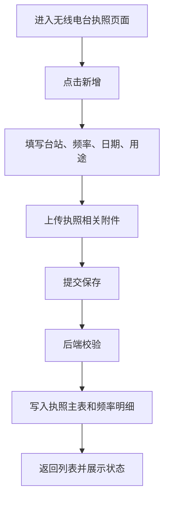
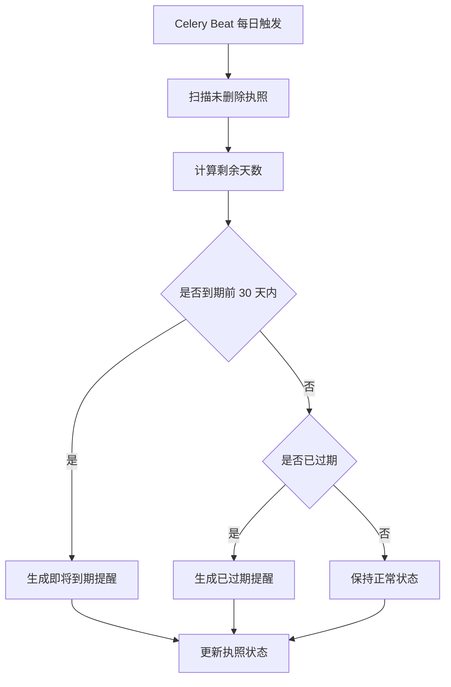

# 03 设计产物：无线电台执照有效期管理

## 设计来源

本阶段承接根目录文档：

```text
无线电台执照有效期管理功能设计方案.md
```

该文档已经包含完整业务设计。本文件将其压缩成开发实现时需要直接引用的关键设计产物。

## 功能边界

### 必须实现

- 执照手工登记。
- 台站、频率、起始日期、截止日期、用途录入。
- 单个或多个频率录入。
- 执照、许可证、许可批复附件上传。
- 到期前 30 天提醒。
- 状态自动计算。
- 列表查询、编辑、删除。
- 权限校验。

### 暂不实现

- 外部系统对接。
- 在线审批。
- 短信、邮件、企业微信通知。
- 复杂频率冲突检测。
- 多级提醒配置。

## 业务流程

### 执照登记



### 到期提醒



## 页面设计

### 菜单

推荐菜单：

```text
无线电管理 / 无线电台执照
```

如果暂不新增一级菜单，可放在：

```text
设备管理 / 无线电台执照
```

### 列表页

字段：

| 字段 | 展示方式 |
| --- | --- |
| 台站 | 文本 |
| 频率 | 主频率 + “等 N 个” |
| 用途 | 文本 |
| 起始日期 | 日期 |
| 截止日期 | 日期 |
| 剩余天数 | 数字，过期显示负数或“已过期 X 天” |
| 状态 | Tag：正常/即将到期/已过期 |
| 附件数 | 数字 |
| 责任人 | 姓名 |
| 操作 | 查看、编辑、续期、删除、附件 |

筛选项：

- 台站
- 频率
- 用途
- 状态
- 截止日期范围
- 是否有附件

### 表单页

字段：

| 字段 | 组件 | 校验 |
| --- | --- | --- |
| 台站 | Input 或 Select | 必填 |
| 频率 | 动态表单行 | 至少一条 |
| 起始日期 | DatePicker | 必填，不能晚于截止日期 |
| 截止日期 | DatePicker | 必填，不能早于起始日期 |
| 用途 | TextArea 或 Select | 必填 |
| 责任人 | User Select | 非必填 |
| 备注 | TextArea | 非必填 |
| 附件 | Upload | 非必填 |

### 详情页

展示：

- 基础信息
- 频率明细
- 附件列表
- 提醒记录
- 创建/更新时间
- 创建人/责任人

## 数据模型

### 执照主表

表名：

```text
tdyw_radio_license
```

关键字段：

| 字段 | 类型 | 说明 |
| --- | --- | --- |
| tenant_id | varchar | 租户 ID |
| station_name | varchar(100) | 台站 |
| purpose | varchar(500) | 用途 |
| valid_from | date | 起始日期 |
| valid_to | date | 截止日期 |
| responsible_user_id | int | 责任人 ID |
| responsible_user_name | varchar(100) | 责任人姓名 |
| status | varchar(20) | normal/expiring/expired |
| last_remind_at | datetime | 最近提醒时间 |
| is_deleted | boolean | 软删除 |
| created_by_id | int | 创建人 |
| updated_by_id | int | 更新人 |

### 频率明细表

表名：

```text
tdyw_radio_license_frequency
```

关键字段：

| 字段 | 类型 | 说明 |
| --- | --- | --- |
| tenant_id | varchar | 租户 ID |
| license_id | bigint | 执照 ID |
| frequency_value | decimal(12,4) | 频率数值 |
| frequency_unit | varchar(20) | MHz/kHz/GHz |
| frequency_text | varchar(100) | 原始显示文本 |
| remark | varchar(200) | 备注 |
| sort_order | int | 排序 |

### 附件表

表名：

```text
tdyw_radio_license_attachment
```

关键字段：

| 字段 | 类型 | 说明 |
| --- | --- | --- |
| tenant_id | varchar | 租户 ID |
| license_id | bigint | 执照 ID |
| attachment_type | varchar(30) | license/permit/approval/other |
| file_name | varchar(255) | 文件名 |
| file_path | varchar(500) | 文件路径或资料库文件 ID |
| file_size | bigint | 文件大小 |
| file_ext | varchar(20) | 扩展名 |
| uploaded_by_id | int | 上传人 |

### 提醒记录表

表名：

```text
tdyw_radio_license_reminder
```

关键字段：

| 字段 | 类型 | 说明 |
| --- | --- | --- |
| tenant_id | varchar | 租户 ID |
| license_id | bigint | 执照 ID |
| remind_type | varchar(30) | expiring/expired |
| remind_date | date | 提醒日期 |
| days_left | int | 剩余天数 |
| title | varchar(200) | 标题 |
| content | text | 内容 |
| receiver_user_id | int | 接收人 |
| is_read | boolean | 是否已读 |
| is_handled | boolean | 是否处理 |

## 接口设计

| 接口 | 方法 | 说明 |
| --- | --- | --- |
| `/api/radio-license/` | GET | 执照列表 |
| `/api/radio-license/` | POST | 新增或编辑执照 |
| `/api/radio-license/?id=<id>` | DELETE | 删除执照 |
| `/api/radio-license/<id>/` | GET | 执照详情 |
| `/api/radio-license/<id>/attachments/` | POST | 上传附件 |
| `/api/radio-license/attachments/?id=<id>` | DELETE | 删除附件 |
| `/api/radio-license/attachments/<id>/download/` | GET | 下载附件 |
| `/api/radio-license/reminders/` | GET | 提醒记录 |
| `/api/radio-license/reminders/handle/` | POST | 处理提醒 |

## 状态计算

规则：

| 条件 | 状态 |
| --- | --- |
| 截止日期早于今天 | 已过期 |
| 截止日期距离今天 0 到 30 天 | 即将到期 |
| 截止日期距离今天大于 30 天 | 正常 |

伪代码：

```python
def calculate_license_status(valid_to, today):
    days_left = (valid_to - today).days
    if days_left < 0:
        return 'expired', days_left
    if days_left <= 30:
        return 'expiring', days_left
    return 'normal', days_left
```

## 权限设计

| 权限编码 | 说明 |
| --- | --- |
| `radio_license.license.view` | 查看执照 |
| `radio_license.license.add` | 新增执照 |
| `radio_license.license.edit` | 编辑执照 |
| `radio_license.license.del` | 删除执照 |
| `radio_license.attachment.upload` | 上传附件 |
| `radio_license.attachment.download` | 下载附件 |
| `radio_license.reminder.handle` | 处理提醒 |
| `radio_license.export` | 导出 |

## 验收标准

- 可以新增执照。
- 可以维护多个频率。
- 可以上传执照、许可证、许可批复附件。
- 列表显示正确状态。
- 到期前 30 天自动生成提醒。
- 已过期执照显示已过期。
- 提醒不重复生成。
- 附件下载受权限控制。
- 不同租户数据隔离。

## 退出标准

- 页面、数据、接口、任务、权限、验收标准均已明确。
- 本文件可直接作为开发实现输入。
