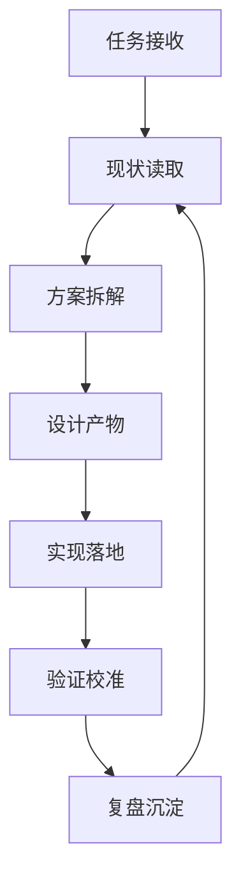

# AI Agent 循环工程标准化设计方案

## 一、目标

围绕“无线电台执照有效期管理”这一当前设计方案，建立一套可复用、可审计、可交付的 AI Agent 循环工程（Loop Engineering）标准流程，用于指导后续所有“需求理解 -> 方案设计 -> 实现 -> 验证 -> 复盘”的闭环执行。

其中，真正的 Agent 执行闭环不是只写文档，而是遵循：

```text
自执行 -> 自检 -> 自修正 -> 再验证 -> 迭代推进
```

具体执行协议见：

```text
agent-loop/AUTO-LOOP-RUNBOOK.md
```

这套流程的核心目标有三点：

1. 让 Agent 的工作有固定输入、固定输出和固定检查点。
2. 让每一轮循环都能沉淀为可复用的文档、模板、清单和决策记录。
3. 让“设计方案”不只停留在文字层面，而是能稳定推进到页面、接口、数据模型、任务和测试。

## 二、适用范围

本规范适用于以下场景：

- 新功能设计
- 现有模块重构
- 需求分析与方案拆解
- 任务分解与里程碑管理
- 接口、数据结构、页面、定时任务设计
- 测试验证与上线前检查

当前示例场景为：

- 无线电台执照有效期管理
- 执照信息手工录入
- 单个或多个频率维护
- 执照/许可证/许可批复附件管理
- 到期前 30 天自动提醒

## 三、Loop Engineering 总体原则

### 3.1 闭环原则

每一次工程循环必须包含以下 6 个动作：

1. 读取输入
2. 形成判断
3. 产出方案
4. 形成执行项
5. 验证结果
6. 记录沉淀

每一次开发循环必须包含以下 5 个动作：

1. 自执行
2. 自检
3. 自修正
4. 再验证
5. 记录并推进

### 3.2 标准化原则

- 同类任务使用同一套阶段定义。
- 同类输出使用同一套命名和结构。
- 同类风险使用同一套检查项。
- 同类验收使用同一套退出标准。

### 3.3 低歧义原则

Agent 在每轮循环中只允许做一件主事：

- 需求不清时先澄清。
- 方案不全时先补齐。
- 设计不稳时先收敛。
- 实现不确定时先验证。

### 3.4 可追踪原则

每一轮循环都必须留下：

- 当前输入
- 当前决策
- 当前输出
- 当前未解决项
- 下一轮动作

## 四、标准循环流程

### 4.1 阶段划分

标准 Loop Engineering 分为 7 个阶段：

| 阶段 | 名称 | 目标 |
| --- | --- | --- |
| L0 | 任务接收 | 明确要解决什么 |
| L1 | 现状读取 | 搞清系统、约束和上下文 |
| L2 | 方案拆解 | 把问题拆成可执行子任务 |
| L3 | 设计产物 | 形成结构化方案 |
| L4 | 实现落地 | 变成代码、页面、接口或任务 |
| L5 | 验证校准 | 用测试和检查修正偏差 |
| L6 | 复盘沉淀 | 把经验写回知识库 |

### 4.2 流程图



## 五、各阶段标准定义

### 5.1 L0 任务接收

输入：

- 用户原始需求
- 当前设计方案
- 目标系统边界

动作：

- 提取目标
- 识别隐含要求
- 标记不确定项

输出：

- 任务目标
- 范围说明
- 风险提示
- 待澄清项

退出标准：

- 知道要做什么
- 知道不做什么

### 5.2 L1 现状读取

输入：

- 仓库结构
- 现有模块约定
- 当前方案文档

动作：

- 识别已有模块
- 识别可复用能力
- 识别约束边界

输出：

- 现状摘要
- 可复用资产清单
- 技术约束清单

退出标准：

- 已明确和现有系统如何对接

### 5.3 L2 方案拆解

输入：

- 需求目标
- 系统现状

动作：

- 拆成页面、接口、数据、权限、任务、测试六类任务
- 识别阶段依赖关系
- 给出优先级

输出：

- 任务树
- 里程碑
- 依赖图

退出标准：

- 每个任务都能独立被执行

### 5.4 L3 设计产物

输入：

- 任务树
- 设计约束

动作：

- 形成正式设计文档
- 补齐数据模型、接口、流程、权限、验收标准

输出：

- Markdown 设计方案
- 字段表
- 接口表
- 流程图
- 验收清单

退出标准：

- 设计内容可以直接进入实现阶段

### 5.5 L4 实现落地

输入：

- 设计文档
- 代码仓库

动作：

- 创建模块
- 编写模型、接口、页面、任务
- 接入权限和日志

输出：

- 可运行功能
- 可检查代码

退出标准：

- 功能能跑起来
- 关键路径能被访问

### 5.6 L5 验证校准

输入：

- 实现结果
- 验收标准

动作：

- 跑测试
- 看页面
- 校验边界条件
- 修正偏差

输出：

- 验证结论
- 缺陷列表
- 修复记录

退出标准：

- 关键验收项通过

### 5.7 L6 复盘沉淀

输入：

- 设计方案
- 实现结果
- 验证结果

动作：

- 记录有效做法
- 记录失败教训
- 沉淀模板和清单

输出：

- 复盘文档
- 模板文件
- 经验规则

退出标准：

- 下一轮可以直接复用

## 六、标准交付物

每一轮 Loop Engineering 至少包含以下交付物：

| 交付物 | 说明 |
| --- | --- |
| 需求摘要 | 问题是什么，目标是什么 |
| 现状摘要 | 当前系统如何，能复用什么 |
| 方案文档 | 详细设计方案 |
| 任务清单 | 可执行的拆解项 |
| 风险清单 | 需要提前防范的点 |
| 验收清单 | 如何判断做完 |
| 复盘记录 | 哪些做法值得保留 |

## 七、标准文件结构

建议 `agent-loop` 目录采用如下结构：

```text
agent-loop/
  AI Agent 循环工程标准化设计方案.md
  00-intake.md
  01-context.md
  02-plan.md
  03-design.md
  04-implement.md
  05-verify.md
  06-retro.md
  templates/
    design-template.md
    task-template.md
    review-template.md
```

说明：

- `00-intake.md`：收集任务原始输入
- `01-context.md`：读取仓库和当前方案
- `02-plan.md`：拆分任务和里程碑
- `03-design.md`：正式设计文档
- `04-implement.md`：实现记录
- `05-verify.md`：测试和验收记录
- `06-retro.md`：复盘沉淀

## 八、标准决策规则

### 8.1 决策优先级

1. 先满足业务正确性
2. 再满足数据一致性
3. 再满足可维护性
4. 最后考虑额外优化

### 8.2 不做事项

- 不在需求未明确时直接扩展范围
- 不在设计未稳定时贸然编码
- 不在验证未通过时结束任务
- 不把临时判断当成长期规则

### 8.3 变更规则

任何变更都必须满足：

- 有明确原因
- 有影响范围说明
- 有回退/替代方案
- 有验证方式

## 九、以无线电台执照管理为例的 Loop 映射

### 9.1 任务输入

- 新增无线电台执照有效期管理
- 支持台站、频率、日期、用途、附件
- 到期前 30 天提醒

### 9.2 Loop 输出示例

L1 现状读取：

- 发现项目已存在 `device`、`interference`、`document` 等模块
- 可复用多租户、审计、上传、定时任务能力

L2 方案拆解：

- 数据模型
- 附件管理
- 提醒任务
- 列表和表单
- 权限
- 测试

L3 设计产物：

- 主表、频率表、附件表、提醒表
- 列表页、编辑页、详情页
- Celery Beat 定时扫描

L5 验证校准：

- 30 天边界
- 多频率录入
- 附件下载权限
- 提醒不重复

## 十、标准检查清单

每轮循环结束前检查以下内容：

- 目标是否清晰
- 范围是否收敛
- 依赖是否明确
- 设计是否可执行
- 风险是否可控
- 验收是否可测
- 文档是否已沉淀

## 十一、建议落地方式

本项目中建议将 Loop Engineering 作为“方案到实现”的统一方法论，用于：

- 新功能设计
- 重构方案编写
- 任务拆解与评审
- 联调前检查
- 验收前归档

对当前无线电台执照有效期管理方案，推荐执行顺序为：

1. 先固化设计方案
2. 再拆解成任务包
3. 再按任务包实现
4. 再按验收清单验证
5. 最后回写复盘文档

## 十二、结语

Loop Engineering 的价值不在于“多绕几圈”，而在于让每一圈都有产出、有判断、有校准。对于无线电台执照有效期管理这类业务，最适合采用这种方式：先把需求讲清，再把方案压实，再把实现和验证一层层闭环，最后把经验留下来，供下一次继续复用。
