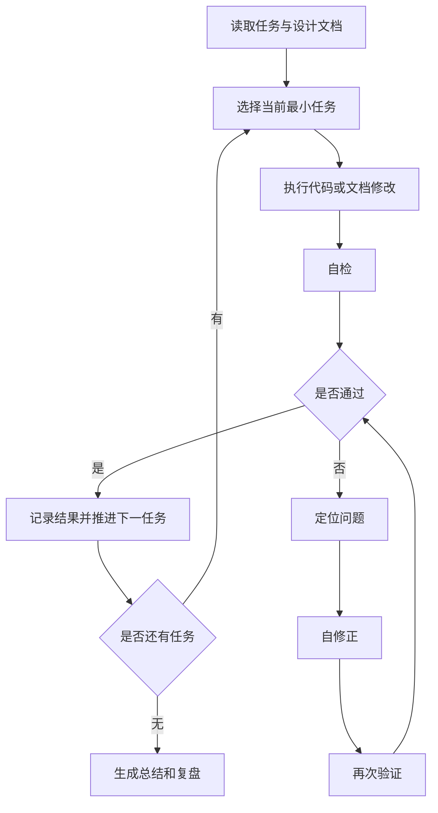

# AI Agent 自动闭环执行手册

## 一、定位

本文件定义 AI Agent 在开发“无线电台执照有效期管理”时的自动闭环工作方式。

它不是普通设计文档，而是 Agent 执行任务时必须遵守的运行协议。

核心循环：

```text
自执行 -> 自检 -> 自修正 -> 再验证 -> 迭代推进
```

## 二、自动闭环总流程



## 三、每轮循环标准

每一轮 Agent 循环必须控制在一个最小可验证任务内。

示例：

- 新增一个模型。
- 新增一个接口。
- 新增一个页面表单。
- 补一个测试场景。
- 修复一个验证失败项。

每轮都必须包含：

| 环节 | 说明 |
| --- | --- |
| 自执行 | 按当前任务修改代码、文档或配置 |
| 自检 | 运行静态检查、单元测试、接口检查或人工可验证检查 |
| 自修正 | 根据失败原因主动修复，不等待用户指出 |
| 再验证 | 修复后重复执行相关检查 |
| 记录 | 更新 `04-implement.md`、`05-verify.md` 或 `06-retro.md` |

## 四、Agent 执行规则

### 4.1 任务选择规则

Agent 每次只选择 `02-plan.md` 中一个明确任务执行。

优先级：

1. P0 任务优先。
2. 后端模型优先于接口。
3. 接口优先于前端。
4. 核心路径优先于扩展能力。
5. 验证失败项优先于新功能。

### 4.2 自执行规则

执行前必须确认：

- 当前任务属于本轮范围。
- 所需输入已经在 `00-intake.md`、`01-context.md`、`03-design.md` 中明确。
- 不会修改无关模块。

执行时必须：

- 遵循现有项目风格。
- 小步修改。
- 保持可回看。
- 不做无关重构。

### 4.3 自检规则

自检至少选择一种方式：

| 场景 | 自检方式 |
| --- | --- |
| Python 后端 | 语法检查、单元测试、接口路径检查 |
| Django 模型 | migration 检查、字段检查 |
| 前端代码 | lint、构建、页面运行检查 |
| 定时任务 | 手动触发任务、检查任务输出 |
| 附件能力 | 上传、下载、权限场景验证 |
| 文档产物 | 检查结构、路径、内容是否完整 |

自检失败不能直接结束，必须进入自修正。

### 4.4 自修正规则

出现以下情况必须自动修正：

- 语法错误。
- import 错误。
- 路由未注册。
- 权限编码不一致。
- 字段名不一致。
- 日期边界计算错误。
- 测试失败。
- 页面无法编译。
- 文档和实际实现不一致。

自修正必须遵守：

- 只修当前任务相关问题。
- 不扩大范围。
- 不覆盖用户已有改动。
- 修完必须再次验证。

### 4.5 迭代推进规则

当前任务满足退出标准后，才能推进下一任务。

推进前必须更新：

- `04-implement.md`：记录实际修改。
- `05-verify.md`：记录验证结果。
- 必要时更新 `06-retro.md`：记录经验和问题。

## 五、失败处理规则

### 5.1 可自动修复

以下问题由 Agent 自行处理：

- 代码格式问题。
- 缺少导入。
- 命名不一致。
- 简单测试失败。
- 文档遗漏。
- 接口参数校验遗漏。

### 5.2 需要暂停确认

以下问题需要向用户确认：

- 菜单挂载位置无法判断。
- 附件存储路线必须二选一且影响较大。
- 需求和现有权限体系冲突。
- 需要删除或迁移已有数据。
- 需要引入新依赖。
- 需要改变既有模块行为。

## 六、无线电台执照功能的自动闭环执行顺序

### Loop 1：后端基础模型

自执行：

- 创建 `spug_api/apps/radio_license`。
- 新增执照主表和频率明细表。
- 生成迁移。

自检：

- Django model import 正常。
- migration 可生成或可检查。
- 字段和设计文档一致。

自修正：

- 修复字段类型、表名、索引、tenant_id 等问题。

### Loop 2：后端 CRUD 接口

自执行：

- 实现列表、详情、新增、编辑、删除。
- 接入租户过滤。
- 接入权限。

自检：

- URL 可解析。
- 参数校验符合设计。
- 新增后可查询。

自修正：

- 修复路由、字段、权限、返回结构问题。

### Loop 3：前端基础页面

自执行：

- 新增页面目录。
- 实现列表、筛选、表单、store。

自检：

- 前端编译通过。
- 页面能打开。
- 表单能提交。

自修正：

- 修复 import、字段映射、日期格式、UI 报错。

### Loop 4：附件管理

自执行：

- 新增附件表和接口。
- 实现上传、下载、删除。
- 前端接入附件组件。

自检：

- 上传成功。
- 下载鉴权生效。
- 删除后列表刷新。

自修正：

- 修复文件类型校验、路径、权限问题。

### Loop 5：到期提醒

自执行：

- 新增提醒表。
- 实现状态计算。
- 实现 Celery 扫描任务。
- 接入提醒展示。

自检：

- 45、30、15、7、1 天分级提醒正确。
- 46 天、今天、昨天边界正确。
- 重复执行任务不重复生成同级别提醒。
- 右下角弹窗提醒能展示未读提醒，且同一会话内不重复弹出。

自修正：

- 修复日期计算、去重、状态更新问题。

### Loop 6：验收与复盘

自执行：

- 按 `05-verify.md` 全量验证。
- 修复发现的问题。

自检：

- P0 验收项全部通过。

自修正：

- 对失败项逐项修复并重测。

迭代结束：

- 更新 `06-retro.md`。
- 输出最终总结。

## 七、开发提示词模板

启动自动闭环开发时，可以使用：

```text
请按照 agent-loop/AUTO-LOOP-RUNBOOK.md 的自动闭环协议，
基于 agent-loop/00-intake.md、01-context.md、02-plan.md、03-design.md，
开始开发“无线电台执照有效期管理”。

本轮从 Loop 1 开始，只执行“后端基础模型”。

要求：
1. 自执行：完成当前最小任务。
2. 自检：运行可用检查，确认结果。
3. 自修正：如果检查失败，自动定位并修复。
4. 再验证：修复后重新检查。
5. 记录：更新 agent-loop/04-implement.md 和 agent-loop/05-verify.md。
6. 当前 Loop 通过后再询问是否进入下一 Loop。
```

如果希望全自动连续推进，可以使用：

```text
请按照 agent-loop/AUTO-LOOP-RUNBOOK.md 的自动闭环协议，
从 Loop 1 开始连续开发“无线电台执照有效期管理”。

每个 Loop 都必须执行：
自执行 -> 自检 -> 自修正 -> 再验证 -> 记录。

除非遇到需要用户确认的问题，否则不要停在半成品；
一个 Loop 验证通过后自动进入下一个 Loop。
```

## 八、完成定义

一个自动闭环任务完成必须同时满足：

- 当前 Loop 的功能已实现。
- 当前 Loop 的自检已通过。
- 发现的问题已自修正。
- 修正后已再次验证。
- 实现和验证记录已写入文档。
- 没有遗留未说明的失败项。
