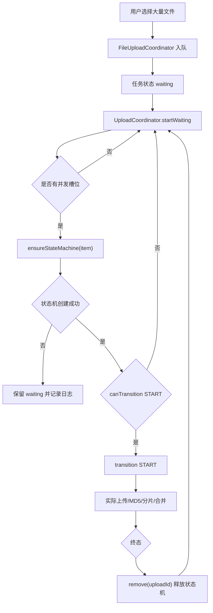

# 03 设计产物

## 设计目标

将上传队列与状态机实例解耦：

- 队列可以容纳大量 waiting 任务。
- 状态机只为即将运行或正在运行的任务存在。
- 调度器负责按需创建状态机。
- 终态任务及时释放状态机。

## 核心流程



## 模块设计

| 模块 | 改造点 | 设计说明 |
| --- | --- | --- |
| `FileUploadCoordinator` | 只负责入队 | 不再批量创建状态机 |
| `UploadCoordinator` | 新增 `ensureStateMachine` | 调度时为即将启动的 waiting 任务创建状态机 |
| `StateMachineManager` | 保留上限与 cleanup | 上限作为异常保护，不作为队列容量 |
| `StateChangeHandler` | 终态释放状态机 | completed/error/cancelled 后 remove |
| `upload.js` | 明确显示限制 | `MAX_DISPLAY_COUNT` 不参与调度 |

## `ensureStateMachine(item)` 设计

职责：

- 如果状态机已存在，直接返回。
- 如果不存在，根据队列 item 补齐状态机 context。
- 创建失败时记录可排查日志，并返回 `null`。
- 不修改队列状态为 error，避免临时资源不足导致任务永久失败。

伪代码：

```js
ensureStateMachine(item) {
  let stateMachine = this.core.stateMachineManager?.get(item.id);
  if (stateMachine) {
    return stateMachine;
  }

  stateMachine = this.core.stateMachineManager?.create(item.id, {
    queueStore: this.core.queueStore,
    transferStore: this.core.transferStore,
    md5Store: this.core.md5Store,
    file: item.file,
    folderId: item.folderId,
    item,
  });

  if (!stateMachine) {
    console.error('[UploadCoordinator] 状态机创建失败', {
      uploadId: item.id,
      name: item.name,
      machineCount: this.core.stateMachineManager?.size?.(),
      activeUploads: this.core.activeUploads,
    });
    return null;
  }

  return stateMachine;
}
```

## `startWaiting()` 设计

原设计问题：

```js
const sm = this.core.stateMachineManager?.get(item.id);
return sm && sm.canTransition('START');
```

新设计：

```js
const waitingItems = queue.filter(item => item.status === 'waiting');

for (const item of waitingItems) {
  if (startedCount >= availableSlots) break;

  const stateMachine = this.ensureStateMachine(item);
  if (!stateMachine) continue;

  if (stateMachine.canTransition('START')) {
    stateMachine.transition('START');
    startedCount++;
  }
}
```

## 终态释放设计

终态包括：

```text
completed
error
cancelled
```

释放策略：

- 默认终态后立即释放状态机。
- 如果 UI 或调试需要读取历史，可改成延迟释放。
- 定时 `cleanup()` 继续作为兜底。

伪代码：

```js
if (['completed', 'error', 'cancelled'].includes(toState)) {
  setTimeout(() => {
    this.core.stateMachineManager?.remove(uploadId);
  }, 0);
}
```

## 验收标准

- 870 个文件一次入队后，上传不会停在第 200 个。
- waiting 任务即使入队时没有状态机，也能被调度启动。
- 状态机数量随活跃任务和短期历史变化，不等于总任务数。
- 控制台无空状态机调用异常。
- 传输列表可正常交互。

## 退出标准

- 设计内容可直接进入实现。
- 状态机懒创建、调度、释放三个关键动作已明确。
- 验收标准可测试。
