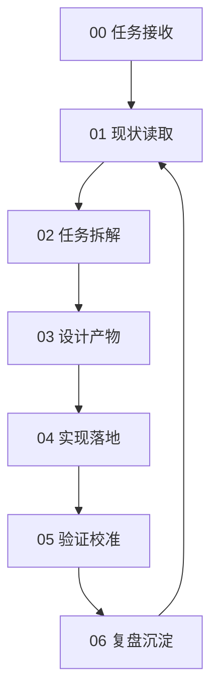

# 资料库批量上传 200 任务卡住 Loop Engineering

## 一、目标

围绕“资料库批量上传大量任务时在第 200 个附近卡住”的问题，建立一套可执行、可审计、可复盘的 Loop Engineering 闭环。

本闭环的目标不是只写修复建议，而是把问题从发现、定位、设计、实现、验证到沉淀全部结构化，确保后续 Agent 或开发者可以直接按照 `zlkloop` 目录推进修复。

## 二、适用范围

本 Loop 适用于资料库上传模块中的以下问题：

- 一次上传 870 个或更多文件时，第 200 个附近停止调度。
- waiting 任务不再继续上传。
- 传输列表点击无响应或前端上传模块局部失效。
- 状态机实例数量与上传队列数量耦合。
- `StateMachineManager.create()` 返回 `null` 后调用方未兜底。

不包含以下问题：

- 多终端同时上传导致整体速度慢。
- 后端磁盘、网络、Celery 队列容量评估。
- 上传 UI 视觉重设计。
- 后端上传协议重构。

## 三、核心判断

当前问题的关键不是后端最多只能上传 200 个文件，而是前端存在以下链路：

```text
入队时批量创建状态机
  -> StateMachineManager.MAX_MACHINES = 200
  -> 第 201 个以后 create() 可能返回 null
  -> startWaiting() 只调度已有状态机的 waiting 任务
  -> 后续任务无法启动
```

因此，本轮生产级修复原则是：

```text
队列无限制，状态机懒创建，终态及时释放。
```

## 四、目录说明

| 文件 | 阶段 | 用途 |
| --- | --- | --- |
| `00-intake.md` | 任务接收 | 明确问题、目标、范围和不确定项 |
| `01-context.md` | 现状读取 | 记录代码结构、现有能力和风险 |
| `02-plan.md` | 任务拆解 | 拆分实现任务、优先级和依赖 |
| `03-design.md` | 设计产物 | 定义懒创建、调度和释放方案 |
| `04-implement.md` | 实现落地 | 给出改造文件、步骤和关键代码形态 |
| `05-verify.md` | 验证校准 | 定义测试命令、870 任务验证和观测指标 |
| `06-retro.md` | 复盘沉淀 | 沉淀经验、教训和下一轮建议 |

## 五、执行流程



## 六、关键修复策略

### 1. 不再入队时批量创建状态机

入队阶段只负责创建 queue item。不要因为一次上传 870 个文件，就立即创建 870 个状态机。

### 2. 调度时懒创建状态机

在 `UploadCoordinator` 中新增 `ensureStateMachine(item)`。只有任务即将占用上传槽位时，才创建状态机。

### 3. 修改 waiting 调度逻辑

`startWaiting()` 不再过滤“必须已有状态机”的任务，而是先找 waiting 任务，再为即将启动的任务补齐状态机。

### 4. 终态及时释放状态机

任务进入 `completed`、`error`、`cancelled` 后调用 `stateMachineManager.remove(uploadId)`，避免状态机数量随总任务数持续增长。

### 5. `create()` 调用点必须判空

任何状态机创建失败都不能导致 UI 崩溃，也不能直接让传输列表失效。

## 七、验收标准

修复完成后必须满足：

- 一次上传 870 个任务不会停在第 200 个。
- 第 201 个以后 waiting 任务可以继续被调度。
- 浏览器控制台无状态机空对象异常。
- 传输列表可正常打开、滚动、点击。
- `activeUploads` 不超过 `MAX_CONCURRENT_UPLOADS`。
- `stateMachineManager.size()` 不等于上传总任务数，并能随任务终态释放下降。

## 八、后续扩展

完成本轮后，建议新建独立 Loop 处理“多个终端同时上传变慢”的性能问题，重点关注：

- 前端多客户端并发叠加。
- 后端分片上传接口耗时。
- 文件落盘和合并 I/O。
- Celery 合并队列积压。
- Gunicorn worker 配置。
- 服务端全局上传背压。
