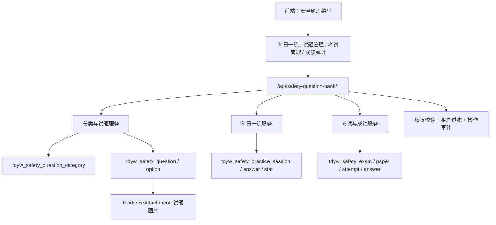
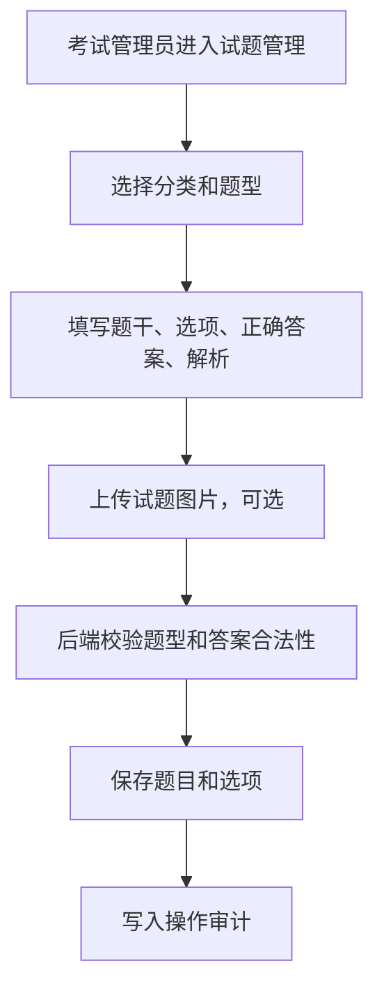
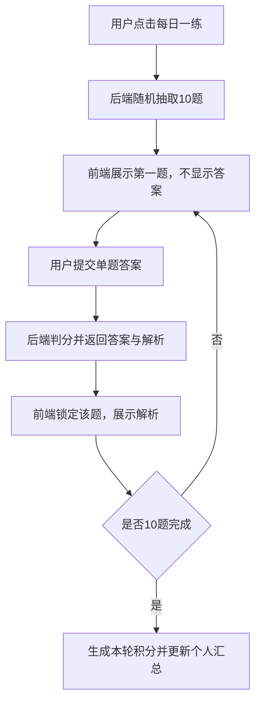
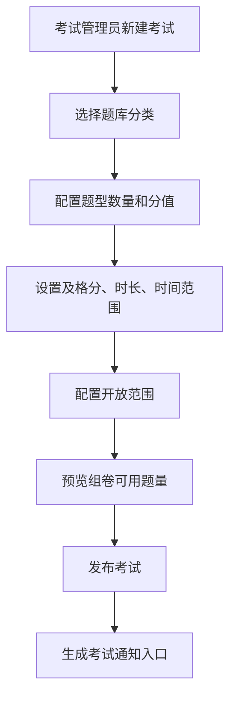
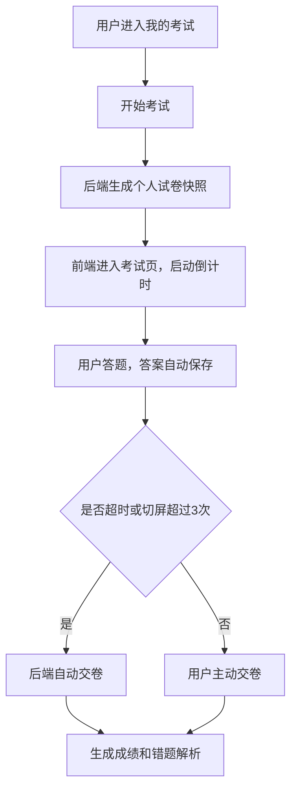

# 安全题库模块设计方案

> 编写日期：2026-07-10  
> 适用范围：安全题库分类、每日一练、试题维护、在线考试、成绩统计与导出  
> 建议模块名：后端 `apps.safety_question_bank`，前端 `spug_web/src/pages/safetyQuestionBank`

## 1. 结论

安全题库建议作为独立业务模块建设，复用项目现有的账号、角色权限、租户隔离、操作审计、通用附件预览与前端 MobX + Ant Design 页面模式。

整体菜单建议为：

```text
安全题库
  - 每日一练
  - 题库分类
  - 试题管理
  - 考试管理
  - 我的考试
  - 成绩统计
```

核心实现策略：

1. 后端新增 `spug_api/apps/safety_question_bank/`，统一承载分类、试题、练习、考试、成绩。
2. 每道题保存题干、题型、解析、选项、正确答案、图片附件、维护部门、适用范围。
3. “每日一练”从专属题库随机抽取 10 题，用户逐题作答后立即返回答案与解析，答对每题积 1 分，答错不扣分。
4. 在线考试在用户开始考试时生成固定试卷快照，考试中不暴露答案，交卷后生成成绩与错题解析。
5. 考试权限支持“完全公开”“部门开放”“部门选人”，需要补齐项目当前缺失的通用部门归属能力。
6. 防切屏由前端监听 + 后端计数双重控制，超过 3 次自动交卷；超时由接口实时校验和 Celery 定时任务兜底处理。

## 2. 项目现状依据

### 2.1 后端现状

当前项目后端为 Django 应用结构，业务模块位于：

```text
spug_api/apps/
```

已有模块示例：

```text
spug_api/apps/radio_license/
spug_api/apps/checksheet/
spug_api/apps/duty/
spug_api/apps/document/
spug_api/apps/logs/
```

根路由位于：

```text
spug_api/spug/urls.py
```

现有业务模块通过如下方式挂载：

```python
path('radio-license/', include('apps.radio_license.urls'))
path('checksheet/', include('apps.checksheet.urls'))
```

安全题库建议新增：

```python
path('safety-question-bank/', include('apps.safety_question_bank.urls'))
```

### 2.2 租户隔离

项目已经有租户混入：

```text
spug_api/libs/tenant_base_model.py
```

业务模型建议沿用：

```python
class Xxx(models.Model, TenantModelMixin):
    objects = TenantModelManager()
    tenant_id = make_tenant_id()
```

接口查询时沿用：

```python
apply_tenant_filter(Model.objects.all(), request.user)
assign_tenant_id(form, request.user)
```

安全题库所有业务表都必须带 `tenant_id`，避免不同租户之间的题库、考试、成绩互相可见。

### 2.3 账号和权限

当前用户模型位于：

```text
spug_api/apps/account/models.py
```

`User` 已具备：

```text
id / username / nickname / tenant_id / roles / is_active
```

但当前没有通用部门字段。需求中的“部门内排名”“部门开放”“部门选人”依赖稳定部门关系，建议补一个轻量部门基础能力：

1. 新增 `Department` 表。
2. 在 `User` 上增加 `department_id` 和 `department_name`，或新增 `UserDepartment` 关系表。
3. 业务记录中保存 `department_id_snapshot` 和 `department_name_snapshot`，避免用户调岗后历史成绩归属漂移。

前端权限码配置位于：

```text
spug_web/src/pages/system/role/codes.js
```

安全题库需要在该文件新增权限组。

### 2.4 操作审计

项目已有操作审计：

```text
spug_api/apps/logs/
```

审计映射位于：

```text
spug_api/apps/logs/audit.py
```

安全题库需要在 `TARGET_MAP` 中补充：

```python
'/safety-question-bank/': {'type': 'safety_question_bank', 'name': '安全题库'}
```

题库导入、导出、考试发布、考试作废、自动交卷等关键动作建议显式调用 `record_audit_event()`，便于后续追溯。

### 2.5 附件和图片

项目已有公共附件与预览能力：

```text
spug_api/apps/evidence/attachment_service.py
spug_api/apps/evidence/models.py
```

试题图片不建议单独写一套上传逻辑，建议复用 `EvidenceAttachment`：

```text
module = safety_question_bank
object_type = question
object_id = question.id
```

前端试题图片上传、预览、删除可复用已有附件服务思路。

### 2.6 前端现状

当前前端为 React + MobX + Ant Design。路由位于：

```text
spug_web/src/routes.js
```

页面一般按模块目录组织，例如：

```text
spug_web/src/pages/radioLicense/
  index.js
  store.js
  Table.js
  Form.js
```

安全题库建议新增：

```text
spug_web/src/pages/safetyQuestionBank/
  index.js
  store.js
  CategoryManager.js
  QuestionManager.js
  QuestionForm.js
  DailyPractice.js
  PracticeRank.js
  ExamManager.js
  ExamForm.js
  ExamCenter.js
  ExamRoom.js
  ScoreManager.js
```

## 3. 业务角色与权限边界

### 3.1 角色建议

| 角色 | 职责 |
|---|---|
| 普通用户 | 参加每日一练、参加考试、查看个人积分和个人成绩 |
| 部门考试管理员 | 维护本部门考试题库，配置本部门考试，查看本部门成绩 |
| 安全管理科室管理员 | 维护每日一练专属题库，查看全平台练习和考试统计 |
| 平台管理员 | 分类维护、权限配置、全平台数据治理 |

### 3.2 权限码建议

在 `spug_web/src/pages/system/role/codes.js` 新增：

```javascript
{
  key: 'safety_question_bank',
  label: '安全题库',
  pages: [{
    key: 'category',
    label: '题库分类',
    perms: [
      {key: 'view', label: '查看分类'},
      {key: 'add', label: '新增分类'},
      {key: 'edit', label: '编辑分类'},
      {key: 'del', label: '删除分类'},
    ]
  }, {
    key: 'question',
    label: '试题管理',
    perms: [
      {key: 'view', label: '查看试题'},
      {key: 'add', label: '新增试题'},
      {key: 'edit', label: '编辑试题'},
      {key: 'del', label: '删除试题'},
      {key: 'import', label: '导入试题'},
      {key: 'export', label: '导出试题'},
      {key: 'daily_manage', label: '维护每日一练题库'},
    ]
  }, {
    key: 'practice',
    label: '每日一练',
    perms: [
      {key: 'view', label: '参加每日一练'},
      {key: 'rank', label: '查看积分排名'},
    ]
  }, {
    key: 'exam',
    label: '考试管理',
    perms: [
      {key: 'view', label: '查看考试'},
      {key: 'add', label: '新建考试'},
      {key: 'edit', label: '编辑考试'},
      {key: 'del', label: '删除考试'},
      {key: 'publish', label: '发布考试'},
      {key: 'answer', label: '参加考试'},
    ]
  }, {
    key: 'score',
    label: '成绩管理',
    perms: [
      {key: 'view', label: '查看成绩'},
      {key: 'export', label: '导出成绩'},
    ]
  }]
}
```

### 3.3 数据边界

1. 普通用户只能看到自己的练习、积分、考试和成绩。
2. 部门考试管理员只能维护本部门可维护分类下的试题，只能查看本部门考试成绩。
3. 安全管理科室管理员可维护 `daily` 范围题库，可查看全平台每日一练统计。
4. 超级管理员和全局管理员可跨部门管理。

## 4. 总体架构



## 5. 数据模型设计

### 5.1 部门基础表

如果项目后续已有组织架构模块，可复用已有表；当前项目没有通用部门模型，建议新增：

```python
class Department(models.Model, TenantModelMixin):
    objects = TenantModelManager()
    tenant_id = make_tenant_id()

    name = models.CharField(max_length=100)
    parent_id = models.IntegerField(null=True, blank=True)
    sort_order = models.IntegerField(default=0)
    is_active = models.BooleanField(default=True)
    created_at = models.CharField(max_length=20, default=human_datetime)
    created_by = models.ForeignKey(User, models.PROTECT, related_name='+', null=True)
```

表名建议：

```text
tdyw_department
```

`User` 建议补充：

```python
department_id = models.IntegerField(null=True, blank=True, db_index=True)
department_name = models.CharField(max_length=100, default='', blank=True)
```

如果不希望直接修改 `users` 表，也可新增：

```text
tdyw_user_department
```

但从账户管理、考试授权、成绩统计的长期一致性看，直接在用户资料中维护部门更清晰。

### 5.2 题库分类表

```python
class SafetyQuestionCategory(models.Model, TenantModelMixin):
    objects = TenantModelManager()
    tenant_id = make_tenant_id()

    name = models.CharField(max_length=100)
    code = models.CharField(max_length=50, default='', blank=True)
    parent_id = models.IntegerField(null=True, blank=True)
    description = models.CharField(max_length=500, default='', blank=True)
    scope = models.CharField(max_length=20, default='exam')
    owner_department_id = models.IntegerField(null=True, blank=True)
    owner_department_name = models.CharField(max_length=100, default='', blank=True)
    sort_order = models.IntegerField(default=0)
    is_active = models.BooleanField(default=True)

    created_at = models.CharField(max_length=20, default=human_datetime)
    created_by = models.ForeignKey(User, models.PROTECT, related_name='+')
    updated_at = models.CharField(max_length=20, null=True, blank=True)
    updated_by = models.ForeignKey(User, models.PROTECT, related_name='+', null=True)
```

表名：

```text
tdyw_safety_question_category
```

字段说明：

| 字段 | 说明 |
|---|---|
| `scope` | `exam` 考试题库、`daily` 每日一练题库、`both` 两者都可用 |
| `owner_department_id` | 维护部门，部门管理员只能维护自己部门范围 |
| `is_active` | 分类停用后不再用于抽题，但历史题目和成绩保留 |

默认分类建议初始化：

```text
设备运维安全
管制操作安全
应急处置
法规知识
案例分析
每日一练
```

### 5.3 试题表

```python
QUESTION_TYPE_CHOICES = (
    ('single', '单选'),
    ('multiple', '多选'),
    ('judge', '判断'),
)

QUESTION_STATUS_CHOICES = (
    ('draft', '草稿'),
    ('active', '启用'),
    ('disabled', '停用'),
)

class SafetyQuestion(models.Model, TenantModelMixin):
    objects = TenantModelManager()
    tenant_id = make_tenant_id()

    category = models.ForeignKey(SafetyQuestionCategory, models.PROTECT, related_name='questions')
    question_type = models.CharField(max_length=20, choices=QUESTION_TYPE_CHOICES)
    stem = models.TextField()
    analysis = models.TextField(default='', blank=True)
    difficulty = models.CharField(max_length=20, default='normal')
    status = models.CharField(max_length=20, choices=QUESTION_STATUS_CHOICES, default='active')
    scope = models.CharField(max_length=20, default='exam')
    source_department_id = models.IntegerField(null=True, blank=True)
    source_department_name = models.CharField(max_length=100, default='', blank=True)
    image_count = models.IntegerField(default=0)

    created_at = models.CharField(max_length=20, default=human_datetime)
    created_by = models.ForeignKey(User, models.PROTECT, related_name='+')
    updated_at = models.CharField(max_length=20, null=True, blank=True)
    updated_by = models.ForeignKey(User, models.PROTECT, related_name='+', null=True)
    deleted_at = models.CharField(max_length=20, null=True, blank=True)
    deleted_by = models.ForeignKey(User, models.PROTECT, related_name='+', null=True)
```

表名：

```text
tdyw_safety_question
```

删除策略：

1. 已被练习或考试引用的试题只允许软删除或停用。
2. 未被引用的草稿题可以物理删除。
3. 考试开始后题目内容必须以快照保存，后续修改题库不影响历史试卷和成绩。

### 5.4 试题选项表

```python
class SafetyQuestionOption(models.Model, TenantModelMixin):
    objects = TenantModelManager()
    tenant_id = make_tenant_id()

    question = models.ForeignKey(SafetyQuestion, models.CASCADE, related_name='options')
    option_key = models.CharField(max_length=5)
    content = models.TextField()
    is_correct = models.BooleanField(default=False)
    sort_order = models.IntegerField(default=0)
```

表名：

```text
tdyw_safety_question_option
```

单选题要求仅 1 个正确选项；多选题要求至少 2 个正确选项；判断题固定两个选项：

```text
A. 正确
B. 错误
```

### 5.5 每日一练会话表

```python
class SafetyPracticeSession(models.Model, TenantModelMixin):
    objects = TenantModelManager()
    tenant_id = make_tenant_id()

    user_id = models.IntegerField(db_index=True)
    user_name = models.CharField(max_length=100)
    department_id = models.IntegerField(null=True, blank=True)
    department_name = models.CharField(max_length=100, default='', blank=True)
    practice_date = models.DateField()
    status = models.CharField(max_length=20, default='in_progress')
    total_count = models.IntegerField(default=10)
    answered_count = models.IntegerField(default=0)
    correct_count = models.IntegerField(default=0)
    score = models.IntegerField(default=0)
    started_at = models.CharField(max_length=20, default=human_datetime)
    completed_at = models.CharField(max_length=20, null=True, blank=True)
```

表名：

```text
tdyw_safety_practice_session
```

### 5.6 每日一练答题表

```python
class SafetyPracticeAnswer(models.Model, TenantModelMixin):
    objects = TenantModelManager()
    tenant_id = make_tenant_id()

    session = models.ForeignKey(SafetyPracticeSession, models.CASCADE, related_name='answers')
    question = models.ForeignKey(SafetyQuestion, models.PROTECT)
    question_snapshot = models.TextField()
    selected_answer = models.TextField(default='[]')
    correct_answer = models.TextField(default='[]')
    is_correct = models.BooleanField(default=False)
    score = models.IntegerField(default=0)
    answered_at = models.CharField(max_length=20, null=True, blank=True)
```

表名：

```text
tdyw_safety_practice_answer
```

设计要点：

1. 用户答题前接口不返回 `correct_answer` 和 `analysis`。
2. 用户提交单题答案后，后端返回是否正确、正确答案、解析。
3. 单题提交后锁定，不允许修改，避免反复试答案。
4. `question_snapshot` 保存题目、选项、解析快照，题库后续修改不影响历史练习记录。

### 5.7 个人积分汇总表

```python
class SafetyPracticeStat(models.Model, TenantModelMixin):
    objects = TenantModelManager()
    tenant_id = make_tenant_id()

    user_id = models.IntegerField(db_index=True)
    user_name = models.CharField(max_length=100)
    department_id = models.IntegerField(null=True, blank=True, db_index=True)
    department_name = models.CharField(max_length=100, default='', blank=True)
    total_score = models.IntegerField(default=0)
    practice_times = models.IntegerField(default=0)
    answered_count = models.IntegerField(default=0)
    correct_count = models.IntegerField(default=0)
    last_practice_at = models.CharField(max_length=20, null=True, blank=True)
```

表名：

```text
tdyw_safety_practice_stat
```

正确率计算：

```text
correct_rate = correct_count / answered_count
```

排名规则：

```text
优先 total_score 倒序
其次 correct_rate 倒序
再次 last_practice_at 升序
最后 user_id 升序
```

### 5.8 考试主表

```python
EXAM_OPEN_TYPE_CHOICES = (
    ('public', '完全公开'),
    ('department', '部门开放'),
    ('department_user', '部门选人'),
)

class SafetyExam(models.Model, TenantModelMixin):
    objects = TenantModelManager()
    tenant_id = make_tenant_id()

    title = models.CharField(max_length=200)
    description = models.TextField(default='', blank=True)
    status = models.CharField(max_length=20, default='draft')
    open_type = models.CharField(max_length=30, choices=EXAM_OPEN_TYPE_CHOICES)
    question_config = models.TextField()
    pass_score = models.IntegerField(default=60)
    duration_minutes = models.IntegerField(default=60)
    start_time = models.DateTimeField()
    end_time = models.DateTimeField()
    max_switch_count = models.IntegerField(default=3)
    anti_switch_enabled = models.BooleanField(default=True)
    allow_retake = models.BooleanField(default=False)

    created_at = models.CharField(max_length=20, default=human_datetime)
    created_by = models.ForeignKey(User, models.PROTECT, related_name='+')
    updated_at = models.CharField(max_length=20, null=True, blank=True)
    updated_by = models.ForeignKey(User, models.PROTECT, related_name='+', null=True)
    published_at = models.CharField(max_length=20, null=True, blank=True)
    published_by = models.ForeignKey(User, models.PROTECT, related_name='+', null=True)
```

表名：

```text
tdyw_safety_exam
```

`question_config` 示例：

```json
{
  "categories": [1, 2, 3],
  "rules": [
    {"question_type": "single", "count": 20, "score": 2},
    {"question_type": "multiple", "count": 10, "score": 3},
    {"question_type": "judge", "count": 10, "score": 1}
  ]
}
```

校验规则：

1. 考试时长限制为 10 到 120 分钟。
2. 及格分数不能超过试卷总分。
3. 发布时间范围必须满足 `start_time < end_time`。
4. 抽题数量不能超过符合条件的启用题数量。
5. 已发布考试若已有用户开始考试，不允许修改题型数量、分值和时间范围，只允许作废后重建。

### 5.9 考试授权表

```python
class SafetyExamTarget(models.Model, TenantModelMixin):
    objects = TenantModelManager()
    tenant_id = make_tenant_id()

    exam = models.ForeignKey(SafetyExam, models.CASCADE, related_name='targets')
    department_id = models.IntegerField(null=True, blank=True)
    department_name = models.CharField(max_length=100, default='', blank=True)
    user_id = models.IntegerField(null=True, blank=True)
    user_name = models.CharField(max_length=100, default='', blank=True)
```

表名：

```text
tdyw_safety_exam_target
```

授权解释：

| `open_type` | 授权表用法 |
|---|---|
| `public` | 不需要授权明细，当前租户所有启用用户可参加 |
| `department` | 写入开放部门，部门下所有启用用户可参加 |
| `department_user` | 写入部门和指定用户，只有选中的用户可参加 |

### 5.10 考试试卷表

```python
class SafetyExamPaper(models.Model, TenantModelMixin):
    objects = TenantModelManager()
    tenant_id = make_tenant_id()

    exam = models.ForeignKey(SafetyExam, models.PROTECT, related_name='papers')
    user_id = models.IntegerField(db_index=True)
    question_order = models.TextField()
    total_score = models.IntegerField(default=0)
    generated_at = models.CharField(max_length=20, default=human_datetime)
```

表名：

```text
tdyw_safety_exam_paper
```

`question_order` 保存固定试卷快照：

```json
[
  {"question_id": 101, "score": 2},
  {"question_id": 205, "score": 3}
]
```

### 5.11 考试作答表

```python
class SafetyExamAttempt(models.Model, TenantModelMixin):
    objects = TenantModelManager()
    tenant_id = make_tenant_id()

    exam = models.ForeignKey(SafetyExam, models.PROTECT, related_name='attempts')
    paper = models.ForeignKey(SafetyExamPaper, models.PROTECT, related_name='attempts')
    user_id = models.IntegerField(db_index=True)
    user_name = models.CharField(max_length=100)
    department_id = models.IntegerField(null=True, blank=True)
    department_name = models.CharField(max_length=100, default='', blank=True)
    status = models.CharField(max_length=30, default='in_progress')
    started_at = models.DateTimeField()
    deadline_at = models.DateTimeField()
    submitted_at = models.DateTimeField(null=True, blank=True)
    submit_reason = models.CharField(max_length=30, default='')
    score = models.IntegerField(default=0)
    total_score = models.IntegerField(default=0)
    is_passed = models.BooleanField(default=False)
    switch_count = models.IntegerField(default=0)
    ip = models.CharField(max_length=50, default='')
    user_agent = models.CharField(max_length=500, default='', blank=True)
```

表名：

```text
tdyw_safety_exam_attempt
```

`status` 建议值：

```text
in_progress
submitted
auto_submitted_timeout
auto_submitted_switch
voided
```

### 5.12 考试答案表

```python
class SafetyExamAnswer(models.Model, TenantModelMixin):
    objects = TenantModelManager()
    tenant_id = make_tenant_id()

    attempt = models.ForeignKey(SafetyExamAttempt, models.CASCADE, related_name='answers')
    question = models.ForeignKey(SafetyQuestion, models.PROTECT)
    question_snapshot = models.TextField()
    selected_answer = models.TextField(default='[]')
    correct_answer = models.TextField(default='[]')
    is_correct = models.BooleanField(default=False)
    score = models.IntegerField(default=0)
    full_score = models.IntegerField(default=0)
    answered_at = models.CharField(max_length=20, null=True, blank=True)
```

表名：

```text
tdyw_safety_exam_answer
```

考试期间前端不返回 `correct_answer` 和解析；交卷后查看错题解析时再返回。

## 6. 索引与约束

### 6.1 题库索引

| 表 | 索引 | 用途 |
|---|---|---|
| `tdyw_safety_question_category` | `tenant_id, scope, is_active` | 分类筛选 |
| `tdyw_safety_question` | `tenant_id, category_id, question_type, status, scope` | 抽题、列表筛选 |
| `tdyw_safety_question` | `tenant_id, source_department_id` | 部门管理员维护边界 |
| `tdyw_safety_question_option` | `tenant_id, question_id, sort_order` | 题目选项排序 |

### 6.2 练习索引

| 表 | 索引 | 用途 |
|---|---|---|
| `tdyw_safety_practice_session` | `tenant_id, user_id, practice_date` | 查询个人当日练习 |
| `tdyw_safety_practice_answer` | `tenant_id, session_id, question_id` | 防重复答题 |
| `tdyw_safety_practice_stat` | `tenant_id, total_score` | 全平台排名 |
| `tdyw_safety_practice_stat` | `tenant_id, department_id, total_score` | 部门排名 |

### 6.3 考试索引

| 表 | 索引 | 用途 |
|---|---|---|
| `tdyw_safety_exam` | `tenant_id, status, start_time, end_time` | 我的考试列表 |
| `tdyw_safety_exam_target` | `tenant_id, exam_id, department_id, user_id` | 考试权限判断 |
| `tdyw_safety_exam_attempt` | `tenant_id, exam_id, user_id` | 防重复考试、查成绩 |
| `tdyw_safety_exam_attempt` | `tenant_id, department_id, exam_id` | 部门成绩统计 |
| `tdyw_safety_exam_answer` | `tenant_id, attempt_id, question_id` | 答案读取与评分 |

唯一约束建议：

```text
tenant_id + exam_id + user_id + attempt_no
tenant_id + user_id + exam_id，在 allow_retake=False 时业务层保证唯一
tenant_id + session_id + question_id
```

## 7. 后端接口设计

### 7.1 分类管理

| 接口 | 方法 | 权限 | 说明 |
|---|---|---|---|
| `/api/safety-question-bank/categories/` | GET | `safety_question_bank.category.view` | 分类树和列表 |
| `/api/safety-question-bank/categories/` | POST | `add/edit` | 新增或编辑分类 |
| `/api/safety-question-bank/categories/` | DELETE | `del` | 删除或停用分类 |

删除分类前校验：

1. 分类下存在启用试题时不允许物理删除。
2. 可提供“停用分类”，历史数据继续保留。

### 7.2 试题管理

| 接口 | 方法 | 权限 | 说明 |
|---|---|---|---|
| `/api/safety-question-bank/questions/` | GET | `question.view` | 试题列表、筛选、分页 |
| `/api/safety-question-bank/questions/` | POST | `question.add/edit` | 新增或编辑试题 |
| `/api/safety-question-bank/questions/` | DELETE | `question.del` | 删除或停用试题 |
| `/api/safety-question-bank/questions/<id>/` | GET | `question.view` | 试题详情 |
| `/api/safety-question-bank/questions/import/` | POST | `question.import` | Excel 导入 |
| `/api/safety-question-bank/questions/export/` | GET | `question.export` | Excel 导出 |
| `/api/safety-question-bank/questions/<id>/attachments/` | GET/POST | `question.view/add/edit` | 试题图片列表和上传 |
| `/api/safety-question-bank/question-attachments/<id>/preview-url/` | GET | `question.view` | 图片或文件预览 |
| `/api/safety-question-bank/question-attachments/` | DELETE | `question.edit` | 删除图片 |

列表筛选字段：

```text
category_id
question_type
scope
status
keyword
source_department_id
created_by
```

### 7.3 每日一练

| 接口 | 方法 | 权限 | 说明 |
|---|---|---|---|
| `/api/safety-question-bank/practice/start/` | POST | `practice.view` | 创建一轮 10 题练习 |
| `/api/safety-question-bank/practice/current/` | GET | `practice.view` | 获取当前未完成练习 |
| `/api/safety-question-bank/practice/answer/` | POST | `practice.view` | 提交单题答案，返回答案与解析 |
| `/api/safety-question-bank/practice/complete/` | POST | `practice.view` | 完成本轮练习 |
| `/api/safety-question-bank/practice/stats/` | GET | `practice.view` | 个人积分、次数、正确率 |
| `/api/safety-question-bank/practice/rank/` | GET | `practice.rank` | 部门内或全平台排名 |

`practice/start/` 抽题规则：

1. 只从 `scope in ('daily', 'both')` 且 `status='active'` 的试题中抽取。
2. 单选、多选、判断混合随机，默认总数 10。
3. 若题量不足 10，返回明确错误：“每日一练启用题不足 10 道，请管理员补充题库”。
4. 同一轮练习题目固定；刷新页面不重新抽题。
5. 提交过的题目不能重复计分。

`practice/rank/` 参数：

```text
scope=department | platform
page=1
page_size=20
```

### 7.4 考试管理

| 接口 | 方法 | 权限 | 说明 |
|---|---|---|---|
| `/api/safety-question-bank/exams/` | GET | `exam.view` | 考试列表 |
| `/api/safety-question-bank/exams/` | POST | `exam.add/edit` | 新增或编辑考试 |
| `/api/safety-question-bank/exams/` | DELETE | `exam.del` | 删除草稿或作废考试 |
| `/api/safety-question-bank/exams/<id>/` | GET | `exam.view` | 考试详情 |
| `/api/safety-question-bank/exams/<id>/publish/` | POST | `exam.publish` | 发布考试 |
| `/api/safety-question-bank/exams/<id>/targets/` | GET/POST | `exam.add/edit` | 考试授权对象 |
| `/api/safety-question-bank/exams/<id>/preview-paper/` | GET | `exam.view` | 管理员预览组卷结果 |

考试发布校验：

1. 题目数量满足配置。
2. 考试时间范围合法。
3. 开放对象存在且属于当前租户。
4. 试卷总分和及格分合理。
5. 发布后写审计日志。

### 7.5 用户考试

| 接口 | 方法 | 权限 | 说明 |
|---|---|---|---|
| `/api/safety-question-bank/my-exams/` | GET | `exam.answer` | 我的可参加考试 |
| `/api/safety-question-bank/exams/<id>/start/` | POST | `exam.answer` | 开始考试并生成试卷 |
| `/api/safety-question-bank/attempts/<id>/` | GET | `exam.answer` | 获取考试作答页数据 |
| `/api/safety-question-bank/attempts/<id>/answer/` | POST | `exam.answer` | 保存单题答案 |
| `/api/safety-question-bank/attempts/<id>/switch-screen/` | POST | `exam.answer` | 上报切屏事件 |
| `/api/safety-question-bank/attempts/<id>/submit/` | POST | `exam.answer` | 主动交卷 |
| `/api/safety-question-bank/attempts/<id>/result/` | GET | `exam.answer` | 查看个人成绩和错题解析 |

开始考试时：

1. 校验考试已发布。
2. 校验当前时间在考试时间范围内。
3. 校验用户属于考试开放范围。
4. 校验是否允许重复考试。
5. 根据 `question_config` 随机抽题，生成 `SafetyExamPaper`。
6. 生成 `SafetyExamAttempt`，计算 `deadline_at = min(started_at + duration, exam.end_time)`。

### 7.6 成绩管理

| 接口 | 方法 | 权限 | 说明 |
|---|---|---|---|
| `/api/safety-question-bank/exams/<id>/scores/` | GET | `score.view` | 成绩列表 |
| `/api/safety-question-bank/exams/<id>/statistics/` | GET | `score.view` | 参考人数、及格率、平均分 |
| `/api/safety-question-bank/exams/<id>/scores/export/` | GET | `score.export` | 导出成绩报表 |
| `/api/safety-question-bank/exams/<id>/wrong-questions/` | GET | `score.view` | 错题统计 |

统计口径：

| 指标 | 计算方式 |
|---|---|
| 应参考人数 | 发布时按开放范围实时计算或生成名单快照 |
| 已参考人数 | 有 `submitted` 或自动交卷状态的 attempt 数 |
| 及格率 | 及格人数 / 已参考人数 |
| 平均分 | 已参考 attempts 的平均分 |
| 缺考人数 | 应参考人数 - 已参考人数 |

建议考试发布时生成 `SafetyExamParticipant` 名单快照，用于稳定统计“应参考人数”。如果首期控制范围，可先按授权范围实时计算。

## 8. 关键业务流程

### 8.1 试题维护流程



题型校验：

1. 单选题必须且只能有一个正确选项。
2. 多选题至少两个正确选项。
3. 判断题固定两个选项，答案只能是正确或错误。
4. 题干不能为空。
5. 解析建议必填；若允许为空，需要在页面给出提醒。

### 8.2 每日一练流程



每日一练计分：

```text
答对：+1
答错：+0
```

积分汇总：

```text
total_score += 本轮得分
practice_times += 1
answered_count += 10
correct_count += 本轮正确数
```

### 8.3 考试配置流程



### 8.4 考试实施流程



## 9. 防切屏与超时设计

### 9.1 前端监听

考试页 `ExamRoom.js` 监听：

```text
visibilitychange
window blur
fullscreenchange
beforeunload
```

触发后调用：

```http
POST /api/safety-question-bank/attempts/<id>/switch-screen/
```

请求体：

```json
{
  "event_type": "visibilitychange",
  "visible": false,
  "client_time": "2026-07-10 14:30:00"
}
```

前端展示：

```text
已切屏 1/3 次
超过 3 次将自动交卷
```

### 9.2 后端控制

后端以 `SafetyExamAttempt.switch_count` 为准。每次上报：

1. 校验 attempt 属于当前用户。
2. 校验状态为 `in_progress`。
3. `switch_count += 1`。
4. 若 `switch_count > max_switch_count`，立即调用自动交卷逻辑。

自动交卷状态：

```text
status = auto_submitted_switch
submit_reason = switch_over_limit
```

### 9.3 超时处理

每次保存答案、获取考试页、交卷前都调用：

```python
ensure_attempt_not_timeout(attempt)
```

若当前时间超过 `deadline_at`：

```text
status = auto_submitted_timeout
submit_reason = timeout
submitted_at = now
```

同时新增 Celery 定时任务：

```text
apps.safety_question_bank.tasks.auto_submit_timeout_attempts
```

建议每 1 分钟扫描一次超时未交卷 attempt，作为兜底。

## 10. Excel 导入导出设计

### 10.1 导入模板

试题导入使用 `.xlsx`，建议字段：

| 列名 | 必填 | 说明 |
|---|---|---|
| 分类 | 是 | 如“设备运维安全” |
| 题型 | 是 | 单选 / 多选 / 判断 |
| 题干 | 是 | 试题正文 |
| 选项A | 单选/多选必填 | 判断题可为空 |
| 选项B | 单选/多选必填 | 判断题可为空 |
| 选项C | 否 | 可选 |
| 选项D | 否 | 可选 |
| 选项E | 否 | 可选 |
| 选项F | 否 | 可选 |
| 正确答案 | 是 | 单选 A，多选 A,C，判断 正确/错误 |
| 解析 | 建议必填 | 答案说明 |
| 适用范围 | 是 | 考试 / 每日一练 / 通用 |
| 难度 | 否 | 简单 / 普通 / 困难 |

### 10.2 导入校验

1. 分类不存在时可选择自动创建，默认建议不自动创建，返回错误让管理员确认。
2. 题型必须合法。
3. 正确答案必须能匹配已有选项。
4. 同一行多处错误一次性返回。
5. 导入采用事务：全量通过才写入；或提供“跳过错误行”模式。
6. 导入结果返回成功数、失败数、失败明细。

### 10.3 导出

导出接口支持按当前筛选条件导出：

```text
分类、题型、题干、选项、正确答案、解析、适用范围、状态、维护部门、创建人、创建时间
```

导出动作写审计日志：

```text
target_type = safety_question
action = export
```

## 11. 前端页面设计

### 11.1 路由

`spug_web/src/routes.js` 新增：

```javascript
{
  icon: <ReadOutlined/>,
  title: '安全题库',
  auth: 'safety_question_bank.practice.view|safety_question_bank.question.view|safety_question_bank.exam.view',
  child: [
    {title: '每日一练', auth: 'safety_question_bank.practice.view', path: '/safety-question-bank/practice', component: DailyPractice},
    {title: '题库分类', auth: 'safety_question_bank.category.view', path: '/safety-question-bank/categories', component: CategoryManager},
    {title: '试题管理', auth: 'safety_question_bank.question.view', path: '/safety-question-bank/questions', component: QuestionManager},
    {title: '考试管理', auth: 'safety_question_bank.exam.view', path: '/safety-question-bank/exams', component: ExamManager},
    {title: '我的考试', auth: 'safety_question_bank.exam.answer', path: '/safety-question-bank/my-exams', component: ExamCenter},
    {title: '成绩统计', auth: 'safety_question_bank.score.view', path: '/safety-question-bank/scores', component: ScoreManager},
  ]
}
```

### 11.2 每日一练页面

页面区域：

1. 顶部显示个人积分、累计答题次数、正确率、部门排名、全平台排名。
2. 中间显示当前题目、选项、题号进度。
3. 答题后显示正确答案、解析、得分。
4. 右侧或底部显示本轮答题卡。

交互要求：

1. 提交单题后锁定答案。
2. 不允许未选答案直接提交。
3. 多选题明确提示“至少选择 2 项”。
4. 已完成 10 题后显示本轮得分和继续练习入口。

### 11.3 试题管理页面

列表字段：

```text
分类 / 题型 / 题干摘要 / 适用范围 / 状态 / 图片数 / 维护部门 / 创建人 / 更新时间 / 操作
```

筛选项：

```text
关键字、分类、题型、适用范围、状态、维护部门
```

操作：

```text
新增、编辑、删除/停用、导入、导出、上传图片、预览图片
```

### 11.4 考试管理页面

列表字段：

```text
考试名称 / 状态 / 开放范围 / 考试时间 / 时长 / 总分 / 及格分 / 参考人数 / 及格率 / 操作
```

操作：

```text
新增、编辑、发布、作废、预览试卷、查看成绩、导出成绩
```

考试表单：

1. 基本信息：名称、说明。
2. 组卷配置：题库分类、题型数量、分值。
3. 考试规则：及格分、考试时长、考试时间范围、防切屏开关、最大切屏次数。
4. 权限范围：完全公开、部门开放、部门选人。

### 11.5 我的考试和考试页

我的考试列表：

```text
未开始 / 可参加 / 已完成 / 已过期
```

考试页：

1. 顶部固定显示考试名称、倒计时、切屏次数。
2. 左侧或右侧显示答题卡。
3. 主区域显示题干、图片、选项。
4. 支持上一题、下一题、标记待检查、交卷。
5. 交卷前提示未答题数量。

考试页不得显示正确答案和解析。

## 12. 评分规则

### 12.1 每日一练

```text
单题答对：1 分
单题答错：0 分
总分：0-10 分
```

多选题必须完全一致才算正确，不做半分。

### 12.2 考试

考试按试卷配置分值计分：

```text
单选：完全一致得满分，否则 0
多选：完全一致得满分，否则 0
判断：完全一致得满分，否则 0
```

首期不建议做多选题漏选半分，避免规则解释复杂。若业务确需支持，可在 `question_config` 中增加：

```json
{"multiple_partial_score": true}
```

### 12.3 成绩生成

交卷时在事务中执行：

1. 锁定 attempt。
2. 读取全部答案。
3. 对比 `correct_answer`。
4. 汇总 `score`。
5. 写入 `is_passed`。
6. 更新 `status` 和 `submitted_at`。
7. 写审计日志。

## 13. 通知设计

需求中提到“用户收到考试通知后”，首期可采用站内入口提醒：

1. 工作台或顶部徽标展示“待参加考试数量”。
2. `my-exams` 接口返回待参加考试。
3. 考试开始前不强依赖短信、邮件、企业微信。

如果后续接入消息中心，可新增：

```text
SafetyExamNotification
```

或复用项目已有消息/提醒机制。

## 14. 安全与一致性要求

### 14.1 答案保护

1. 每日一练在用户提交单题前不返回答案。
2. 考试在交卷前不返回答案和解析。
3. 试题管理接口必须区分普通用户和管理员权限。
4. 前端隐藏答案不是安全边界，后端响应必须裁剪字段。

### 14.2 并发控制

1. 单题答题保存使用唯一约束避免重复计分。
2. 交卷使用事务和行锁，避免重复交卷重复算分。
3. 自动交卷和主动交卷同时发生时，以第一次成功更新为准。

### 14.3 租户控制

1. 所有业务查询使用 `apply_tenant_filter`。
2. 通过主键操作记录时必须验证 `tenant_id`。
3. 批量导入、导出、授权选人都只能在当前租户内执行。

### 14.4 审计

需要审计的动作：

```text
新增/编辑/删除分类
新增/编辑/删除/导入/导出试题
上传/删除试题图片
发布/作废考试
开始考试
主动交卷
超时自动交卷
切屏超限自动交卷
导出成绩
```

## 15. 实施计划

### 阶段一：基础题库

1. 新增后端 `apps.safety_question_bank`。
2. 新增分类、试题、选项模型和迁移。
3. 新增分类管理和试题管理接口。
4. 新增前端题库分类、试题管理页面。
5. 接入权限码和操作审计。

### 阶段二：每日一练

1. 新增练习 session、answer、stat 模型。
2. 实现随机抽题、单题提交、即时解析。
3. 实现个人积分、累计次数、正确率。
4. 实现部门内和全平台排名。
5. 前端完成每日一练页面。

### 阶段三：考试管理

1. 新增考试、授权、试卷、作答、答案模型。
2. 实现考试配置、发布、授权范围。
3. 实现我的考试、开始考试、自动保存答案、主动交卷。
4. 实现超时自动交卷和防切屏。
5. 前端完成考试管理、我的考试、考试页。

### 阶段四：成绩与导入导出

1. 实现考试统计：参考人数、及格率、平均分、缺考人数。
2. 实现个人成绩、错题解析。
3. 实现成绩报表 Excel 导出。
4. 实现试题 Excel 导入导出。
5. 补充单元测试和关键接口测试。

## 16. 测试建议

### 16.1 后端测试

建议新增：

```text
spug_api/tests/test_safety_question_bank.py
```

覆盖：

1. 分类 CRUD 和租户隔离。
2. 单选、多选、判断题答案校验。
3. 每日一练抽题数量不足时返回错误。
4. 每日一练单题提交后不能重复计分。
5. 个人积分和排名计算。
6. 考试开放范围判断。
7. 考试时长和时间范围校验。
8. 超时自动交卷。
9. 切屏超过 3 次自动交卷。
10. 考试交卷评分和错题解析。

### 16.2 前端测试

重点人工验证：

1. 普通用户看不到试题管理答案。
2. 每日一练提交后即时显示解析。
3. 考试中刷新页面后仍回到同一 attempt。
4. 倒计时结束后自动交卷。
5. 切屏次数达到 4 次时自动交卷。
6. 不同角色看到的菜单和按钮符合权限配置。

## 17. 风险与处理

| 风险 | 处理建议 |
|---|---|
| 当前没有通用部门模型 | 首期补 `Department` 与用户部门字段，考试授权和排名都基于部门 ID |
| 考试题目后续被修改影响历史成绩 | 作答表保存题目快照和正确答案快照 |
| 前端防切屏容易被绕过 | 后端只做内部管理强约束，不声明绝对防作弊；以计数、审计、自动交卷形成管理闭环 |
| 导入数据质量不稳定 | 导入前全量校验，返回行级错误明细 |
| 题库题量不足导致组卷失败 | 发布前预检查题量，禁止发布无法组卷的考试 |
| 多管理员同时维护题库 | 编辑保存时校验更新时间，必要时提示“记录已被他人修改” |

## 18. 推荐落地路径

优先顺序建议：

1. 先补部门基础能力，否则考试授权和排名没有可靠边界。
2. 再做题库分类和试题管理，这是每日一练和考试的共同底座。
3. 每日一练先上线，验证题库质量和用户使用频率。
4. 最后上线正式考试、防切屏、成绩报表等高约束能力。

这样可以让安全题库模块逐步上线，先支撑日常安全学习，再承接正式考试和统计管理。
