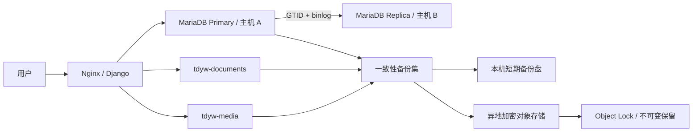

# 数据库安全与灾备八项问题修复实施方案

> 适用项目：spug-3.0 / TDYW
>
> 编制日期：2026-07-23
>
> 适用规模：约 100 名用户、典型并发 10～40、尖峰并发 80～100、业务表日增约 200 条

## 1. 目标与边界

本方案解决当前数据库审计发现的 8 个问题：

1. 已提交事务在断电场景仍存在约 1 秒丢失窗口。
2. MariaDB、宿主机和数据盘均为单点。
3. 仓库虽有备份脚本，但缺少生产调度、成功证据和恢复验收闭环。
4. `tdyw-media` 未纳入现有 DB + documents 备份集。
5. DB 与物理文件不是严格一致快照。
6. 缺少自动化异地、加密和不可变备份。
7. Django 应用使用数据库 `root` 账号。
8. 租户隔离依赖调用方主动使用 `.for_user()`，默认查询存在漏过滤风险。

本方案不能承诺“绝对安全”。工程目标定义为：

| 指标 | 最低目标 | 推荐目标 | 验证方式 |
|---|---:|---:|---|
| 正常断电事务 RPO | 0 | 0 | 断电/强杀恢复测试 |
| 整机损坏 RPO | 15 分钟 | 5 分钟 | 异机 binlog 时间差 |
| 单库故障 RTO | 2 小时 | 30 分钟 | 副本提升演练 |
| 整机灾难 RTO | 4 小时 | 2 小时 | 空白主机恢复演练 |
| 备份恢复成功率 | 100% | 100% | 每月自动恢复验证 |
| 跨租户越权 | 0 | 0 | 全接口跨租户测试 |

业务正式上线的最低门槛是：P0 项全部完成、至少有一份异机备份、最近一次全量恢复演练成功。

## 2. 当前架构与目标架构

### 2.1 当前架构

- Django 4.2 通过 `mysqlclient` 连接单个 MariaDB/MySQL 容器。
- `ATOMIC_REQUESTS=True`，核心业务已有显式事务和 `select_for_update()`。
- 约 49 个实体、80 个显式索引、14 个唯一约束，容量不是当前瓶颈。
- 数据库存放业务数据和附件元数据。
- `tdyw-documents` 保存资料库、规章附件等文件。
- `tdyw-media` 保存运行日志附件、证据附件、签名、升级附件等文件。
- 本机有逻辑备份、物理备份、documents 增量备份和备份集脚本，但未形成可验证的生产闭环。

### 2.2 目标架构



设计原则：

- 副本解决数据库服务可用性，不替代备份。
- 备份解决误删、逻辑损坏、勒索和整机灾难，不替代副本。
- DB 与附件必须使用同一 `backup_set_id`，并在禁止写入的窗口内生成。
- 生产运行账号、迁移账号、备份账号分离。
- 租户查询默认 fail-closed，跨租户访问必须显式授权并记录审计日志。

## 3. 实施总览

| 阶段 | 内容 | 优先级 | 预计停机 | 完成标志 |
|---|---|---|---:|---|
| Phase 0 | 基线采集、现有数据和备份保护 | P0 | 0 | 基线报告归档 |
| Phase 1 | 强刷盘、binlog、数据库账号降权 | P0 | 5～15 分钟 | 参数与权限验收通过 |
| Phase 2 | DB + documents + media 一致性备份集 | P0 | 每晚 2～10 分钟只读 | 备份集可完整恢复 |
| Phase 3 | 异地加密、不可变备份、告警 | P0 | 0 | 3-2-1-1-0 达标 |
| Phase 4 | 异机 MariaDB 副本与提升演练 | P1 | 切换演练 15～30 分钟 | 副本可独立接管 |
| Phase 5 | 租户隔离默认 fail-closed | P0 | 发布窗口 | 全接口越权测试为 0 |
| Phase 6 | 每月恢复演练和持续审计 | P0 | 0 | 连续 3 次演练成功 |

### 3.1 八项整改后的残余风险治理

完成八项整改后，系统可以达到较高的生产可靠性，但仍不能承诺“绝对安全”。剩余风险必须通过预防、检测、限制影响范围和恢复四层控制继续降低。

| 残余风险 | 预防措施 | 检测措施 | 恢复/兜底措施 |
|---|---|---|---|
| 应用写入“业务上错误、数据库上合法”的数据，并同步到副本 | 关键删除、批量修改、权限变更实行双人审批；业务状态机、范围约束、账实校验；高风险变更设置冷静期 | 异常数量、状态跳变、批量更新行数和关键字段变化告警；每日业务数据质量巡检 | 软删除、变更前后快照、binlog 时间点恢复；关键领域逐步采用事件溯源，只追加事件而不覆盖历史 |
| 数据库管理员、备份管理员和密钥管理员同时失陷 | 身份与管理域分离；硬件 MFA；PAM/JIT 临时授权；禁止共享账号；生产账号无权删除不可变备份 | 所有提权、密钥读取、备份删除和保留期调整进入独立审计域并实时告警 | 使用双人授权或 M-of-N 密钥；离线恢复密钥由不同人员、不同地点分持 |
| 错误长期未发现，超过全部在线备份保留期 | 日、周、月、年度 GFS 分层保留；关键业务设置长期归档期限 | 数据质量趋势、关键表数量、业务余额/状态对账、历史哈希连续性巡检 | 年度离线归档或合规期限归档；从长期逻辑备份恢复到隔离环境进行追溯 |
| 生产、异地备份和密钥同时遭遇区域性灾难 | 数据与密钥不得处于同一账号、同一机房和同一故障域 | 多地域复制状态、备份延迟和 KMS 可用性监控 | 增加第三份离线/空气隔离备份；恢复密钥封存在另一地区，并每季度验证可读 |
| MariaDB、操作系统、硬件或恢复工具存在未知缺陷 | 固定版本与镜像 digest；灰度升级；补丁评估；生产前恢复验证 | canary 恢复、数据库错误日志、文件系统/SMART/介质错误监控 | 同时保存 MariaDB 物理备份、SQL 逻辑备份和开放格式关键数据导出，避免单一工具链失效 |
| 恢复流程长期未演练，事故时人员无法操作 | Runbook 版本化；恢复命令自动化；至少两名人员掌握流程 | 监控最近演练时间、成功率和超时步骤 | 每月空白环境恢复、每季度故障切换、每半年整机灾难演练，并安排非原开发人员执行 |
| 最后几分钟 binlog 尚未传到异地 | 持续流式归档；复制延迟阈值告警；避免仅依赖定时复制 | 实时记录 GTID/binlog 位点与异地确认位点之差 | 采用半同步复制；若业务要求跨故障域 RPO=0，则采用同步多数派提交并接受更高延迟和网络分区时停止写入 |
| 物理存储虚假报告刷盘成功 | 使用带断电保护的企业级 SSD、UPS、正确写屏障/FUA、可靠文件系统与控制器缓存策略 | 端到端数据校验、介质巡检、定期断电恢复测试 | 在不同厂商/不同硬件上保存独立副本，以多数副本和备份恢复降低关联故障风险 |

跨地域同步复制存在不可消除的取舍：网络分区时，要么停止写入以保持零数据丢失，要么继续写入以保持服务可用。方案和业务负责人必须明确选择，不能同时承诺跨地域 `RPO=0` 和“任何网络故障下永远可写”。

## 4. 问题一：事务刷盘不满足零丢失要求

### 4.1 当前风险

`docker/config/mysqlnew.cnf` 当前使用：

```ini
innodb_flush_log_at_trx_commit=2
```

该值允许事务日志先进入操作系统缓存。操作系统崩溃、宿主机断电时，数据库已经返回成功的最近事务仍可能丢失。配置中也没有显式 `sync_binlog=1`，binlog 与事务提交之间缺少最强持久性保证。

### 4.2 修改方案

修改 `docker/config/mysqlnew.cnf`：

```ini
[mysqld]
innodb_flush_log_at_trx_commit=1
sync_binlog=1
binlog_format=ROW
binlog_expire_logs_seconds=604800
```

同时保留：

```ini
innodb_doublewrite=ON
```

若数据库版本默认已开启 `innodb_doublewrite`，仍应显式写入配置，避免自定义镜像默认值变化。

修改 `scripts/pre_release/audit_config.py`，将以下条件设为发布阻断项：

- `innodb_flush_log_at_trx_commit` 必须为 `1`。
- `sync_binlog` 必须为 `1`。
- `log_bin` 必须为 `ON`。
- `binlog_format` 必须为 `ROW`。
- 所有业务表必须为 InnoDB。

### 4.3 上线步骤

1. 执行一次完整逻辑备份，并验证 `gzip -t`。
2. 记录修改前 `SHOW GLOBAL VARIABLES` 和磁盘 IOPS 基线。
3. 修改配置并在维护窗口重启 `tdyw-db`。
4. 运行 40 并发混合负载 10 分钟。
5. 对比事务延迟、磁盘写延迟和 API P95。

当前日写入量很低，预计强刷盘对业务性能影响很小，不应为了微小吞吐提升保留数据丢失窗口。

### 4.4 验收标准

```sql
SHOW VARIABLES WHERE Variable_name IN (
  'innodb_flush_log_at_trx_commit',
  'sync_binlog',
  'log_bin',
  'binlog_format',
  'innodb_doublewrite'
);
```

验收结果必须分别为 `1`、`1`、`ON`、`ROW`、`ON`。压测不得出现 500，写接口 P95 不得超过修改前的 2 倍。

### 4.5 回滚

只有在磁盘无法满足强刷盘且确认出现持续业务故障时，才允许临时回滚为 `innodb_flush_log_at_trx_commit=2`。回滚必须登记风险、限定结束时间，并优先更换 SSD/存储，而不是长期接受数据丢失窗口。

## 5. 问题二：数据库和宿主机单点

### 5.1 当前风险

当前只有一个 `tdyw-db` 容器和一个 `tdyw-mysql-data` volume。容器重启策略只能恢复进程故障，不能处理宿主机、磁盘、Docker volume 或机房故障。

### 5.2 修改方案

在独立物理机或独立虚拟机上部署一台同版本 MariaDB Replica：

- 主库：主机 A，`server_id=1`。
- 从库：主机 B，`server_id=2`。
- 使用 GTID + ROW binlog。
- 副本启用只读：`read_only=ON`。
- 主从机器不能共享同一物理磁盘、同一 Docker volume 或同一宿主机。
- 数据库镜像必须从模糊的 `mysql:0601` 改为可审计的固定版本和 digest。

主库建议配置：

```ini
server_id=1
log_bin=mysql-bin
binlog_format=ROW
gtid_strict_mode=ON
log_slave_updates=ON
sync_binlog=1
```

副本建议配置：

```ini
server_id=2
relay_log=relay-bin
read_only=ON
gtid_strict_mode=ON
log_slave_updates=ON
```

不建议在本项目第一阶段直接引入无人值守自动故障切换。100 人内部系统采用“监控告警 + 人工确认 + 脚本化提升”更容易避免网络分区导致双主。若业务要求 RTO 小于 5 分钟，再评估 Orchestrator/MaxScale 等自动故障转移。

### 5.3 新增运维脚本

建议新增：

- `database_maintenance/check_replication.sh`
- `database_maintenance/promote_replica.sh`
- `database_maintenance/rejoin_old_primary.sh`
- `database_maintenance/FAILOVER_RUNBOOK.md`

`check_replication.sh` 至少检查：

- IO/SQL 复制线程状态。
- `Seconds_Behind_Master` 或 GTID 差距。
- 最近一次复制错误。
- 副本只读状态。
- 主从数据库版本和 schema migration 一致性。

### 5.4 验收标准

- 正常运行时复制延迟小于 10 秒。
- 主库停止后，30 分钟内可将副本提升并恢复应用写入。
- 提升前必须确认旧主不可写，防止双主。
- 故障切换后抽查用户、审计日志、业务记录和附件元数据。
- 每季度执行一次完整提升及旧主重新加入演练。

### 5.5 回滚

Replica 部署失败不得影响主库。应用在第一阶段仍只连接主库；副本验收通过前不加入连接路由。切换演练失败时恢复原主连接，并保留现场日志分析。

## 6. 问题三：备份脚本存在，但生产执行不可证明

### 6.1 当前风险

“脚本可以运行”不等于“备份可靠”。当前缺少以下闭环证据：

- 明确的生产调度和互斥锁。
- 最近一次成功时间和产物大小。
- 失败告警。
- 备份校验和。
- 自动恢复测试。
- 备份脚本本身的版本控制证据。

### 6.2 修改方案

将 `backups/` 纳入 Git 版本控制，并使用 `systemd service + timer` 代替只写在文档中的 crontab 示例。若生产环境不使用 systemd，才使用 cron，但必须保留同等的锁、退出码和告警能力。

新增：

- `deploy/systemd/tdyw-backup-daily.service`
- `deploy/systemd/tdyw-backup-daily.timer`
- `deploy/systemd/tdyw-backup-weekly.service`
- `deploy/systemd/tdyw-backup-weekly.timer`
- `database_maintenance/check_backup_freshness.sh`

备份入口统一使用：

```bash
flock -n /run/lock/tdyw-backup.lock \
  /opt/tdyw/spug-3.0/backups/backup_set_create.sh
```

每个备份集必须生成：

```text
backup_set.meta
SHA256SUMS
database/...
documents/...
media/...
logs/...
```

`backup_set.meta` 至少记录：

- `backup_set_id`
- 开始、结束时间
- 主机名、容器名、数据库版本
- Django migration 叶子节点
- DB binlog 文件和位置/GTID
- DB、documents、media 产物路径
- 每个产物大小和 SHA256
- 文件总数
- `status=SUCCESS|FAILED`
- 异地上传状态
- 恢复验证状态和时间

### 6.3 调度建议

| 任务 | 频率 | 本机保留 | 异地保留 |
|---|---|---:|---:|
| 一致性逻辑全量备份集 | 每日 02:00 | 30 天 | 90 天 |
| MariaDB 物理备份 | 每周日 03:00 | 14 天 | 8 周 |
| binlog 异机归档 | 持续或每 1 分钟 | 7 天 | 30 天 |
| 月末备份 | 每月 | 12 个月 | 3 年或按制度 |
| 恢复验证 | 每月 | 最近结果 | 报告长期保存 |

### 6.4 告警规则

以下任一条件必须告警并返回非零退出码：

- 最近成功逻辑备份超过 26 小时。
- 最近成功物理备份超过 8 天。
- 备份产物为空或比前 7 日中位数小 50% 以上。
- `gzip -t`、`tar -tzf` 或 `sha256sum -c` 失败。
- 本地剩余空间不足 20%。
- 异地上传超过 2 小时仍未成功。
- 最近一次恢复演练超过 35 天。

### 6.5 验收标准

- 连续 7 天自动备份成功。
- 人为停止数据库一次，任务失败且告警到达。
- 并发启动两个备份任务，第二个被 `flock` 拒绝。
- 随机修改一个备份字节，SHA256 校验必须失败。
- 从新主机仅依赖 Git 仓库、密钥和备份即可启动恢复流程。

## 7. 问题四：`tdyw-media` 未纳入备份

### 7.1 当前风险

当前 documents 备份只覆盖 `/data/spug/spug_api/storage/documents`。以下关键数据位于 `MEDIA_ROOT` 对应的 `tdyw-media`：

- 运行日志附件。
- Evidence 附件。
- 账号签名及历史版本。
- 系统升级附件。
- 其他通过 `/media/` 提供的业务文件。

只恢复数据库和 documents 会产生“记录存在、附件不存在”的静默数据损坏。

### 7.2 修改方案

不要复制维护两套完全相同的增量逻辑。将现有 documents 脚本提炼为通用脚本：

```text
backups/fileset_backup.sh
```

参数：

```bash
FILESET_NAME=documents
SOURCE_CONTAINER=tdyw
SOURCE_PATH=/data/spug/spug_api/storage/documents

FILESET_NAME=media
SOURCE_CONTAINER=tdyw
SOURCE_PATH=/data/spug/spug_api/media
```

保留兼容入口：

- `documents_incremental_backup.sh` 调用 `fileset_backup.sh`。
- 新增 `media_incremental_backup.sh` 调用 `fileset_backup.sh`。

每个 fileset 生成：

- `.tar.gz` 或增量归档。
- `.manifest`：相对路径、大小、mtime、ctime、SHA256。
- `.meta`：来源 volume、路径、备份类型、基线、文件数、总大小。

同步修改：

- `backup_set_create.sh`：增加 `run_media_backup()`。
- `backup_set_restore.sh`：恢复顺序改为 DB → documents → media → 一致性检查。
- `backup_set.meta`：增加 media 相关字段。
- `备份维护手册.md`：补充 media 恢复和校验流程。

### 7.3 验收标准

在测试环境分别创建：

- 一条带图片的运行日志。
- 一个 Evidence 附件。
- 一张账号签名并产生一次签署记录。
- 一个升级附件。
- 一个 documents 文件和一个规章附件。

执行备份后删除测试环境的 DB 和两个文件 volume，再从备份恢复。上述文件必须全部能预览/下载，manifest 文件数、大小和 SHA256 全部一致。

### 7.4 回滚

media 备份属于增量能力，不改变原 documents 产物格式。上线时保留原入口一个版本周期；新备份集失败时不得删除旧备份集。

## 8. 问题五：DB 与物理文件缺少一致性快照

### 8.1 当前风险

`backup_set_create.sh` 当前先备份 DB，再备份 documents，并明确提示维护模式尚未实现。两步之间若发生上传、删除、合并或签名变更，恢复后可能出现：

- DB 有记录但文件缺失。
- 文件存在但 DB 无记录。
- DB 哈希与物理文件版本不一致。
- 签署记录引用错误版本的签名文件。

### 8.2 推荐实现：夜间短只读窗口

本项目写入量低，优先使用简单、可证明的一致性策略，而不是引入复杂分布式快照。

新增 Django 中间件：

```text
spug_api/libs/maintenance_middleware.py
```

维护状态由只读挂载文件或 Redis key 控制：

```text
/run/tdyw/maintenance.json
```

进入备份维护模式后：

- 允许 `GET`、`HEAD`、健康检查和管理员状态查询。
- 拒绝 `POST`、`PUT`、`PATCH`、`DELETE`，返回 `503` 和 `Retry-After`。
- Celery 中会修改 DB/文件的任务停止取新任务。
- 等待正在执行的上传、合并和写事务结束。

`backup_set_create.sh` 的顺序改为：

1. `flock` 获取全局备份锁。
2. 写入维护标记，阻断新写入。
3. 暂停会写数据的 Celery queue。
4. 等待活跃上传、合并任务和 DB 写事务归零，超时则失败退出。
5. 记录 GTID/binlog 起点。
6. 执行 DB 一致性逻辑备份。
7. 备份 documents。
8. 备份 media。
9. 生成 manifest 和 `SHA256SUMS`。
10. 执行 DB 元数据与物理文件快速一致性检查。
11. 标记 `status=SUCCESS`。
12. 恢复 Celery 和写入能力。

无论任一步成功或失败，都必须通过 shell `trap` 恢复写入能力：

```bash
trap 'leave_maintenance_mode' EXIT INT TERM
```

### 8.3 一致性检查

新增：

```text
scripts/verify_backup_set_consistency.py
```

检查内容：

- DB 所有非软删除文件记录的路径是否存在于对应 manifest。
- manifest 中是否存在 DB 无引用的文件；允许的缓存/临时目录进入白名单。
- DB 文件大小与 manifest 大小是否一致。
- 已记录 SHA256 的 Evidence、签名、规章附件是否一致。
- backup_set 的 migration 版本是否与恢复环境兼容。

快速检查在每次备份时运行；全量逐文件 SHA256 检查在每周或每月运行。

### 8.4 验收标准

- 维护模式开启后，所有写接口返回 503，读接口正常。
- 在上传过程中触发备份，脚本必须等待或安全失败，不得生成 SUCCESS 备份集。
- 强制终止备份脚本后，维护模式和 Celery 必须自动恢复。
- 恢复后 `verify_backup_set_consistency.py` 返回 0。
- 夜间只读窗口应控制在 10 分钟以内。

## 9. 问题六：缺少异地、加密和不可变备份

### 9.1 当前风险

默认 `/data/backups/tdyw` 仍可能与生产主机处于同一故障域。磁盘损坏、误删、勒索或管理员账号失陷时，本地数据和本地备份可能同时丢失。gzip/tar 只压缩，不提供加密和不可变保护。

### 9.2 修改方案

采用 `restic + S3 兼容对象存储`：

- restic 提供客户端加密、校验和和快照管理。
- 对象存储开启版本控制和 Object Lock/WORM。
- 生产主机使用仅能新增对象、不能缩短保留期的凭据。
- 删除/管理凭据离线保存，不放在生产机。
- 凭据写入 `/etc/tdyw-backup.env`，权限 `0600`，不得提交 Git。

上传流程：

```text
本地 backup_set SUCCESS
  → sha256sum -c
  → restic backup
  → restic check
  → 记录 remote_snapshot_id
  → backup_set.meta 标记 remote_status=SUCCESS
```

安全要求：

- 服务端启用 HTTPS。
- restic repository password 使用独立密钥管理。
- 对象锁保留至少 30 天。
- 生产数据库密码与备份仓库密码完全分离。
- 每季度验证离线保存的恢复凭据可用。

### 9.3 3-2-1-1-0 验收

| 要求 | 实现 |
|---|---|
| 3 份副本 | 生产数据、本地备份、异地对象存储 |
| 2 种介质/故障域 | 生产 SSD/volume、对象存储 |
| 1 份异地 | 独立主机或独立地域对象存储 |
| 1 份不可变 | Object Lock/WORM |
| 0 个校验错误 | SHA256 + restic check + 恢复演练 |

### 9.4 验收标准

- 删除本地备份后能从异地恢复。
- 使用生产上传凭据不能删除锁定期内对象。
- 随机恢复最近一天、最近一周和最近一个月快照。
- 异地快照延迟不得超过 2 小时；binlog 归档延迟不得超过 15 分钟。

## 10. 问题七：应用使用数据库 root 账号

### 10.1 当前风险

`docker/docker-compose.yml` 当前设置 `MYSQL_USER=root`。应用漏洞一旦被利用，攻击者可创建账号、修改权限、删除其他数据库、关闭日志或破坏备份，影响范围远超业务 CRUD 所需权限。

### 10.2 账号拆分

至少创建三类账号：

| 账号 | 用途 | 权限原则 |
|---|---|---|
| `tdyw_app` | Django 运行时 | 仅目标库 DML |
| `tdyw_migrate` | 发布迁移 | 限时 DDL，发布后不提供给应用 |
| `tdyw_backup` | dump/mariabackup | 只读及备份必要权限 |

运行时账号示例权限：

```sql
CREATE USER 'tdyw_app'@'%' IDENTIFIED BY '<secret>';
GRANT SELECT, INSERT, UPDATE, DELETE ON tdyw.* TO 'tdyw_app'@'%';
```

迁移账号按实际 migration 所需授予 `CREATE, ALTER, DROP, INDEX, REFERENCES`，仅在发布任务中注入。备份账号按 MariaDB 当前版本的 `mariadb-dump`/`mariabackup` 官方最小权限创建，禁止直接复用 root。

不要把密码写在命令行参数或仓库 `.env`。使用 Docker secrets 或权限为 `0600` 的客户端配置文件：

```ini
[client]
user=tdyw_app
password=...
host=tdyw-db
```

### 10.3 Compose 和发布流程调整

修改 `docker/docker-compose.yml`：

- `MYSQL_USER=tdyw_app`。
- 应用读取运行时 secret。
- 数据库初始化 root 密码只供 DBA 使用。
- migration 从独立的一次性容器/发布步骤执行。
- 应用启动流程不再自动使用运行时账号执行 DDL。

修改 `scripts/pre_release/audit_config.py`：

- 发现应用 `USER=root` 直接阻断发布。
- 检查运行时账号没有全局权限、`GRANT OPTION`、`FILE`、`SUPER`。

### 10.4 上线顺序

1. 创建新账号，不立即撤销 root。
2. 用 `tdyw_migrate` 在测试环境执行全部 migration。
3. 用 `tdyw_app` 跑完整 API、Celery 和文件流程测试。
4. 切换生产应用凭据并观察 24 小时。
5. 从应用容器移除 root 凭据。
6. 审计并撤销多余授权。

### 10.5 验收标准

- `tdyw_app` 可完成所有正常 CRUD。
- `tdyw_app` 执行 `DROP TABLE`、`CREATE USER`、读取其他库均失败。
- 应用容器环境和文件中不存在 root 密码。
- 备份和 migration 使用各自独立账号成功。

### 10.6 回滚

切换初期保留 DBA 可控的 root 凭据，但不得重新注入应用容器。出现权限遗漏时只补充明确需要的单项权限，不允许临时 `GRANT ALL`。

## 11. 问题八：租户隔离不是默认强制

### 11.1 当前风险

`TenantModelManager.get_queryset()` 当前返回未过滤 QuerySet，只有调用 `.for_user()` 才加租户条件。这意味着任何新增视图、Celery 任务、批处理或直接 `.objects.get()` 都可能漏掉租户过滤。

MariaDB 不提供与 PostgreSQL RLS 等价的成熟行级策略，因此必须在应用层实现默认 fail-closed，并用数据库约束和测试补强。

### 11.2 分两阶段上线

新增环境变量：

```text
TENANT_QUERY_MODE=audit   # 第一阶段，只记录漏过滤
TENANT_QUERY_MODE=enforce # 第二阶段，强制阻断
```

#### 阶段 A：audit 模式

修改 `spug_api/libs/tenant_base_model.py`：

- 增加 `for_tenant(tenant_id)`。
- 对未显式 scoped 的 tenant model 查询记录调用栈和模型名。
- 统计所有 `.objects` 直接调用点。
- 不改变线上返回结果，用于识别 Celery、管理命令、迁移和全局管理员路径。

新增 CI AST 检查：

```text
scripts/code_gate/check_tenant_queries.py
```

禁止业务视图和 service 中出现未经批准的：

```python
TenantModel.objects.all()
TenantModel.objects.get(...)
TenantModel.objects.filter(...)
```

允许形式：

```python
TenantModel.objects.for_user(request.user)
TenantModel.objects.for_tenant(tenant_id)
TenantModel.all_objects...  # 仅显式白名单的后台/审计代码
```

#### 阶段 B：enforce 模式

引入两个 Manager：

```python
objects = ScopedTenantManager()
all_objects = UnscopedTenantManager()
```

`ScopedTenantManager` 规则：

- 请求上下文有 tenant 时自动限定 tenant。
- 显式 `.for_tenant()` 始终限定 tenant。
- tenant 上下文缺失时抛出 `TenantContextMissing`，不得返回全表。
- 超级管理员跨租户查询必须调用显式 `all_objects`/管理 service，并写审计日志。
- 中间件必须在 `finally` 中清除 tenant 上下文，防止 gevent/线程复用污染。
- Celery 任务 payload 必须携带 `tenant_id`，任务入口建立并清理 tenant context。

禁止仅依赖 thread-local 自动过滤后静默返回数据。缺少上下文时必须失败，避免后台任务误操作全库。

### 11.3 数据库约束补强

对需要租户隔离的模型逐步增加：

- `tenant_id` 从 `default=''` 改为非空且无空字符串。
- `CheckConstraint(tenant_id <> '')`。
- 业务唯一约束包含 `tenant_id`，例如 `(tenant_id, device_sn)`。
- 父子实体增加租户一致性校验，禁止跨租户关联。
- 迁移前扫描 NULL、空 tenant 和跨租户外键。

全局共享表必须建立显式清单，例如：

```text
GLOBAL_SHARED_MODELS = {
  DepartmentDutyLog,
  Regulation,
  RegulationCategory,
  ...
}
```

每张全局表必须有业务审批，不能因为历史遗漏而默认认定为共享。

### 11.4 测试方案

为每个租户业务模块建立统一契约测试：

- 租户 A 列表看不到租户 B 数据。
- 租户 A 用租户 B ID 查询、修改、删除均返回 404/403。
- 批量接口不能混入租户 B ID。
- 导出、统计、搜索、附件下载和 WebSocket 同样隔离。
- Celery 任务不能处理其他租户记录。
- 超管跨租户操作有明确权限且产生审计日志。
- tenant context 在连续请求之间不泄漏。

新增生产巡检：

```text
scripts/check_tenant_integrity.py
```

每日检查空 tenant、非法 tenant、父子 tenant 不一致和孤立数据，只读运行并告警。

### 11.5 验收标准

- CI 中所有 tenant model 直接未限定查询为 0，白名单除外。
- 全部跨租户契约测试通过。
- audit 模式连续 7 天没有未知调用后才切换 enforce。
- enforce 模式下，缺少 tenant context 的查询明确失败。
- 生产巡检无空 tenant 和跨租户关联。

### 11.6 回滚

保留 `TENANT_QUERY_MODE=audit` 一个发布周期。enforce 引发遗漏时可以回到 audit，但不得移除日志和测试；修复调用点后重新开启 enforce。数据库非空约束只在数据清理和应用稳定后单独迁移，避免与 Manager 改造同批发布。

## 12. Phase 0：实施前基线与保护

任何配置修改前执行以下只读检查并归档输出：

```sql
SELECT VERSION();
SHOW VARIABLES LIKE 'innodb_flush_log_at_trx_commit';
SHOW VARIABLES LIKE 'sync_binlog';
SHOW VARIABLES LIKE 'log_bin';
SHOW VARIABLES LIKE 'binlog_format';
SHOW VARIABLES LIKE 'gtid%';
SHOW VARIABLES LIKE 'default_storage_engine';
SHOW ENGINE INNODB STATUS;
```

同时归档：

- `docker ps`、镜像 digest、volume 列表。
- 所有表的 engine、行数估算、数据/索引大小。
- migration 状态。
- 当前数据库账号授权。
- `crontab -l`、systemd timer、最近备份文件和日志。
- documents/media 文件数与容量。
- 40 并发混合压测结果和数据库资源数据。

执行第一次修改前，必须先制作一份逻辑备份，并复制到另一台机器；如果这份备份尚未恢复验证，不得执行不可逆数据库迁移。

## 13. 推荐发布批次

### 批次 1：低风险立即整改

- 备份脚本纳入版本控制。
- 增加备份 freshness 检查、互斥锁和告警。
- 创建非 root 账号并在测试环境验证。
- 将 `innodb_flush_log_at_trx_commit`、`sync_binlog` 加入发布审计。
- 开启租户查询 audit 模式。

### 批次 2：生产可靠性 P0

- 切换最安全刷盘配置。
- 应用切换 `tdyw_app`。
- 新增 media 备份。
- 实现只读维护窗口和一致性备份集。
- 执行第一次新环境恢复演练。

### 批次 3：灾难恢复

- 部署 restic 异地加密备份和 Object Lock。
- 部署 binlog 异机归档。
- 运行 3-2-1-1-0 验收。

### 批次 4：高可用与租户强制隔离

- 部署异机 Replica。
- 完成故障提升演练。
- 修复 audit 发现的所有未限定查询。
- 切换 `TENANT_QUERY_MODE=enforce`。
- 分批增加 tenant 非空和组合约束。

## 14. RPO、RTO、完整性、隔离性与可恢复性验证

### 14.1 指标责任矩阵

每项指标必须同时写明故障场景、计时边界、阈值、验证频率、责任人、证据和不达标处置。建议采用以下基线：

| 指标 | 故障场景 | 推荐目标 | 验证频率 | 责任人 | 必留证据 |
|---|---|---:|---|---|---|
| 数据库进程故障 RPO | MariaDB 进程崩溃/强杀 | 0 | 每季度 | DBA | 事务标记、恢复日志、核对结果 |
| 宿主机断电 RPO | OS/主机突然掉电 | 0 | 每季度 | DBA/运维 | 断电时间、最后可信记录、InnoDB 恢复日志 |
| 单机损坏 RPO | 主库磁盘/宿主机完全不可用 | ≤5 分钟 | 每季度 | DBA/运维 | GTID 差距、最后一致恢复点 |
| 区域灾难 RPO | 生产主机和本地备份同时丢失 | ≤15 分钟 | 每半年 | 运维 | 异地快照和 binlog 确认位点 |
| 数据库故障 RTO | 主库不可服务、Replica 提升 | ≤30 分钟 | 每季度 | 运维 | 故障和恢复时间线、冒烟测试 |
| 整机重建 RTO | 应用、DB、volume 均不可用 | ≤2 小时 | 每半年 | 运维 | 空白环境恢复时间线 |
| 数据完整率 | DB + documents + media | 100% | 每月 | 运维/业务 | 表级校验、manifest、SHA256 报告 |
| 跨租户越权成功数 | API、文件、任务、导出 | 0 | 每次发布 | 开发/测试 | 自动化测试报告 |
| 全新环境恢复成功率 | 仅使用异地备份和 Runbook | 100% | 每月 | 运维 | 恢复报告和业务签字 |

### 14.2 RPO 的定义与验证

RPO 必须按故障类型分别定义：

| 故障场景 | 验收目标 |
|---|---:|
| MariaDB 进程崩溃 | 0 |
| 宿主机突然断电 | 0 |
| 主数据库磁盘损坏 | ≤5 分钟 |
| 整个生产区域不可用 | ≤15 分钟 |
| 人为误删 | 可恢复到误删前 5 分钟内的一致点 |

计算公式：

```text
实际 RPO = 故障发生时间 T_failure - 恢复后最后一个可信一致点 T_last_consistent
```

系统真实恢复点不是数据库单独的最新时间，而是 DB、documents、media 三者共同可恢复的最新一致点。数据库能恢复到 10:29，但 media 只能恢复到 02:00 时，不能宣称系统 RPO 为 1 分钟。

建议新增灾备探针：

```text
scripts/dr_write_probe.py
scripts/dr_verify_probe.py
```

验证流程：

1. 在隔离的演练租户中，每分钟写入一条带 UUID、服务端时间和递增序号的探针记录。
2. 同时向 documents 和 media 各写入一个带相同 UUID 的小文件，并记录 SHA256。
3. 保存该分钟对应的 GTID/binlog 位点。
4. 记录模拟故障时间 `T_failure`，停止主库或模拟主机数据盘不可用。
5. 仅使用 Replica、异地备份和 binlog 恢复，不得复制原主残留文件补齐结果。
6. 找到恢复后 DB 记录和两个文件均存在、哈希均正确的最后一个 UUID，记为 `T_last_consistent`。
7. 计算实际 RPO，与对应故障场景阈值比较。

演练记录示例：

```text
故障时间：2026-07-23 10:30:00
最后完整恢复点：2026-07-23 10:27:42
实际 RPO：2 分 18 秒
目标：≤5 分钟
结论：通过
```

### 14.3 RTO 的定义与验证

统一计时边界：

```text
T_start：系统首次无法完成正常业务请求的时间
T_ready：恢复后健康检查、登录、CRUD、附件和后台任务全部通过的时间
实际 RTO = T_ready - T_start
```

容器启动、端口可连接或健康接口单独返回 200 都不能视为恢复完成。`T_ready` 必须满足：

- API 健康检查通过。
- 普通用户可以登录。
- 可以查询历史业务数据。
- 可以新增、修改、查询和软删除一条演练数据。
- documents 和 media 均能上传、预览和下载。
- Celery 能处理一条实际任务。
- 新写入能正常复制并进入后续备份。
- 跨租户冒烟测试全部通过。

至少分别演练：

1. 主库停止后提升 Replica。
2. 数据库 volume 完全丢失后恢复。
3. 应用主机完全丢失后重建。
4. 本地备份不可用，只从异地不可变备份恢复。

每次演练必须保存完整时间线，例如：

```text
10:00 系统不可服务，RTO 开始
10:03 监控告警并确认
10:08 开始提升副本
10:17 应用切换完成
10:22 全部冒烟测试通过，RTO 结束
实际 RTO：22 分钟
```

### 14.4 完整性的四层验证

#### 结构完整性

- migration 叶子节点与备份元数据一致。
- 表、字段、索引、唯一约束和外键符合目标 schema。
- 所有业务表使用 InnoDB。
- 不存在外键孤儿记录。
- 需要隔离的模型不存在 NULL、空字符串或非法 `tenant_id`。

#### 数据内容完整性

每个备份集记录并在恢复后比较：

- 每张表行数。
- 最大/最小主键。
- 最早/最晚业务时间。
- 关键状态分组数量。
- 关键业务字段按稳定排序、统一空值/时间/编码后计算的逻辑 SHA256。

不要只依赖 `CHECKSUM TABLE`。表经过重建、版本变化或存储布局变化后物理校验结果可能不同，应以规范化业务字段的逻辑哈希作为主要证据。

#### 文件完整性

- DB 引用的每个非软删除文件都存在于对应 manifest。
- 文件路径、大小和 SHA256 一致。
- 不存在路径穿越或指向备份根目录之外的记录。
- manifest 中 DB 无引用的文件只能来自明确的缓存/临时白名单。

验收阈值：

```text
DB 引用但文件缺失：0
文件大小或 SHA256 错误：0
关键表逻辑哈希差异：0
非法租户关系：0
白名单外孤儿文件：0
```

#### 业务语义完整性

- 已签署记录引用的签名版本和哈希正确。
- Evidence/附件归属于正确租户和业务对象。
- 已软删除记录不会重新出现在正常列表。
- 状态流转历史能够推导出当前状态。
- 审计哈希链、请求 ID 和关键业务快照可以验证。

### 14.5 隔离性的验证矩阵

准备租户 A、租户 B，各自创建带唯一标记的数据和附件。租户 A 使用租户 B 的对象 ID、文件路径、下载 token 和任务 ID 执行以下测试：

| 测试面 | 必测行为 | 合格结果 |
|---|---|---|
| CRUD | 列表、详情、新增关联、修改、删除 | 不返回 B；跨租户 ID 返回 404/403；B 数据不变化 |
| 批量接口 | 混入 B 的对象 ID | 整批拒绝或只处理明确允许的 A 数据，不能静默修改 B |
| 查询 | 搜索、统计、深分页、首页聚合 | 响应正文和计数均不包含 B |
| 数据输出 | CSV/Excel/PDF 导出 | 导出文件中 B 的唯一标记为 0 |
| 文件 | 预览、下载、缩略图、打包 | A 无法使用 B 的路径或 token 获取内容 |
| 异步能力 | Celery、定时任务、重试任务 | payload 必须带 tenant_id，不能处理 B |
| 长连接 | WebSocket/推送 | A 不接收 B 的事件 |
| 上下文复用 | gevent、线程、连续请求 | tenant context 不串号，`finally` 后已清理 |
| 管理员 | 显式跨租户操作 | 仅授权管理员成功，并产生完整审计日志 |

“跨租户访问测试为零”的可计算定义：

```text
未经授权成功访问次数 = 0
跨租户响应数据条数 = 0
跨租户数据修改条数 = 0
未知未限定 ORM 查询数 = 0
```

该矩阵必须进入 CI，并在每次发布运行。生产环境只运行不修改数据的 tenant 完整性巡检；破坏性越权测试必须在隔离环境执行。

### 14.6 可恢复性的月度验证

每月在空白服务器或隔离环境执行完整恢复，禁止复用生产数据库、已有 volume 或生产主机残留数据。恢复人员只能使用：

- 指定 Git commit/发行版本。
- 异地不可变备份。
- 离线保存的恢复密钥。
- 仓库中的恢复 Runbook。

恢复流程：

1. 创建全新主机、网络和空 volume。
2. 下载指定 `backup_set_id`，验证 Object Lock/快照元数据。
3. 执行 `sha256sum -c` 和备份格式校验。
4. 恢复数据库，并按顺序应用 binlog 到目标一致点。
5. 恢复 documents 和 media。
6. 执行结构、数据、文件、业务语义四层一致性检查。
7. 启动应用和后台任务。
8. 执行登录、CRUD、附件、签名、导出和租户隔离测试。
9. 记录实际 RPO、RTO、失败步骤和人工干预。
10. 由运维、开发和业务负责人共同签署结果。

恢复报告至少包含：

```text
drill_id / backup_set_id
数据库版本和镜像 digest
Git commit 和 migration 叶子节点
故障场景与故障时间
恢复起止时间、实际 RPO、实际 RTO
恢复表数、记录数和逻辑哈希结果
documents/media 文件数与 SHA256 错误数
孤儿文件和缺失引用数量
跨租户测试结果
自动化步骤与人工干预清单
执行人、审核人、业务确认人
最终结论与整改期限
```

只有恢复环境能正常承载业务，才算恢复成功；“备份文件可以解压”不等于可恢复。

### 14.7 演练周期与不达标处置

| 周期 | 验证内容 |
|---|---|
| 每天 | 备份 freshness、大小、退出码、异地上传和 binlog 延迟 |
| 每周 | gzip/tar/SHA256 校验，随机恢复单表和单个文件 |
| 每月 | 从异地备份恢复完整空白环境，执行全量一致性与业务测试 |
| 每季度 | 主库故障、Replica 提升、binlog 时间点恢复、离线密钥可用性 |
| 每半年 | 模拟生产主机和本地备份全部丢失，验证整机 RTO |
| 每年 | 使用长期离线归档和异地密钥执行区域灾难恢复 |

任何指标不达标时：

1. 演练结果标记为 FAILED，不得通过口头说明改为成功。
2. 建立问题单，记录实际值、目标值、原因、负责人和整改期限。
3. RPO、完整性或租户隔离不达标属于 P0，修复前阻断相关发布。
4. 修复后必须重跑失败场景，不能等待下一常规周期。
5. 连续三次演练成功后，才能认定该指标进入稳定状态。

## 15. 最终验收清单

### 数据持久性

- [ ] `innodb_flush_log_at_trx_commit=1`
- [ ] `sync_binlog=1`
- [ ] `log_bin=ON`、`binlog_format=ROW`
- [ ] 所有业务表为 InnoDB
- [ ] 强杀/重启后已提交事务不丢失

### 账号权限

- [ ] 应用不使用 root
- [ ] runtime、migration、backup 账号分离
- [ ] 应用无法执行 DDL、账号管理和跨库访问
- [ ] 密钥未提交 Git，文件权限为 0600

### 备份与恢复

- [ ] DB、documents、media 属于同一 `backup_set_id`
- [ ] 写入维护模式已实现，失败时自动退出维护模式
- [ ] 每个备份集有 manifest、meta、SHA256SUMS
- [ ] 每日/每周调度真实启用
- [ ] 备份失败和过期告警真实到达
- [ ] 异地加密备份和不可变保留已启用
- [ ] 最近 35 天内有一次全新环境恢复成功报告

### 高可用

- [ ] Replica 位于独立故障域
- [ ] 复制延迟正常小于 10 秒
- [ ] 提升和防双主 runbook 已演练
- [ ] RTO/RPO 达到第 1 节目标

### 租户安全

- [ ] tenant 查询 audit 未发现未知漏过滤
- [ ] `TENANT_QUERY_MODE=enforce` 已启用
- [ ] 缺少 tenant context 时 fail-closed
- [ ] 全模块跨租户契约测试通过
- [ ] 空 tenant、跨租户关联巡检为 0

### 指标与演练证据

- [ ] 每个故障场景均有独立 RPO/RTO 目标、计时边界和责任人
- [ ] 灾备探针能够同时验证 DB、documents、media 的共同一致点
- [ ] 最近一次 RPO/RTO 演练实际值达标
- [ ] 结构、数据内容、文件和业务语义四层完整性检查全部通过
- [ ] 跨租户四项计数均为 0
- [ ] 月度空白环境恢复报告包含完整证据并已签字
- [ ] 不达标项均已复测关闭

## 16. 完成定义

只有同时满足以下条件，才能将当前状态从“性能满足但灾备未验收”改为“满足生产数据安全要求”：

1. 8 个问题均有代码/配置落地，不是仅有文档或人工约定。
2. 自动化测试、发布审计和监控能够阻止问题再次出现。
3. 至少完成一次从异地备份恢复 DB + documents + media 的全流程演练。
4. 至少完成一次 Replica 提升演练。
5. 恢复后业务抽查、文件哈希、租户隔离和审计链检查全部通过。
6. 形成实际 RPO/RTO 记录，并由业务负责人确认可接受。

副本正常、备份文件存在或脚本返回成功都不是最终完成证据；可恢复、可验证、可审计才是完成标准。
