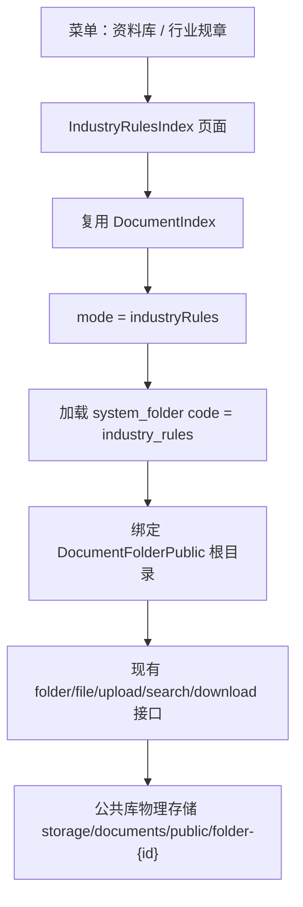

# 行业规章子模块详细设计方案

## 1. 结论

行业规章子模块采用“独立业务入口 + 复用资料库底座 + 公共库受保护根目录”的方案。

用户侧表现为资料库下的独立菜单：

```text
资料库
  - 资料管理
  - 行业规章
```

技术侧不新建一套文件存储、不复制上传下载预览能力，而是复用现有 `apps.document` 模块：

- 目录模型继续使用 `DocumentFolderPublic`
- 文件模型继续使用 `DocumentFilePublic`
- 物理文件继续落在 `storage/documents/public/folder-{id}/`
- 上传、下载、预览、搜索、缩略图、传输队列、备份恢复继续复用现有资料库能力
- 额外新增一个“系统目录绑定”能力，用 `industry_rules` 绑定公共库中的“行业规章”根目录

核心目标是：用户看到的是独立模块，系统实现仍然是资料库公共空间中的一个受保护业务根目录。

## 2. 现有资料库基础

### 2.1 前端现状

当前资料库菜单配置在：

```text
spug_web/src/routes.js
```

现状是“资料库”父菜单下只有一个“资料管理”页面：

```text
资料库
  - 资料管理 -> /document
```

资料库权限配置在：

```text
spug_web/src/pages/system/role/codes.js
```

现有权限以 `document.document.*` 为主，例如：

```text
document.document.view
document.document.upload
document.document.download
document.document.delete
document.document.create_folder
document.document.copy
document.document.move
document.document.rename
```

资料库页面主体在：

```text
spug_web/src/pages/document/index.js
```

页面已具备：

- 面包屑
- 公共共享库 / 我的文件空间
- 左侧目录树 `FolderTree`
- 文件区 `Explorer`
- 上传面板 `UploadPanel`
- 搜索框 `SearchBox`
- 磁盘状态 `DiskStatus`
- 列表 / 缩略图视图切换
- 详情面板

目录导航状态在：

```text
spug_web/src/pages/document/stores/navigation/
```

其中 `NavigationStore` 当前包含：

```text
currentFolderId
selectedFolderId
path
isPublic
```

这说明“行业规章”不需要重做前端文件管理器，只需要给现有资料库页面增加一种受限业务模式。

### 2.2 后端现状

资料库后端模块在：

```text
spug_api/apps/document/
```

核心模型在：

```text
spug_api/apps/document/models.py
```

公共空间目录模型：

```python
class DocumentFolderPublic(...)
```

公共空间文件模型：

```python
class DocumentFilePublic(...)
```

公共目录唯一性规则是“同父目录下同名目录唯一”，`DocumentFolderPublic._compute_unique_key()` 使用：

```text
name:parent_id
```

公共文件通过 `folder` 外键挂到 `DocumentFolderPublic`，文件物理路径由 `file_path` 和 `physical_name` 维护。移动文件时现有实现只改 `folder` 关系，不移动物理文件。

物理路径生成在：

```text
spug_api/apps/document/libs/document_utils.py
```

公共空间路径规则：

```python
get_document_relative_path(is_public=True, folder_id=None) -> "public"
get_document_relative_path(is_public=True, folder_id=123) -> "public/folder-123"
```

因此行业规章根目录绑定到 `DocumentFolderPublic.id = 123` 时，文件物理路径仍然类似：

```text
spug_api/storage/documents/public/folder-123/xxx.pdf
spug_api/storage/documents/public/folder-456/yyy.docx
```

不要设计成：

```text
spug_api/storage/documents/industry_rules/
```

否则会绕开现有资料库的上传、清理、备份和一致性机制。

### 2.3 现有接口

资料库路由在：

```text
spug_api/apps/document/urls.py
```

现有主要接口包括：

```http
GET  /api/document/folder/
POST /api/document/folder/
POST /api/document/folder/rename/
POST /api/document/folder/move/
POST /api/document/folder/copy/
GET  /api/document/folder/download/
GET  /api/document/folder/properties/

GET  /api/document/folder/search/

GET  /api/document/file/
POST /api/document/upload/
GET  /api/document/download/
GET  /api/document/preview/
GET  /api/document/text_content/
GET  /api/document/office_preview_url/
GET  /api/document/preview_token/
POST /api/document/file/rename/
POST /api/document/file/move/
POST /api/document/file/copy/

POST /api/document/upload_chunk/
POST /api/document/merge_chunks/
GET  /api/document/merge_status/
GET  /api/document/check_uploaded_chunks/
POST /api/document/direct_merge/
```

行业规章应优先复用这些接口，但必须增加“业务根目录边界校验”，不能只靠前端限制。

## 3. 设计目标

### 3.1 用户目标

行业规章是正式资料，不应混在普通资料管理目录里让用户自己找。用户打开系统后应能明确看到：

```text
资料库 / 行业规章
```

进入后只看到行业规章目录树和文件，不看到公共共享库其他目录。

### 3.2 业务目标

满足这些场景：

- 统一存放法律法规、行业标准、技术规范、管理制度等资料
- 普通用户可查看、预览、下载
- 管理员可维护目录和文件
- 行业规章根目录不可被误删、误改名、误移动
- 未来可扩展规章台账字段，例如发布日期、生效日期、效力状态等

### 3.3 技术目标

- 不新增独立文件存储目录
- 不复制资料库上传、下载、预览、缩略图、传输队列逻辑
- 不破坏现有 `/document` 资料管理页面
- 不影响私有空间
- 行业规章所有操作都落在公共空间 `DocumentFolderPublic` 和 `DocumentFilePublic`
- 后端必须能校验请求目标属于行业规章根目录或其子孙目录

## 4. 总体架构



行业规章只增加“入口、上下文、保护和边界”，不重新实现文件管理能力。

## 5. 数据设计

### 5.1 推荐新增模型

建议新增轻量模型 `DocumentSystemFolder`，用于绑定系统级业务目录。

位置建议：

```text
spug_api/apps/document/models.py
```

模型建议：

```python
class DocumentSystemFolder(models.Model):
    code = models.CharField(max_length=64, unique=True, db_index=True)
    name = models.CharField(max_length=100)
    folder = models.ForeignKey(DocumentFolderPublic, on_delete=models.PROTECT)
    is_public = models.BooleanField(default=True)
    protected = models.BooleanField(default=True)
    description = models.CharField(max_length=255, blank=True, default='')
    created_at = models.DateTimeField(auto_now_add=True)
    updated_at = models.DateTimeField(auto_now=True)

    class Meta:
        db_table = 'tdyw_document_system_folder'
```

字段说明：

| 字段 | 类型 | 说明 |
| --- | --- | --- |
| `code` | string | 系统目录编码，行业规章固定为 `industry_rules` |
| `name` | string | 显示名称，行业规章固定为 `行业规章` |
| `folder` | FK | 绑定公共目录 `DocumentFolderPublic` |
| `is_public` | bool | 当前方案固定为 `true` |
| `protected` | bool | 是否保护根目录，行业规章固定为 `true` |
| `description` | string | 说明 |

为什么需要这张表：

- 不靠目录名称判断，避免用户改名或重名带来的歧义
- 不把业务入口写死到代码常量里，后续可扩展“技术资料”“培训资料”等入口
- 可通过 `on_delete=PROTECT` 防止系统目录绑定被数据库级误删
- 初始化可幂等执行，便于部署和修复

### 5.2 行业规章根目录记录

初始化后应有一条公共目录记录：

```text
tdyw_document_folder_public
  id: 123
  name: 行业规章
  parent_id: null
  is_deleted: false
```

同时有一条系统目录绑定：

```text
tdyw_document_system_folder
  code: industry_rules
  name: 行业规章
  folder_id: 123
  is_public: true
  protected: true
```

注意：`folder_id=123` 只是示例，真实 ID 由数据库生成。

### 5.3 物理存储规则

行业规章根目录本身仍然是公共库目录，所以文件存储继续使用现有规则：

```text
storage/documents/public/folder-{folder_id}/{physical_name}
```

例如：

```text
storage/documents/public/folder-123/20260709_xxxxxx.pdf
storage/documents/public/folder-456/20260709_yyyyyy.docx
```

其中：

- `folder-123` 可以是行业规章根目录
- `folder-456` 可以是行业规章下的子目录
- `physical_name` 仍由现有上传逻辑生成
- 移动文件时仍然只改数据库 `folder_id`，不移动物理文件

不新增：

```text
storage/documents/industry_rules/
storage/industry_rules/
```

### 5.4 推荐默认目录结构

初始化行业规章根目录后，可以只创建根目录，也可以预置一级分类。推荐第一版只自动创建根目录，一级分类由业务管理员维护。

如果需要预置分类，建议：

```text
行业规章
  - 法律法规
  - 行政规章
  - 行业标准
  - 技术规范
  - 管理制度
  - 应急预案
  - 培训学习
```

预置分类也应通过 `DocumentFolderPublic` 创建，不建物理静态目录。

## 6. 初始化和迁移设计

### 6.1 数据库迁移

新增 migration：

```text
spug_api/apps/document/migrations/0009_document_system_folder.py
```

包含：

- 创建 `tdyw_document_system_folder`
- 建立 `folder_id` 外键到 `tdyw_document_folder_public`
- `code` 唯一索引

### 6.2 初始化命令

建议新增 management command：

```text
spug_api/apps/document/management/commands/init_document_system_folders.py
```

命令职责：

1. 确保公共根目录下存在“行业规章”
2. 若不存在，创建 `DocumentFolderPublic(name='行业规章', parent=None)`
3. 若存在同名未删除目录，复用该目录
4. 创建或更新 `DocumentSystemFolder(code='industry_rules')`
5. 输出绑定结果

伪代码：

```python
folder, _ = DocumentFolderPublic.objects.get_or_create(
    name='行业规章',
    parent=None,
    defaults={'created_by': system_user}
)

DocumentSystemFolder.objects.update_or_create(
    code='industry_rules',
    defaults={
        'name': '行业规章',
        'folder': folder,
        'is_public': True,
        'protected': True,
    }
)
```

注意事项：

- 如果系统没有“系统用户”，`created_by` 可以为空，因为 `DocumentFolderPublic.created_by` 允许 `null=True`
- 如果公共根目录下存在多个历史软删除“行业规章”，只复用未删除记录
- 若已有未删除“行业规章”目录，则不改其 ID，不移动其内容

### 6.3 是否放入 migration 的数据迁移

建议不要在 schema migration 中直接创建业务目录，优先使用管理命令或启动初始化逻辑。

原因：

- 创建目录涉及 `DocumentFolderPublic` 的唯一键计算和软删除规则
- 部署环境可能已有手工创建的“行业规章”目录
- 管理命令可重复执行，便于修复绑定关系

如果希望部署后自动可用，可以在发布脚本中执行：

```bash
python manage.py init_document_system_folders
```

## 7. 后端服务设计

### 7.1 新增 system folder 服务

建议新增：

```text
spug_api/apps/document/services/system_folder_service.py
```

核心函数：

```python
def get_system_folder(code):
    ...

def get_system_root_folder_id(code):
    ...

def ensure_folder_in_system_scope(folder_id, code, include_root=True):
    ...

def ensure_file_in_system_scope(file_id, code):
    ...

def is_protected_system_root(folder_id):
    ...
```

### 7.2 目录范围判断

行业规章范围定义：

```text
folder_id == industry_rules.root_folder_id
或
folder_id 是 industry_rules.root_folder_id 的任意后代目录
```

判断方式推荐向上查父链，而不是从根目录向下递归整棵树。

伪代码：

```python
def is_folder_under_root(folder_id, root_id, FolderModel):
    if folder_id is None:
        return False

    current = FolderModel.objects.filter(pk=folder_id, is_deleted=False).first()
    visited = set()
    depth = 0

    while current and depth < DEFAULT_MAX_FOLDER_DEPTH:
        if current.id == root_id:
            return True
        if current.id in visited:
            return False
        visited.add(current.id)
        current = current.parent
        depth += 1

    return False
```

这样可以覆盖：

- 上传到行业规章根目录
- 上传到行业规章子目录
- 查询行业规章子目录
- 移动到行业规章内部目录
- 防止移动到公共库其他目录

### 7.3 文件范围判断

文件属于行业规章的条件：

```text
file.folder_id 在行业规章根目录或其子孙目录内
```

行业规章不应允许 `folder_id = null` 的文件，因为行业规章不是公共库根目录，而是公共库下的系统业务根目录。

伪代码：

```python
def is_file_under_system_root(file_obj, code):
    if not file_obj.folder_id:
        return False
    return is_folder_under_root(file_obj.folder_id, root_id, DocumentFolderPublic)
```

## 8. 接口设计

### 8.1 新增系统目录接口

新增：

```http
GET /api/document/system-folder/?code=industry_rules
```

返回：

```json
{
  "code": "industry_rules",
  "name": "行业规章",
  "is_public": true,
  "folder_id": 123,
  "protected": true,
  "path": [
    {"id": 123, "name": "行业规章"}
  ]
}
```

用途：

- 前端进入 `/document/industry-rules` 时获取根目录 ID
- 初始化导航状态为公共空间 + 行业规章根目录
- 后续接口请求带上 `system_folder=industry_rules`

### 8.2 现有接口增加上下文参数

建议给现有接口增加可选参数：

```text
system_folder=industry_rules
```

没有该参数时，保持原有资料管理行为。

有该参数时，后端执行行业规章范围校验。

示例：

```http
GET /api/document/folder/?id=123&is_public=true&system_folder=industry_rules
GET /api/document/folder/search/?folder_id=123&is_public=true&keyword=xxx&system_folder=industry_rules
POST /api/document/upload/  form-data: folder_id=123, is_public=true, system_folder=industry_rules
POST /api/document/file/move/  body: {"id": 1, "target_id": 456, "is_public": true, "system_folder": "industry_rules"}
GET /api/document/download/?id=1&is_public=true&system_folder=industry_rules
```

### 8.3 行业规章模式下的接口规则

| 接口 | 行业规章规则 |
| --- | --- |
| `GET /folder/` | `id` 必须是行业规章根目录或子孙目录；不允许用 `id=null` 查看公共库根目录 |
| `POST /folder/` | `parent_id` 必须是行业规章根目录或子孙目录 |
| `POST /folder/rename/` | 不能重命名行业规章根目录；普通子目录必须在行业规章范围内 |
| `POST /folder/move/` | 不能移动行业规章根目录；源目录和目标目录都必须在行业规章范围内 |
| `POST /folder/copy/` | 源目录和目标目录都必须在行业规章范围内，除非明确允许从普通资料复制到行业规章 |
| `GET /folder/download/` | 下载目录必须在行业规章范围内 |
| `GET /folder/properties/` | 查询目录必须在行业规章范围内 |
| `GET /folder/search/` | `folder_id` 固定为行业规章根目录或子孙目录，默认搜索根目录 |
| `POST /upload/` | `folder_id` 必须在行业规章范围内，且不允许 `folder_id=null` |
| `POST /upload_chunk/` | 上传目标目录必须在行业规章范围内 |
| `POST /merge_chunks/` | 合并目标目录必须在行业规章范围内 |
| `POST /direct_merge/` | 直传合并目标目录必须在行业规章范围内 |
| `GET /download/` | 文件必须属于行业规章范围 |
| `GET /preview/` | 文件必须属于行业规章范围 |
| `GET /text_content/` | 文件必须属于行业规章范围 |
| `GET /office_preview_url/` | 文件必须属于行业规章范围 |
| `GET /preview_token/` | 文件必须属于行业规章范围 |
| `POST /file/rename/` | 文件必须属于行业规章范围 |
| `POST /file/move/` | 文件源目录和目标目录都必须在行业规章范围内 |
| `POST /file/copy/` | 文件源目录和目标目录都必须在行业规章范围内，除非明确允许跨区复制 |

第一版建议不允许跨区移动和跨区复制，避免边界复杂。

### 8.4 错误返回

建议统一错误文案：

```text
无权访问行业规章目录外的资料
行业规章根目录不允许删除、重命名或移动
行业规章文件必须上传到行业规章目录内
```

前端收到错误后直接 `message.error()` 即可。

## 9. 权限设计

### 9.1 新增权限码

新增独立权限，不复用 `document.document.*` 作为行业规章的唯一权限。

建议：

```text
document.industry_rule.view
document.industry_rule.upload
document.industry_rule.download
document.industry_rule.delete
document.industry_rule.create_folder
document.industry_rule.copy
document.industry_rule.move
document.industry_rule.rename
```

### 9.2 前端角色配置

修改：

```text
spug_web/src/pages/system/role/codes.js
```

在 `document` 模块下增加页面：

```js
{
  key: 'industry_rule',
  label: '行业规章',
  perms: [
    {key: 'view', label: '查看行业规章'},
    {key: 'upload', label: '上传规章文件'},
    {key: 'download', label: '下载规章文件'},
    {key: 'delete', label: '删除规章文件'},
    {key: 'create_folder', label: '新建规章目录'},
    {key: 'copy', label: '复制规章文件'},
    {key: 'move', label: '移动规章文件'},
    {key: 'rename', label: '重命名规章文件'},
  ]
}
```

生成权限码后对应：

```text
document.industry_rule.view
document.industry_rule.upload
...
```

### 9.3 后端鉴权方式

现有接口使用类似：

```python
@auth('document.document.view')
```

行业规章有两种实现方式。

方案 A：在现有接口中根据 `system_folder` 动态检查权限。

```python
if system_folder == 'industry_rules':
    require_permission(request.user, 'document.industry_rule.view')
else:
    require_permission(request.user, 'document.document.view')
```

方案 B：为行业规章单独封装一层接口，再内部调用资料库服务。

```http
/api/document/industry-rules/folder/
/api/document/industry-rules/upload/
```

第一版推荐方案 A，因为改动小、复用度高。但要注意现有 `@auth` 装饰器是静态权限，若继续保留 `@auth('document.document.view')`，会导致拥有行业规章权限但没有普通资料管理权限的用户被拦截。

因此第一版实现时需要二选一：

1. 给行业规章页面用户同时授予 `document.document.view` 基础权限，再用 `document.industry_rule.*` 控制按钮和后端细粒度操作。
2. 调整资料库接口鉴权，使其支持 `document.document.*` 与 `document.industry_rule.*` 的上下文权限。

更推荐第 2 种，权限边界更清楚。

## 10. 前端设计

### 10.1 路由

修改：

```text
spug_web/src/routes.js
```

新增行业规章页面：

```js
import IndustryRulesIndex from './pages/document/IndustryRulesIndex';

{
  icon: <FolderOpenOutlined />,
  title: '资料库',
  auth: 'document.document.view|document.industry_rule.view',
  child: [
    {title: '资料管理', auth: 'document.document.view', path: '/document', component: DocumentIndex},
    {title: '行业规章', auth: 'document.industry_rule.view', path: '/document/industry-rules', component: IndustryRulesIndex},
  ]
}
```

### 10.2 新增页面壳

新增：

```text
spug_web/src/pages/document/IndustryRulesIndex.js
```

内容只做模式包装：

```jsx
import React from 'react';
import DocumentIndex from './index';

export default function IndustryRulesIndex() {
  return (
    <DocumentIndex
      mode="industryRules"
      systemFolderCode="industry_rules"
      title="行业规章"
    />
  );
}
```

当前 `DocumentIndex` 是 default wrapper，需要改成可接收 props。可拆出内部组件：

```jsx
export const DocumentPage = observer(function DocumentPage(props) {
  ...
});

export default function DocumentIndexWrapper(props) {
  return (
    <DocumentErrorBoundary>
      <DocumentPage {...props} />
    </DocumentErrorBoundary>
  );
}
```

### 10.3 DocumentIndex 模式参数

`DocumentIndex` 增加 props：

| 参数 | 默认值 | 说明 |
| --- | --- | --- |
| `mode` | `normal` | `normal` 或 `industryRules` |
| `systemFolderCode` | `null` | 行业规章为 `industry_rules` |
| `title` | `资料库` | 页面标题 |
| `lockedToSystemFolder` | 根据 mode 计算 | 是否限制在系统目录内 |

行业规章模式下：

- `navigationStore.isPublic = true`
- 初始 `currentFolderId = industry_rules.folder_id`
- 初始 `path = [{id: folder_id, name: '行业规章'}]`
- 左侧目录树只显示行业规章根目录及其子目录
- 面包屑根节点显示“行业规章”，不显示“公共共享库”
- 搜索默认从行业规章根目录开始
- 上传目标不允许为空

### 10.4 FolderTree 改造

现有 `FolderTree` 是公共 / 私有双根节点。行业规章模式下应支持单业务根节点。

新增 props：

```jsx
<FolderTree
  isPublic={true}
  rootFolderId={123}
  rootFolderName="行业规章"
  lockedRoot
/>
```

普通模式保持现状：

```text
公共共享库
我的文件
```

行业规章模式显示：

```text
行业规章
  - 法律法规
  - 行业标准
  - 技术规范
```

实现规则：

- `lockedRoot=false` 时走现有 `buildDualRootTree`
- `lockedRoot=true` 时构建单根节点
- 单根节点 key 可使用 `system-root-industry_rules`
- 展开根节点时请求：

```http
GET /api/document/folder/?id=123&is_public=true&system_folder=industry_rules
```

### 10.5 NavigationStore 改造

建议增加系统根目录状态：

```js
@observable mode = 'normal';
@observable systemFolderCode = null;
@observable lockedRootFolderId = null;
@observable lockedRootFolderName = null;
```

新增动作：

```js
initSystemFolder({ code, folderId, name }) {
  this.isPublic = true;
  this.mode = 'industryRules';
  this.systemFolderCode = code;
  this.lockedRootFolderId = folderId;
  this.lockedRootFolderName = name;
  this.path = [{ id: folderId, name }];
  this.currentFolderId = folderId;
  this.selectedFolderId = folderId;
}
```

`goUp()` 在行业规章模式下不能回到公共库根目录：

```js
if (this.store.lockedRootFolderId && this.store.currentFolderId === this.store.lockedRootFolderId) {
  return;
}
```

`navigateTo(-1)` 在行业规章模式下也不能跳到公共根目录，应回到行业规章根目录。

### 10.6 SearchBox 改造

行业规章模式下搜索参数：

```http
folder_id = lockedRootFolderId 或 currentFolderId
is_public = true
system_folder = industry_rules
```

搜索框 placeholder 可改为：

```text
搜索行业规章
```

不要显示“搜索整个资料库”，避免用户误以为可搜公共库全部内容。

### 10.7 操作按钮权限

行业规章模式按钮权限使用：

```text
document.industry_rule.upload
document.industry_rule.create_folder
document.industry_rule.rename
document.industry_rule.move
document.industry_rule.delete
document.industry_rule.download
```

普通资料管理继续使用：

```text
document.document.*
```

需要改造的位置包括：

- 上传按钮
- 新建文件夹按钮
- 右键菜单
- 批量操作
- 下载按钮
- 删除按钮
- 重命名按钮
- 移动 / 复制按钮

## 11. 后端保护规则

### 11.1 根目录保护

行业规章根目录是 `DocumentSystemFolder(code='industry_rules').folder_id`。

这些操作必须拒绝：

- 删除行业规章根目录
- 重命名行业规章根目录
- 移动行业规章根目录
- 把行业规章根目录复制到其他目录

返回：

```text
行业规章根目录不允许删除、重命名或移动
```

### 11.2 边界保护

带 `system_folder=industry_rules` 的请求必须满足：

- `is_public=true`
- 目录 ID 必须在行业规章根目录或子孙目录内
- 文件必须属于行业规章根目录或子孙目录内
- 上传目标不能为 `null`
- 移动目标不能为公共库根目录
- 搜索起点不能为公共库根目录

### 11.3 防绕过场景

必须防住这些请求：

```http
GET /api/document/folder/?id=null&is_public=true&system_folder=industry_rules
```

不能返回公共库根目录内容。

```http
GET /api/document/download/?id=999&is_public=true&system_folder=industry_rules
```

如果文件 `999` 不属于行业规章，必须拒绝。

```http
POST /api/document/file/move/
{"id": 1, "target_id": null, "is_public": true, "system_folder": "industry_rules"}
```

不能把行业规章文件移到公共库根目录。

```http
POST /api/document/folder/move/
{"id": 123, "target_id": 456, "is_public": true, "system_folder": "industry_rules"}
```

如果 `123` 是行业规章根目录，必须拒绝。

## 12. 审计和日志

现有资料库已有 `log_operation`。行业规章操作建议复用，但增加业务上下文：

```text
system_folder=industry_rules
business_module=industry_rule
```

建议记录：

- 上传规章文件
- 下载规章文件
- 预览规章文件
- 删除规章文件
- 新建规章目录
- 重命名规章文件 / 目录
- 移动规章文件 / 目录
- 复制规章文件 / 目录

如果现有审计日志只记录 `resource_type/resource_id/is_public`，第一版可以先不扩字段，但日志 message 中要带上 `system_folder=industry_rules`，便于排查。

## 13. 备份恢复影响

行业规章文件仍然位于：

```text
storage/documents/public/folder-{id}
```

因此现有资料库文件备份和恢复脚本无需新增独立备份路径。

需要注意：

- 数据库备份必须包含新增表 `tdyw_document_system_folder`
- 恢复时必须同时恢复数据库和 `storage/documents`
- 如果只恢复文件不恢复数据库，行业规章绑定关系会丢失
- 如果只恢复数据库不恢复文件，行业规章文件记录存在但物理文件缺失

现有资料库一致性检查命令如覆盖 `DocumentFilePublic.file_path`，则行业规章天然受益。

## 14. 未来元数据扩展

第一版不建议加规章元数据表，先把目录型资料管理跑通。

当业务需要“台账化”时，再新增：

```text
DocumentIndustryRuleMeta
```

建议字段：

| 字段 | 说明 |
| --- | --- |
| `file` | 关联 `DocumentFilePublic` |
| `rule_no` | 规章编号 |
| `issuer` | 发布单位 |
| `publish_date` | 发布日期 |
| `effective_date` | 生效日期 |
| `expire_date` | 失效日期 |
| `status` | 现行 / 废止 / 修订中 |
| `rule_type` | 法规 / 标准 / 技术规范 / 管理制度 |
| `specialty` | 适用专业 |
| `keywords` | 关键词 |
| `remark` | 备注 |

台账视图可以作为行业规章页面的第二个 tab：

```text
文件视图 | 台账视图
```

文件仍由资料库管理，元数据只作为业务增强。

## 15. 实施拆分

### 15.1 后端第一阶段

1. 新增 `DocumentSystemFolder` 模型和 migration
2. 新增 `init_document_system_folders` 管理命令
3. 新增 `system_folder_service.py`
4. 新增接口：

```http
GET /api/document/system-folder/
```

5. 给资料库关键接口增加 `system_folder` 参数解析
6. 增加目录 / 文件边界校验
7. 增加根目录保护校验

第一阶段必须覆盖的接口：

- `GET /folder/`
- `POST /folder/`
- `POST /folder/rename/`
- `POST /folder/move/`
- `GET /folder/search/`
- `POST /upload/`
- `GET /download/`
- `GET /preview/`
- `GET /preview_token/`
- `POST /file/rename/`
- `POST /file/move/`

### 15.2 前端第一阶段

1. 新增 `IndustryRulesIndex`
2. `DocumentIndex` 支持 `mode/systemFolderCode/title`
3. 页面初始化时请求 `/api/document/system-folder/?code=industry_rules`
4. 初始化导航到行业规章根目录
5. `FolderTree` 支持 `lockedRoot`
6. `SearchBox` 支持行业规章搜索范围
7. 所有资料库接口请求带上 `system_folder=industry_rules`
8. 菜单新增“行业规章”

### 15.3 权限第二阶段

1. `codes.js` 新增 `document.industry_rule.*`
2. 路由菜单按 `document.industry_rule.view` 展示
3. 前端按钮按行业规章权限控制
4. 后端接口支持上下文权限
5. 角色初始化或默认管理员权限补齐

### 15.4 元数据第三阶段

1. 新增规章元数据表
2. 文件详情增加元数据编辑入口
3. 增加台账列表
4. 增加按状态、类型、发布日期筛选
5. 增加导出

## 16. 测试用例

### 16.1 初始化

- 执行初始化命令后，公共根目录存在“行业规章”
- 重复执行初始化命令不会创建重复目录
- `DocumentSystemFolder(code='industry_rules')` 绑定正确
- 已存在未删除“行业规章”目录时复用原目录

### 16.2 前端访问

- 有 `document.industry_rule.view` 权限的用户能看到“行业规章”菜单
- 点击后进入 `/document/industry-rules`
- 页面标题显示“行业规章”
- 左侧树只显示行业规章根目录及其子目录
- 面包屑不能返回公共共享库根目录
- 搜索框提示为“搜索行业规章”

### 16.3 后端边界

- `GET /folder/?id=行业规章根目录` 成功
- `GET /folder/?id=行业规章子目录` 成功
- `GET /folder/?id=公共库其他目录&system_folder=industry_rules` 失败
- `GET /folder/?id=null&system_folder=industry_rules` 失败或自动限定到行业规章根目录
- 下载行业规章内文件成功
- 下载公共库其他文件并带 `system_folder=industry_rules` 失败
- 预览公共库其他文件并带 `system_folder=industry_rules` 失败

### 16.4 根目录保护

- 删除行业规章根目录失败
- 重命名行业规章根目录失败
- 移动行业规章根目录失败
- 删除行业规章子目录按权限正常
- 重命名行业规章子目录按权限正常
- 移动行业规章子目录到行业规章内部成功
- 移动行业规章子目录到行业规章外部失败

### 16.5 上传和移动

- 上传文件到行业规章根目录成功
- 上传文件到行业规章子目录成功
- 行业规章模式下上传到 `folder_id=null` 失败
- 移动行业规章文件到行业规章子目录成功
- 移动行业规章文件到公共库根目录失败
- 移动行业规章文件到公共库其他目录失败

### 16.6 权限

- 只有查看权限时，只能查看和预览，不能上传、删除、重命名、移动
- 有上传权限时，可以上传文件
- 有新建目录权限时，可以新建子目录
- 无下载权限时，下载接口拒绝
- 无删除权限时，删除接口拒绝

## 17. 风险和处理

### 17.1 静态 `@auth` 与动态业务权限冲突

现有接口使用静态 `@auth('document.document.view')`。如果行业规章用户没有资料管理权限，可能被现有装饰器提前拦截。

处理建议：

- 短期：行业规章用户同时授予 `document.document.view` 基础权限
- 长期：改造资料库接口鉴权，支持 `system_folder` 上下文动态权限

### 17.2 前端只限制 UI 不足

如果只在前端锁定目录，用户仍可能手工构造接口访问公共库其他目录。

处理建议：

- 后端每个关键接口必须校验 `system_folder=industry_rules`
- 文件下载、预览、token 生成都要校验文件归属

### 17.3 根目录误删

如果只隐藏删除按钮，仍可能通过接口删除。

处理建议：

- 后端通过 `DocumentSystemFolder` 判断根目录是否受保护
- 删除、重命名、移动接口统一拒绝 protected root
- 外键使用 `on_delete=PROTECT`

### 17.4 目录重名

公共根目录下可能已经存在用户手工创建的“行业规章”目录。

处理建议：

- 初始化命令优先复用未删除同名目录
- 复用后写入 `DocumentSystemFolder` 绑定
- 不创建第二个同名目录

## 18. 最终推荐落地顺序

推荐按下面顺序实施：

1. 后端新增 `DocumentSystemFolder` 和初始化命令
2. 后端新增 `/api/document/system-folder/`
3. 后端加行业规章范围校验和根目录保护
4. 前端新增“行业规章”菜单和页面壳
5. 改造 `DocumentIndex/FolderTree/SearchBox/navigationStore` 支持锁定根目录
6. 前端所有行业规章模式请求带 `system_folder=industry_rules`
7. 新增独立权限并接入按钮控制
8. 做回归测试
9. 后续再考虑规章元数据和台账视图

第一版做到第 1 到第 8 步即可上线使用。第 9 步属于业务增强，不应阻塞行业规章文件库落地。
