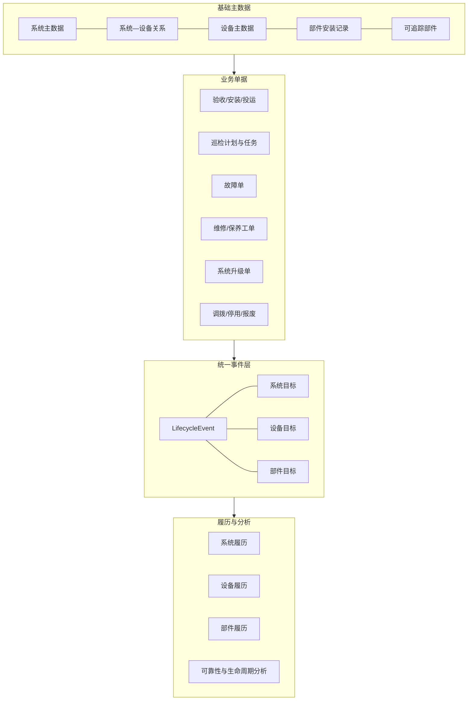
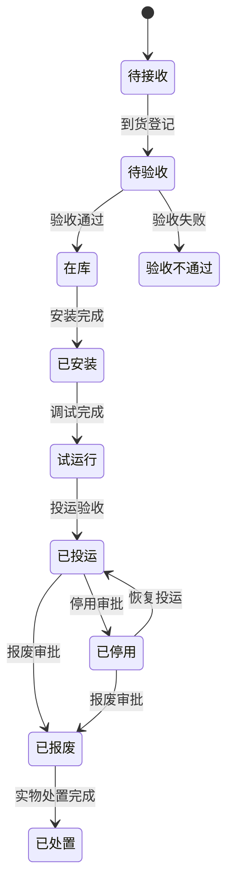
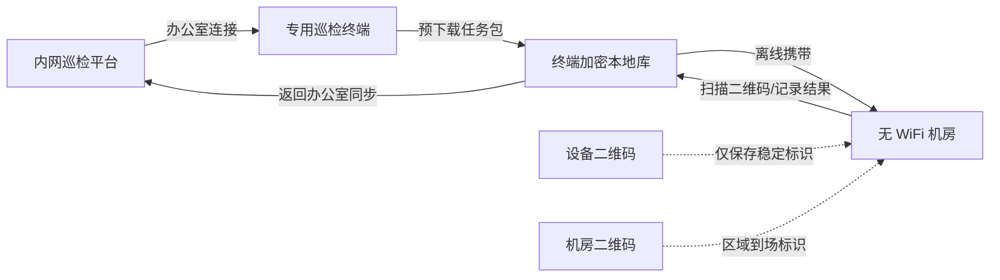

# 设备与系统全生命周期管理总体方案

> 版本：V2.0（业务与技术评审稿）  
> 编制日期：2026-08-07  
> 适用范围：设备管理、系统管理、部件管理、故障管理、系统升级、巡检、工单及履历查询  
> 编制依据：已形成的《设备与系统主数据及履历一体化管理总体方案 V1.0》、后续业务讨论和当前代码现状  
> 说明：本文不引用此前的《设备与系统全生命周期管理设计方案》。

## 1. 方案摘要

本方案以“系统主数据、设备主数据、系统—设备多对多关系”为基础，将可追踪部件、故障、系统升级、巡检、维修工单、调拨、停用和报废纳入统一的设备全生命周期管理体系。

方案的核心结论如下：

1. 系统列表和设备列表是全局基础数据，其他业务模块只能通过稳定 ID 关联，不再依赖自由填写的系统名称或设备编号。
2. 系统和设备采用带角色、状态和有效期的多对多关系，支持一台设备服务多套系统及历史加入、退出记录。
3. 有资产编号的对象进入设备列表；无资产编号但需要跨设备追踪的部件使用系统生成的内部管理编号；无需追踪个体的普通部件只作为故障明细。
4. 故障单、升级单、巡检任务、维修工单等业务单据是业务事实来源，履历是由业务动作生成的追溯结果，不是第二套独立业务表。
5. 系统履历和设备履历是两个查看维度，底层共享统一履历事件；一条事件可以同时关联多个系统、设备和可追踪部件。
6. 设备全生命周期覆盖接收、验收、入库、安装、调试、投运、巡检、维护、故障、维修、调拨、停用、报废和处置。
7. 机房无 WiFi 时采用“专用终端预下载任务、现场离线执行、返回办公室连接内网同步”的巡检模式；二维码只保存稳定标识，不依赖在线网址。
8. 工单体系可以在第一阶段之后增加，但第一阶段必须提前建好统一事件服务、目标关联、设备状态服务、通用附件和可扩展业务来源机制。

## 2. 建设范围和边界

### 2.1 本方案建设范围

- 系统主数据管理。
- 设备主数据管理。
- 系统—设备多对多关系管理。
- 可追踪部件及跨设备安装、拆卸和移动管理。
- 故障、系统升级、巡检和工单与系统、设备、部件的关联。
- 系统、设备和部件的全生命周期状态管理。
- 统一履历事件及系统履历、设备履历、部件履历。
- 内网无 WiFi 环境下的离线巡检。
- 数据迁移、权限、审计、附件、导出和验收。

### 2.2 暂不作为首期重点的范围

- 预算申请、采购审批和招投标全流程。
- 发票、会计科目、财务折旧和资产原值核算。
- 完整仓储物流和多仓库库存系统。
- 供应商结算及财务付款流程。
- 所有低价值耗材逐件编码。

上述能力可以预留字段和接口。若单位已有采购、财务或固定资产系统，应优先集成，而不是在本系统中重复建设。

## 3. 当前系统基础和主要问题

### 3.1 可复用的现有基础

当前代码已经具备以下基础：

| 能力 | 当前实现 | 本方案处理方式 |
| --- | --- | --- |
| 设备台账 | `DeviceResume` 已包含资产编号 `device_sn`，并在租户内唯一 | 保留并扩展为正式设备主数据 |
| 设备事件 | `DeviceEvent` 已记录故障、更新、检修等事件 | 平滑演进为统一履历事件或迁移到新事件模型 |
| 升级系统候选项 | `UpgradeSystem` 用于升级系统下拉 | 提升为全局系统主数据，不再由升级模块独占 |
| 系统升级 | `UpgradeRecord` 已有升级过程、步骤和状态日志 | 增加正式系统关联、受影响设备和版本基线 |
| 故障管理 | `FaultRecord` 和 `FaultPart` 已存在 | 增加设备、受影响系统和可追踪部件关联 |
| 通用附件和审计 | 多个模块已经使用公共附件和审计能力 | 后续巡检和工单继续复用 |

### 3.2 当前主要问题

- 升级记录中的系统仍以名称文本保存。
- 故障中的系统名称和设备编号仍以文本保存。
- 系统候选项属于升级模块私有数据，不能作为全局基础数据。
- 设备只表达当前状态，缺少完整生命周期阶段和状态变化规则。
- 设备、系统、部件的历史关系没有统一的时间区间模型。
- 故障、升级和设备履历可能重复录入同一事实。
- 无资产编号但需要跨设备移动的部件缺少稳定身份。
- 巡检发生在机房，现有系统入口在电脑端，记录时间和实际巡检时间错位。
- 后续工单、预防性维护和报废流程尚未形成统一业务架构。

## 4. 核心概念

### 4.1 系统

系统是承担一组业务能力或运行功能的逻辑对象。一个系统可以包含多台设备，一台设备也可以同时服务多套系统。

### 4.2 设备

设备是具有独立资产编号，可以独立安装、维修、调拨、停用或报废的资产对象。数据库内部使用不可见的主键 ID 关联，资产编号是租户内唯一的业务编号。

### 4.3 可追踪部件

可追踪部件没有正式资产编号，但需要知道这个具体部件过去装在哪台设备、发生过什么故障、现在在哪里。因此系统为其生成内部管理编号，例如 `COMP-2026-000123`。

### 4.4 普通故障部件

普通故障部件不需要识别具体个体，只需要在故障单中记录名称、规格、数量、是否更换和处理结果，例如普通内存条、保险丝或接头。

### 4.5 业务单据

故障单、升级单、巡检任务、维修工单、调拨单、报废单等是业务事实来源。

### 4.6 履历事件

履历事件是由业务动作产生的追溯记录。履历事件保存来源、动作、发生时间、操作人、目标关联和当时快照，可以被系统履历、设备履历和部件履历共同展示。

## 5. 总体业务架构



## 6. 系统、设备和关系主数据

### 6.1 系统主数据

建议系统主数据至少包含：

| 字段 | 含义 | 规则 |
| --- | --- | --- |
| `system_code` | 系统编号 | 租户内唯一，原则上不可修改 |
| `name` | 系统名称 | 当前正式名称，可修改 |
| `short_name` | 系统简称 | 可选 |
| `status` | 系统状态 | 规划中、建设中、试运行、在用、停用、下线 |
| `owner_department` | 责任部门 | 建议必填 |
| `owner` | 负责人 | 建议必填 |
| `launch_date` | 投运日期 | 可选 |
| `purpose` | 系统用途 | 建议填写 |
| `description` | 系统说明 | 可选 |
| 审计字段 | 创建、更新、停用和删除信息 | 必须 |

系统改名后，历史事件仍保留事件发生时的系统编号和名称快照。

### 6.2 设备主数据

现有 `DeviceResume.device_sn` 继续作为设备资产编号。建议补充：

- 设备类别。
- 出厂序列号。
- 采购或接收日期。
- 到货和验收日期。
- 供应商。
- 合同编号。
- 质保开始和结束时间。
- 设计使用年限。
- 设备重要等级。
- 技术负责人和资产保管人。
- 当前生命周期状态、运行状态和使用状态。
- 停用、报废和处置信息。

### 6.3 系统—设备多对多关系

不在设备表中增加单一 `system_id`，而是建立正式关系表：

| 字段 | 含义 |
| --- | --- |
| `system_id` | 关联系统 |
| `device_id` | 关联设备 |
| `role_code` / `role_name` | 设备在该系统中的角色 |
| `is_primary` | 是否为设备主要归属系统，仅用于默认展示和统计 |
| `valid_from` | 关系生效时间 |
| `valid_to` | 关系结束时间，为空表示当前有效 |
| `status` | 待生效、有效、已退出 |
| `remark` | 变更原因或备注 |
| 审计字段 | 操作人和创建更新时间 |

必须满足以下规则：

- 同一系统、设备和角色不能存在重叠的有效关系区间。
- 设备退出系统时结束关系，不能删除历史关系。
- 重新加入时建立新的关系时间段。
- 新增、退出和角色变化均生成同时关联系统和设备的履历事件。

## 7. 无资产编号部件管理

### 7.1 分类规则

| 对象类型 | 识别标准 | 管理方式 |
| --- | --- | --- |
| 设备资产 | 有正式资产编号，可独立安装、维修、调拨或报废 | 进入设备列表 |
| 可追踪部件 | 无资产编号，但需要追踪具体个体和跨设备流转 | 建立部件档案和内部管理编号 |
| 普通故障部件 | 不关心具体个体，只记录故障和更换 | 作为故障明细，不建部件档案 |

### 7.2 可追踪部件档案

建议字段包括：

- 部件内部管理编号。
- 部件名称、类别和型号。
- 厂家和厂家序列号。
- 当前状态：在库、已安装、已拆卸、送修、待测试、报废。
- 当前设备缓存。
- 当前安装位置。
- 备注和审计字段。

### 7.3 部件安装记录

部件当前设备不能成为唯一历史依据，必须建立带时间区间的安装记录：

| 字段 | 含义 |
| --- | --- |
| `component_id` | 具体部件 |
| `device_id` | 安装设备 |
| `installed_at` | 安装时间 |
| `removed_at` | 拆卸时间，为空表示当前安装 |
| `position` | 机框、插槽或安装位置 |
| `operation_type` | 安装、拆卸、移动、送修、返库、报废 |
| `source_type` / `source_id` | 来源故障单或工单 |
| `reason` | 操作原因 |
| `operator` | 操作人 |

一个可追踪部件同一时刻只能存在一条未结束的安装记录。

### 7.4 部件移动

部件从设备 A 移到设备 B 时，系统在一个事务中：

1. 校验部件当前状态和当前设备。
2. 结束设备 A 的有效安装记录。
3. 建立设备 B 的安装记录。
4. 更新部件当前设备和状态缓存。
5. 生成一条部件移动事件。
6. 将事件关联部件、设备 A 和设备 B。
7. 若移动影响系统运行，再明确选择受影响系统。

部件在设备 A 上发生的旧故障永久属于设备 A，不因以后移到设备 B 而转移。

## 8. 全生命周期状态设计

### 8.1 不使用单一混合状态

设备的“已投运”和“故障”并不冲突。完整生命周期不能只使用一个状态字段，建议拆成三个维度。

| 状态维度 | 示例 | 说明 |
| --- | --- | --- |
| 生命周期状态 | 待接收、待验收、在库、已安装、试运行、已投运、已停用、已报废 | 表示设备处于哪个生命周期阶段 |
| 运行状态 | 正常、故障、维修中、降级运行、未知 | 表示当前健康和运行情况 |
| 使用状态 | 在用、备用、借出、送修、调拨中 | 表示当前使用方式和占用情况 |

例如：

```text
生命周期状态：已投运
运行状态：故障
使用状态：在用
```

### 8.2 设备生命周期



### 8.3 系统生命周期

```text
规划 → 建设 → 验收 → 试运行 → 投运 → 升级/变更 → 停运 → 下线
```

### 8.4 部件生命周期

```text
建档/入库 → 安装 → 拆卸 → 送修 → 测试 → 再安装/返库 → 报废
```

## 9. 生命周期业务能力

### 9.1 接收、验收和入库

建议增加：

- 到货登记。
- 开箱验收。
- 数量、型号、序列号核对。
- 外观、附件和技术资料检查。
- 通电和功能测试。
- 验收问题和遗留项。
- 验收结论。
- 验收照片、报告和签字附件。

验收通过后设备进入在库状态；验收不通过不能直接投运。

### 9.2 安装、调试和投运

安装和投运记录至少包含：

- 安装位置。
- 安装单位和执行人。
- 关联系统及设备角色。
- 安装时间。
- 线缆、网络、频率等关键连接信息。
- 调试项目和结果。
- 初始配置基线。
- 投运验收人和投运时间。

安装、关系建立、调试完成和正式投运分别生成履历事件。

### 9.3 调拨和信息变更

以下信息不能直接覆盖修改后不留历史：

- 使用单位。
- 安装位置。
- 保管人和负责人。
- 关联系统。
- 设备角色。
- 在用、备用或借出状态。

重要变更应通过调拨或变更单完成，审批通过后更新主数据并生成履历。

### 9.4 停用、报废和处置

报废流程建议包括：

1. 停用或报废申请。
2. 技术鉴定。
3. 审批。
4. 退出关联系统。
5. 拆出仍可使用的部件。
6. 数据擦除或配置清理。
7. 实物处置。
8. 上传处置凭证。
9. 关闭设备档案并永久保留履历。

电脑、服务器和存储设备应记录硬盘数据擦除或销毁证明。

## 10. 故障和系统升级

### 10.1 故障管理

故障单是故障事实的唯一来源，建议包含：

- 故障设备。
- 故障时间、现象和级别。
- 实际受影响系统，可多选。
- 可追踪部件或普通故障部件。
- 故障原因。
- 处置过程。
- 恢复时间。
- 最终结果。
- 是否生成维修工单。

选择设备后，系统根据故障时间列出当时有效的关联系统，由操作人确认本次实际受影响的系统。不能用设备当前系统关系反推历史影响范围。

### 10.2 设备状态联动

关闭一张故障单时不能简单把设备改回正常。设备可能同时存在多张未关闭故障。

建议规则：

- 报废和停用属于人工生命周期状态，优先级最高。
- 存在维修中工单时运行状态显示维修中。
- 存在其他未关闭故障时运行状态显示故障。
- 无未关闭故障、未停用且未报废时才恢复正常。
- 自动状态变化和人工覆盖均生成履历事件。

### 10.3 系统升级

系统升级单必须关联正式系统主数据，并记录：

- 升级系统。
- 升级类型。
- 升级前后版本。
- 计划和实际时间。
- 升级内容、风险和回退方案。
- 明确受影响设备，可多选。
- 执行步骤和状态日志。
- 完成、失败和回退结果。

系统升级始终进入系统履历。只有明确选择且实际发生固件、配置、版本或其他变更的设备，才进入设备履历。禁止给系统内所有设备自动复制升级履历。

## 11. 巡检和预防性维护

### 11.1 巡检业务模型

```text
巡检策略
→ 巡检计划
→ 巡检任务
→ 巡检执行
→ 设备检查结果
→ 检查项结果
→ 异常
→ 故障单或维修工单
```

### 11.2 巡检策略

巡检策略可以配置在设备类别、型号、系统或具体设备上：

- 巡检周期。
- 适用设备范围。
- 巡检路线。
- 检查项目。
- 是否必须读取实测值。
- 正常范围。
- 是否需要现场照片。
- 异常级别和自动转单规则。
- 任务提前生成时间和超期规则。

类别或型号提供默认策略，具体设备可以覆盖周期和检查项。

### 11.3 异常驱动的巡检表

巡检表不应要求每台设备填写大量重复文字，否则容易诱发批量点击“正常”。建议：

- 正常设备允许快速确认。
- 重点设备必须填写少量关键实测值。
- 检查项异常时才展开原因、照片和说明。
- 设备名称、编号、系统和位置全部自动带出。
- 异常直接生成待办、故障单或维修工单。
- 照片主要用于异常、关键设备和抽查，不要求所有设备每次拍照。

### 11.4 巡检与设备履历

- 所有巡检明细保存在巡检模块。
- 设备详情可以查看完整巡检记录。
- 日常正常巡检不逐条堆入设备主履历，可按月或周期汇总。
- 发现异常、调整参数、更换部件或状态变化时生成显著履历事件。
- 巡检任务生成故障单后，故障发生和处置由故障单及工单继续负责，避免重复履历。

## 12. 内网无 WiFi 的离线巡检方案

### 12.1 约束条件

本方案针对以下现场条件：

- 平台部署在单位内网。
- 机房没有 WiFi，巡检现场无法访问平台。
- 个人手机可能不能接入内网，甚至可能不允许带入机房。
- 巡检结果最终仍需要进入内网平台。
- 不能把“返回办公室后凭记忆填写”伪装成现场实时记录。

二维码扫描本身不需要网络。真正需要解决的是任务预下载、本地离线执行和回到内网后的可靠同步。

### 12.2 推荐模式

推荐使用单位管理的安卓平板或手持终端：

```text
办公室连接内网
→ 用户登录并下载当天巡检任务包
→ 终端进入离线模式
→ 到机房扫描机房/设备二维码
→ 离线填写检查结果、读数、异常、照片或语音
→ 返回办公室
→ 终端通过内网 WiFi、有线网卡或同步底座连接平台
→ 上传巡检批次
→ 服务端校验、去重、入库并返回逐条结果
→ 终端确认成功后清理已同步数据
```

机房不需要建设 WiFi，巡检终端只在办公室下载和上传。

### 12.3 推荐部署拓扑



### 12.4 终端选择

优先级建议如下：

1. 单位专用安卓手持终端或三防平板。
2. 单位统一管理的普通安卓平板。
3. 允许个人手机时使用受控移动端，但可信度和安全性较低。
4. 现场禁止电子设备时使用简化纸质路线卡，返回后补录并上传扫描件。

专用终端应具备：

- 摄像头或二维码扫描头。
- 足够的离线存储空间。
- 可通过 USB-C 网卡、内网 WiFi 或底座连接办公室内网。
- 系统时间和安装应用受管理。
- 锁屏密码和本地加密。
- 可限制截屏、导出和安装无关应用。

### 12.5 PWA 与原生应用选择

现有前端是 Web 技术体系，可优先评估离线 PWA：

- 使用 Service Worker 缓存应用静态资源。
- 使用 IndexedDB 保存任务、结果和待同步附件索引。
- 使用摄像头扫描二维码。
- 回到内网后调用同步接口。

PWA 的前提：

- 内网站点使用可信 HTTPS 证书。
- 终端浏览器支持摄像头、Service Worker 和 IndexedDB。
- 应用在离开网络前已安装并完成任务预下载。
- 终端存储和浏览器清理策略受控。

以下情况更适合原生安卓应用：

- 需要专用扫码头或 NFC。
- 需要更强的本地加密和设备证书。
- 需要严格禁止用户修改时间或导出文件。
- 需要后台上传、断点续传或大批量照片。
- PWA 在目标终端上的离线稳定性不满足要求。

建议先用真实目标终端做 PWA 技术验证，通过后再决定是否开发原生应用。

### 12.6 二维码设计

二维码不保存平台 URL、用户信息或设备敏感参数，只保存稳定标识和格式版本，例如：

```text
TDYW|V1|ROOM|YANTAI-JF-01
TDYW|V1|DEVICE|TD-YW-2026001
TDYW|V1|COMPONENT|COMP-2026-000123
```

服务端维护二维码标识与内部 ID 的映射。离线任务包中包含本次任务所需的最小映射数据。

二维码管理要求：

- 编码不因设备改名或系统改名而改变。
- 标签损坏后可以重新打印相同标识。
- 标签作废、设备报废或二维码泄露时可以在平台停用。
- 二维码只用于识别，不作为单独的安全凭证。
- 重点设备可以使用防拆标签，但不能把标签存在当作巡检完成证明。

### 12.7 机房二维码与设备二维码

建议分两级使用：

- 机房二维码用于确认巡检进入某个区域并打开该区域任务。
- 重点设备二维码要求逐台扫描。
- 普通设备可以在完成机房扫码后按路线快速确认。
- 设备扫码顺序形成现场执行序列，但不强制固定顺序。

不建议依赖手机 GPS 证明机房到场。室内定位误差大，且内网环境下没有必要。机房和设备二维码更直接。

### 12.8 离线任务包

终端离开办公室前下载一个具备版本和有效期的任务包。任务包只包含本次巡检必需的数据：

- 任务 ID 和离线批次 ID。
- 执行人或执行班组。
- 计划时间和有效期。
- 巡检路线和机房列表。
- 需要检查的系统、设备和资产编号。
- 检查项、字段类型和正常范围。
- 设备及机房二维码标识映射。
- 必要的上次读数或最近异常摘要。
- 表单版本和业务规则版本。
- 服务端数字签名或完整性校验值。

不应下载：

- 与本次任务无关的全部设备台账。
- 用户不具备权限的系统和设备。
- 不必要的人员、合同或敏感配置数据。
- 可用于长期调用内网接口的明文密码或长期令牌。

### 12.9 离线身份和授权

用户必须在连接内网时完成登录和任务领取。离线执行使用限定范围的任务授权，而不是长期保存账号密码。

建议授权信息包含：

- 用户 ID。
- 终端 ID。
- 离线批次 ID。
- 允许操作的任务和设备范围。
- 生效时间和失效时间。
- 服务端签名。

任务过期后终端可以保留已经采集的数据，但不能继续新增超出授权范围的记录。返回内网后由服务端决定是否接受超期补录，并要求说明原因。

### 12.10 本地数据模型

终端本地至少保存：

| 本地对象 | 主要内容 |
| --- | --- |
| `OfflinePackage` | 任务包版本、签名、有效期、下载时间 |
| `InspectionTaskCache` | 任务、路线、机房、设备和检查项 |
| `InspectionRunLocal` | 本次执行、开始结束时间、执行人、终端 |
| `ItemResultLocal` | 检查项结果、读数、异常和备注 |
| `ScanEventLocal` | 扫描对象、时间、顺序号和结果 |
| `AttachmentLocal` | 照片、语音、文件摘要和本地路径 |
| `SyncQueue` | 待上传事件、重试次数和同步状态 |

本地业务记录使用终端生成的 UUID，不能依赖服务端自增 ID。

### 12.11 现场执行流程

1. 巡检员在办公室确认任务已完整下载。
2. 终端显示离线可用状态、任务数量和有效期。
3. 到达机房后扫描机房二维码，打开对应路线。
4. 按路线检查设备；重点设备扫描设备二维码。
5. 正常项快速确认，关键项目输入实测值。
6. 异常项展开异常类型、说明、照片或语音。
7. 暂时无法判断时标记“待复核”，不能强制填正常。
8. 完成机房任务后进行完整性检查。
9. 巡检员确认提交，终端将批次置为“待同步”。
10. 返回办公室连接内网后执行同步。

### 12.12 时间记录和可信度

离线巡检必须同时保存多个时间：

| 时间 | 来源 | 用途 |
| --- | --- | --- |
| `planned_at` | 服务端 | 计划巡检时间 |
| `package_downloaded_at` | 服务端 | 任务包下载时间 |
| `scan_captured_at` | 终端 | 现场扫码时间 |
| `inspected_at_client` | 终端 | 现场检查时间 |
| `submitted_at_client` | 终端 | 本地提交时间 |
| `received_at_server` | 服务端 | 平台收到时间 |
| `synced_at` | 服务端 | 同步完成时间 |

还应保存：

- 下载任务时服务端时间与终端时间的偏移量。
- 本地递增序号。
- 终端 ID。
- 任务包版本。
- 是否离线执行。
- 是否超期同步。
- 是否人工补录。

需要明确：离线状态下服务端无法百分之百证明终端时间未被修改。提高可信度的方法包括单位专用终端、限制修改系统时间、保存扫描顺序、服务端时间偏移和任务包有效期。系统不能把离线终端时间包装成绝对可信时间。

### 12.13 同步协议

同步采用批次方式，而不是一条一条直接提交：

```text
终端提交同步批次
→ 服务端验证用户、终端、任务包和签名
→ 校验任务版本和权限
→ 按客户端 UUID 去重
→ 逐条校验扫描、检查结果和附件摘要
→ 写入巡检执行和检查结果
→ 创建异常、故障或待办
→ 返回逐条成功/失败结果
→ 终端仅清理确认成功的数据
```

同步批次建议包含：

- `batch_id`：终端生成的唯一批次 ID。
- `package_id`：来源任务包。
- `terminal_id`：终端标识。
- `user_id`：执行用户。
- `schema_version`：离线数据结构版本。
- `form_version`：巡检表版本。
- `records`：执行记录和检查项。
- `attachments`：附件清单及摘要。
- `client_hash`：批次完整性摘要。

服务端响应必须逐条返回：

- 客户端 UUID。
- 服务端记录 ID。
- 成功、重复、拒绝或需要人工处理。
- 失败原因。
- 服务端最终版本。

### 12.14 幂等和冲突处理

#### 重复上传

同一 `batch_id` 或客户端记录 UUID 重复提交时，服务端返回原处理结果，不生成重复巡检记录。

#### 任务被修改

终端下载任务后，服务端可能修改检查项。处理规则建议：

- 已开始的离线任务继续使用下载时的表单版本。
- 同步时保存原表单版本，不强行套用最新表单。
- 影响安全或合规的紧急变更可以使旧任务包失效，但必须允许上传已采集数据并进入人工复核。

#### 两人执行同一任务

- 任务领取时记录执行人和终端。
- 默认只允许一个有效执行批次。
- 第二人确需接管时必须执行正式转派。
- 双方均已产生数据时不能覆盖，应进入冲突处理并保留两个批次。

#### 主数据发生变化

离线记录始终保存任务下载时的设备编号、名称和检查项快照，同时关联当前主数据 ID。设备以后改名不影响历史记录。

### 12.15 附件同步

照片和语音体积较大，建议分阶段同步：

1. 先提交结构化巡检结果和附件摘要。
2. 服务端返回需要上传的附件列表和上传凭证。
3. 终端逐个上传，支持断点续传和失败重试。
4. 服务端校验文件哈希、大小、类型和权限。
5. 所有必需附件成功后，巡检批次才进入“完整同步”。

异常照片应自动关联具体设备、检查项和异常记录，不能只挂在整个任务上。

### 12.16 本地安全

建议实施：

- 本地数据库和附件目录加密。
- 终端必须设置锁屏密码。
- 用户退出、授权过期或终端报失后禁止新增离线记录。
- 任务包只包含最小必要数据。
- 上传成功并超过保留期后自动清理本地数据。
- 终端丢失时可通过设备管理平台锁定或擦除。
- 禁止把附件自动同步到个人云盘或系统相册。
- 不在二维码中保存 IP、频率参数、密码或其他敏感配置。
- 同步接口仍执行租户、权限和对象范围校验，不能信任终端传来的 ID。

### 12.17 应用缓存和数据缓存分离

离线应用需要区分：

- 应用静态资源缓存：页面、脚本、样式和图标。
- 业务任务缓存：任务、设备、检查项和二维码映射。
- 用户采集数据：结果、异常、照片和语音。

升级应用时不能清除尚未同步的用户数据。数据库结构升级必须有迁移脚本，并在升级前检查待同步数据。

### 12.18 终端同步方式

按优先级选择：

#### 方式 A：办公室受控内网 WiFi

终端只在办公室连接受控无线网络。机房无需无线覆盖。这是使用体验最好的方式。

#### 方式 B：USB-C 有线网卡或同步底座

终端返回办公室后插入网线底座或 USB-C 网卡接入内网。适合不允许无线网络的单位。

#### 方式 C：加密任务包导入导出

当移动终端完全不能接入内网时：

1. 内网电脑导出签名任务包。
2. 通过受控介质或专用桌面工具导入终端。
3. 巡检后终端导出加密结果包。
4. 内网电脑校验签名并导入平台。

该方式需要介质审批、病毒检查、签名、加密、重复导入防护和操作审计，开发和运维成本明显更高。

#### 方式 D：纸质路线卡加补录

现场禁止任何电子设备时：

- 平台打印带任务编号和设备清单的简化路线卡。
- 现场只勾选、填写关键读数和异常。
- 返回后扫描上传并补录结构化结果。
- 系统分别保存实际巡检时间、补录时间和原始扫描件。

该方式真实性弱于专用离线终端，但比返回后凭记忆填写可靠。

### 12.19 不建议的做法

- 为巡检临时建立未经安全评估的机房热点。
- 二维码直接包含内网平台 URL 和敏感设备信息。
- 把终端时间当作绝对可信时间。
- 要求每台设备每次拍照，导致形式化应付。
- 上传成功前删除本地数据。
- 用相同账号在多台终端长期离线工作。
- 发生同步冲突时以后上传的数据直接覆盖先上传的数据。
- 将所有正常巡检逐条写入设备主履历。

### 12.20 离线巡检验收场景

| 场景 | 预期结果 |
| --- | --- |
| 无网络启动任务 | 已下载任务可以打开，未下载任务不可伪造 |
| 扫描机房二维码 | 正确打开对应路线，错误区域给出提示 |
| 扫描设备二维码 | 识别资产并定位检查项，不依赖在线查询 |
| 关键读数越界 | 立即提示并要求异常说明 |
| 拍摄异常照片 | 离线保存并关联设备和检查项 |
| 应用被关闭或终端重启 | 已保存数据仍然存在 |
| 重复同步同一批次 | 服务端不生成重复记录 |
| 同步部分失败 | 成功项保持成功，失败项可修正后重试 |
| 任务版本变化 | 原任务按下载版本保存并标注版本 |
| 终端时间偏差明显 | 平台标记异常并进入复核，不直接拒绝全部数据 |
| 两人执行同一任务 | 不互相覆盖，进入转派或冲突处理 |
| 附件上传中断 | 支持续传，结构化结果不丢失 |
| 终端丢失 | 任务授权可吊销，本地数据可锁定或擦除 |

## 13. 工单体系及后续扩展

### 13.1 工单与故障单的边界

故障单回答“发生了什么”，工单回答“由谁、何时、怎样处理”。

```text
故障单
└─ 一张或多张维修工单
   ├─ 现场检查
   ├─ 部件拆卸送修
   └─ 返装和恢复测试
```

故障单记录现象、影响、原因和恢复；工单记录负责人、步骤、工时、部件使用和执行结果。

### 13.2 工单类型

- 故障维修工单。
- 定期巡检工单。
- 预防性保养工单。
- 安装调试工单。
- 部件更换工单。
- 技术改造工单。
- 调拨拆装工单。
- 现场测试和校准工单。

### 13.3 工单主数据

建议工单包含：

- 工单编号和类型。
- 来源业务，例如故障、巡检异常或维护计划。
- 目标系统、设备和部件。
- 优先级。
- 负责人和协作人。
- 计划开始和结束时间。
- 实际开始和结束时间。
- 执行步骤和检查清单。
- 工时和停机时间。
- 使用、更换和拆卸的部件。
- 处理结果和验证结果。
- 验收人。
- 附件和状态日志。

### 13.4 第一阶段必须预留的扩展点

第一阶段完成后能否顺利加工单，取决于以下基础是否正确：

1. 履历来源使用可扩展的 `source_type + source_id + action`，不能只允许故障和升级。
2. 统一服务可以关联多个系统、设备和部件。
3. 设备状态由统一状态服务计算，不能由各页面分别直接覆盖。
4. 通用附件、审计和操作日志可供工单复用。
5. 故障处置不能被设计成永远只有一次处理过程。
6. 事件幂等、来源唯一和更正机制已经存在。

### 13.5 事件所有权

为了避免重复履历，建议明确：

| 事件 | 主要来源 |
| --- | --- |
| 故障发生和影响范围 | 故障单 |
| 维修开始、暂停和完成 | 维修工单 |
| 部件拆卸、更换和安装 | 维修工单 |
| 设备恢复运行 | 故障关闭或恢复确认 |
| 系统升级完成和回退 | 系统升级单 |
| 正常巡检完成 | 巡检任务 |
| 巡检发现异常 | 巡检任务，后续事实转入故障单 |

一条事件可以关联来源工单和关联故障单，但只能有一个主要来源。

## 14. 统一履历事件

### 14.1 数据模型

| 实体 | 作用 |
| --- | --- |
| `LifecycleEvent` | 事件类型、标题、摘要、时间、来源、动作、操作人和状态 |
| `EventSystemTarget` | 关联一个或多个系统并保存事件时快照 |
| `EventDeviceTarget` | 关联一个或多个设备并保存资产编号和名称快照 |
| `EventComponentTarget` | 关联可追踪部件并保存内部编号和名称快照 |
| `EventCorrection` | 关联原事件并保存更正原因、人员和时间 |

建议使用 `tenant_id + source_type + source_id + action` 建立来源唯一约束，防止接口重试产生重复事件。

### 14.2 关联规则矩阵

| 业务事件 | 系统目标 | 设备目标 | 部件目标 | 来源 |
| --- | --- | --- | --- | --- |
| 系统投运/停运 | 必须 | 无 | 无 | 系统业务操作 |
| 系统升级完成/回退 | 必须 | 明确选择，可多个 | 可选 | 升级单 |
| 设备验收/投运 | 关联所属系统时选择 | 必须 | 无 | 验收/投运单 |
| 设备故障/恢复 | 实际受影响，可多个 | 必须 | 可选 | 故障单 |
| 设备检修/报废 | 通常不关联 | 必须 | 可选 | 工单/报废单 |
| 设备加入/退出系统 | 必须 | 必须 | 无 | 系统—设备关系 |
| 部件安装/拆卸/移动 | 影响运行时选择 | 原设备/新设备 | 必须 | 工单/安装记录 |
| 部件故障/送修 | 实际受影响，可多个 | 发生时所在设备 | 必须 | 故障单/工单 |
| 正常巡检 | 默认不进入系统主履历 | 详情页可查，主履历按周期汇总 | 可选 | 巡检任务 |
| 巡检异常 | 实际受影响，可多个 | 必须 | 可选 | 巡检任务/故障单 |
| 设备调拨 | 影响系统时选择 | 必须 | 随设备或明确移动 | 调拨单 |
| 设备报废处置 | 退出的系统 | 必须 | 拆出或报废部件 | 报废单 |

### 14.3 代码落点

关联规则由后端领域服务统一实现，不散落在前端和各个视图函数中：

1. 业务模块在数据库事务中完成自身状态变化。
2. 调用统一履历服务并传入来源、动作、时间和明确目标。
3. 履历服务根据事件策略校验必须关联的系统、设备和部件。
4. 写入事件、目标关联和事件时快照。
5. 通过唯一键保证幂等。
6. 业务保存或履历生成失败时整体回滚。

## 15. 页面和菜单

```text
设备管理
├─ 基础数据
│  ├─ 系统列表
│  ├─ 设备列表
│  └─ 部件台账（首期也可放入设备详情）
├─ 生命周期
│  ├─ 到货与验收
│  ├─ 安装与投运
│  ├─ 调拨与变更
│  └─ 停用与报废
├─ 巡检维护
│  ├─ 巡检策略
│  ├─ 巡检计划
│  ├─ 巡检任务
│  └─ 工单管理
├─ 运行管理
│  ├─ 故障管理
│  └─ 系统升级管理
└─ 履历查询
   ├─ 系统履历
   ├─ 设备履历
   └─ 部件履历
```

设备详情建议包含：

- 基本信息。
- 当前和历史关联系统。
- 当前和历史安装部件。
- 验收、安装和投运记录。
- 巡检记录。
- 故障和工单。
- 配置和版本基线。
- 调拨、停用和报废。
- 设备履历。

## 16. 权限、审计和删除

### 16.1 权限域

- 系统主数据：查看、创建、编辑、停用、关系维护、导出。
- 设备主数据：查看、创建、编辑、停用、报废、关系维护、导出。
- 部件管理：查看、建档、安装、拆卸、移动、送修、报废。
- 巡检管理：策略、计划、任务、执行、补录、复核、导出。
- 工单管理：创建、派发、接单、执行、验收、关闭、更正。
- 故障管理：报障、定位、处置、关闭、更正。
- 升级管理：申请、执行、完成、回退、更正。
- 履历管理：查看、导出、更正申请和高权限撤销。

### 16.2 审计要求

- 重要对象的创建、修改、状态变化、删除和导出必须记录操作人和时间。
- 系统—设备关系、部件安装关系结束时必须填写原因。
- 关键业务事件不允许普通用户硬删除。
- 更正必须关联原事件并说明原因。
- 离线巡检保存终端、任务包、时间、同步批次和补录标记。
- 后端按当前用户和租户重新查询数据，不信任前端或终端传来的名称和编号。

### 16.3 删除策略

已被故障、升级、巡检、工单或履历引用的系统、设备和部件不得物理删除，只能停用或软删除。停用对象不进入新建业务的默认候选，但历史记录仍可查看。

## 17. 配置基线、质保和可靠性

### 17.1 配置基线

建议逐步记录：

- 固件和软件版本。
- IP、端口和网络配置。
- 频率、呼号等业务参数。
- 板卡和模块组成。
- 配置文件和参数快照。
- 变更前后值。

系统升级或设备改造完成后形成新的配置基线。

### 17.2 质保和合同提醒

建议预留：

- 生产厂家和供应商。
- 采购和维保合同编号。
- 质保开始和结束时间。
- 服务联系人和服务等级。
- 厂家停产和停止支持时间。

可生成质保到期、维保到期、巡检到期、校准到期、设计寿命到期和厂家停止支持提醒。

### 17.3 可靠性指标

在故障和工单时间准确后，可以计算：

- 故障次数。
- 平均故障间隔时间 MTBF。
- 平均修复时间 MTTR。
- 可用率。
- 累计停机时间。
- 维修和部件更换次数。
- 设备年龄。
- 质保内外故障比例。
- 巡检异常率和逾期率。
- 维护工时和外部维修费用。

## 18. 数据迁移

### 18.1 原则

- 先增加新表和可空关联，再回填数据，最后收紧约束。
- 历史文本保留为快照，不覆盖原始内容。
- 只做基础规范化，不按相似名称自动强行合并。
- 无法确认的系统、设备和部件进入待映射清单。
- 设备映射优先使用资产编号，禁止仅按设备名称猜测。
- 迁移脚本可重复执行并输出数量和未映射报告。

### 18.2 阶段

| 阶段 | 主题 | 主要工作 |
| --- | --- | --- |
| 0 | 数据盘点 | 统计设备、升级系统、升级、故障、故障件和设备事件 |
| 1 | 系统主数据 | 建立系统列表并迁移 `UpgradeSystem` 及历史系统名称 |
| 2 | 多对多关系 | 由业务确认设备服务系统、角色和有效期 |
| 3 | 故障改造 | 增加设备、受影响系统和部件关联 |
| 4 | 升级改造 | 增加正式系统关联和受影响设备 |
| 5 | 统一履历 | 迁移可确认的设备事件并接入业务模块 |
| 6 | 生命周期单据 | 建立验收、安装、投运、调拨和报废 |
| 7 | 离线巡检 | 建立巡检计划、离线终端和同步服务 |
| 8 | 工单体系 | 接入维修、保养和部件操作工单 |
| 9 | 收紧约束 | 停止自由文本新增并增加非空、唯一和检查约束 |

## 19. 分阶段实施建议

### 第一阶段：主数据、关系和统一履历基础

- 系统列表。
- 设备列表扩展。
- 系统—设备多对多关系。
- 可追踪部件和安装记录。
- 故障和升级正式关联。
- 统一履历服务和关联规则。
- 通用附件、审计和设备状态服务。

### 第二阶段：生命周期流转

- 到货和验收。
- 安装、调试和投运。
- 调拨和信息变更。
- 停用、报废和处置。

### 第三阶段：巡检和离线终端

- 巡检策略、计划和任务。
- 异常驱动检查表。
- PWA 或专用安卓应用技术验证。
- 任务包、离线执行和批量同步。
- 二维码标签和终端管理。

### 第四阶段：工单和预防性维护

- 维修、保养、安装和部件操作工单。
- 计划任务自动生成工单。
- 工时、停机、部件使用和验收。
- 巡检异常、故障和工单闭环。

### 第五阶段：配置、提醒和分析

- 配置和版本基线。
- 质保、合同和寿命提醒。
- MTBF、MTTR、可用率和维护成本分析。
- 与采购、财务或固定资产系统集成。

## 20. 核心验收场景

| 场景 | 验收结果 |
| --- | --- |
| 多对多关系 | 同一设备可服务两套系统且角色不同，退出后历史仍可查询 |
| 共享设备故障 | 设备履历一次，实际受影响的多个系统履历均显示同一事件 |
| 纯系统升级 | 进入系统履历，不自动污染设备履历 |
| 设备固件升级 | 明确选择设备后进入系统和设备履历 |
| 部件移动 | 只存在一条有效安装记录，原设备和新设备历史正确 |
| 历史故障 | 部件旧故障不因移动到新设备而转移 |
| 设备状态 | 关闭一张故障不会覆盖其他未关闭故障和工单状态 |
| 生命周期流转 | 非法状态跳转被拒绝，合法状态变化形成履历 |
| 离线巡检 | 无网络完成巡检，回网同步后不重复、不丢数据 |
| 巡检异常 | 异常可生成故障单或工单并保持来源追溯 |
| 工单扩展 | 新增工单来源不需要重构故障、升级和统一履历 |
| 租户隔离 | 相同编号可存在于不同租户，数据和关联互不可见 |
| 停用保护 | 被引用对象不能物理删除，历史仍可查看 |
| 并发移动 | 两人同时移动同一部件时只能一个操作成功 |

## 21. 待确认事项

1. 故障报障时是否允许先建“待定位”记录，在关闭前强制补齐设备。
2. 一次升级单是否只允许一个主系统，还是允许同时升级多套系统。
3. 可追踪部件内部编号规则及是否打印二维码、防拆标签。
4. 部件台账首期是否独立成菜单。
5. 是否允许设备指定一个主要归属系统。
6. 现场是否允许携带单位专用平板或手持终端。
7. 办公区域是否具备受控内网 WiFi；若没有，是否允许 USB-C 网卡或同步底座。
8. 离线巡检首期采用 PWA 还是原生安卓应用，应以目标终端技术验证结果决定。
9. 终端时间是否由单位设备管理策略锁定。
10. 正常巡检进入设备履历时采用月度汇总还是周期汇总。
11. 存量无法映射的故障和升级记录是否只保留文本并标记“未映射”。
12. 财务资产、采购合同和折旧数据由本系统维护还是对接现有系统。

## 22. 结论

本方案不是在现有设备台账上简单增加几个字段，而是建立一套分层架构：

```text
系统、设备和部件是主数据
系统—设备及部件—设备是带时间的关系
故障、升级、巡检和工单是业务事实
统一事件是追溯机制
系统、设备和部件履历是不同查看维度
验收、投运、维护、调拨和报废构成完整生命周期
```

内网和机房无 WiFi 不妨碍现场电子巡检。可行前提是使用受控终端，在办公室预下载最小任务包，在机房离线采集，返回后连接内网进行幂等批量同步。系统必须诚实区分计划时间、终端现场时间、补录时间和服务端接收时间，不能把离线记录包装成绝对可信的实时在线记录。

第一阶段应优先建成稳定的主数据、多对多关系、部件身份、统一事件、目标关联、设备状态和通用附件能力。完成这些基础后，巡检和工单可以作为新的业务单据平滑接入，而不需要重构故障、升级和履历。
