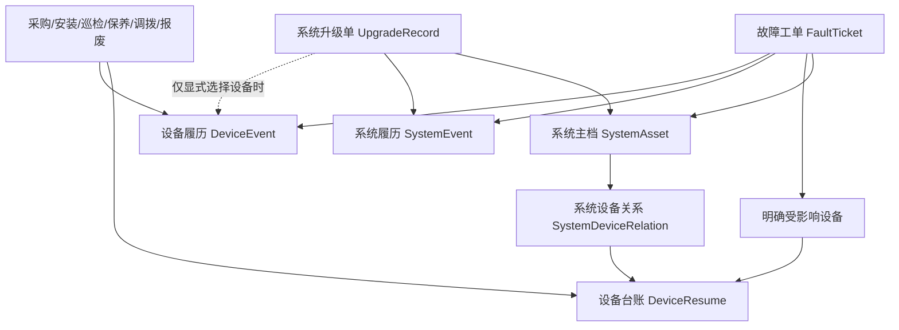

# 设备与系统全生命周期管理设计方案

> 版本：V2.0  
> 编写日期：2026-08-04  
> 适用项目：通导运维管理平台  
> 涉及模块：设备履历、故障管理、系统升级管理、合同协议、附件证据、提醒与数据分析

## 一、方案结论

现有设备管理不能只以“单台设备”为唯一管理主体。实际业务中同时存在两个层级：

- **系统级对象**：例如甚高频通信系统、自动转报系统、雷达系统。一个系统通常由多台具体设备组成。
- **设备级对象**：具有独立设备资产编号的物理设备、板卡、服务器、收发信机或其他资产。

因此，本方案采用“系统主档 + 设备台账 + 业务工单 + 双层履历”的结构：

```text
系统主档
  -> 系统与设备组成关系
      -> 多台设备资产

系统级业务
  -> 系统升级、系统级故障、系统投运、系统停运
  -> 写入系统履历

设备级业务
  -> 采购、入库、安装、巡检、故障、维修、保养、调拨、报废
  -> 写入设备履历
```

系统升级默认属于系统级事件。一次系统升级不能因为系统下挂有多台设备，就自动复制成每台设备的升级履历。只有升级明确针对某台设备的固件、板卡、服务器或部件时，才为被明确选择的设备生成设备级履历。

最终应形成以下业务原则：

1. 系统主档保存系统当前信息和当前状态。
2. 设备台账保存每台具体设备的资产信息和当前状态。
3. 故障单、升级单、巡检单等业务单据保存完整业务过程，是事实数据源。
4. 系统履历和设备履历由业务动作自动生成，不重复录入业务明细。
5. 系统事件不会无条件下沉到系统内所有设备，设备事件也不会无条件上升为系统事件。

## 二、现状与主要问题

### 2.1 当前已有能力

项目当前已经具备：

- `DeviceResume`：设备资产台账，设备资产编号在租户内唯一。
- `DeviceEvent`：设备履历事件，包含重大故障维修、设备更新、设备检修。
- `FaultRecord`：故障处置记录。
- `FaultPart`：故障件记录。
- `UpgradeRecord`：系统升级申请和执行记录。
- `UpgradeSystem`：升级系统名称候选字典。
- 升级方案、升级执行步骤、升级状态时间线、回退能力。
- 公共附件、证据事件、审计日志、提醒和数据分析能力。

### 2.2 当前问题

#### 2.2.1 系统和设备没有形成正式的两层主档

当前设备有唯一资产编号，但“系统”主要以名称文本存在于升级、故障和运行日志中。现有 `UpgradeSystem` 只是升级表单候选项，不是完整的系统主档，不具备系统编号、负责人、运行状态、投运时间、所属设备和生命周期等能力。

#### 2.2.2 故障管理和设备履历重复录入

设备履历已经记录故障现象、故障原因、故障件、检修措施和修复时间；故障管理又记录设备编号、故障现象和处置过程。两者没有正式来源关系，容易产生：

- 同一次故障需要录入两遍。
- 两边设备编号或时间不一致。
- 故障结案后设备状态没有自动恢复。
- 删除或修改故障单后，履历仍保留旧内容。

#### 2.2.3 系统升级与“设备更新”边界不清

设备履历中的“设备更新”可能被理解为软件升级、固件升级或硬件更换，而系统升级管理已经承担升级申请、执行、测试和回退流程。

本方案将两者明确拆分：

- **系统升级**：软件版本、配置、数据库、网络策略、系统级固件或整体方案升级。
- **设备变更**：设备替换、板卡更换、部件更换、移装、硬件扩容。

#### 2.2.4 生命周期覆盖仍不完整

当前主要覆盖设备在役阶段的部分记录，采购入库、安装验收、巡检计划、预防性保养、调拨交接、报废审批等尚未形成闭环。

## 三、领域对象与业务边界

### 3.1 系统主档

系统主档表示一个可独立运行、维护、升级和统计的业务或技术系统，例如：

- 甚高频通信系统。
- 自动转报系统。
- 雷达数据处理系统。
- 内话系统。
- 导航监视系统。

系统主档不使用设备资产编号，使用独立的系统编号 `system_code`。

系统可以包含多台设备。一台设备原则上有一个主要归属系统，同时允许作为共享设备或保障设备关联到其他系统。

### 3.2 设备资产

设备资产表示具有独立资产编号、可以单独安装、维修、调拨或报废的具体对象。

设备资产编号继续使用现有 `DeviceResume.device_sn`，并保持租户内唯一。

### 3.3 业务单据

业务单据是事实数据源，保存完整处理过程：

| 业务单据 | 主要主体 | 是否可以关联设备 |
|---|---|---|
| 系统升级单 | 系统 | 可选，仅关联明确受影响设备 |
| 故障工单 | 系统、设备或混合 | 可以关联一台或多台设备 |
| 巡检任务 | 系统计划、设备执行 | 每条执行记录关联具体设备 |
| 保养任务 | 设备 | 关联具体设备 |
| 采购入库单 | 设备 | 关联具体设备 |
| 安装验收单 | 设备，可汇总到系统 | 关联具体设备 |
| 调拨交接单 | 设备 | 关联具体设备 |
| 报废申请单 | 设备 | 关联具体设备 |

### 3.4 双层履历

系统履历和设备履历分别回答不同问题：

| 履历 | 回答的问题 |
|---|---|
| 系统履历 | 这个系统何时投运、升级、发生重大故障、停运或退役？ |
| 设备履历 | 这台具体设备何时采购、安装、巡检、维修、更换部件、调拨或报废？ |

履历不是另一个业务录入入口，而是业务数据的时间线投影。

## 四、总体架构



### 4.1 数据职责

| 数据层 | 保存内容 | 是否允许直接编辑历史 |
|---|---|---|
| 主档层 | 系统和设备当前快照 | 允许按权限修改 |
| 业务层 | 故障、升级、巡检等过程记录 | 通过流程动作修改 |
| 履历层 | 关键节点时间线、来源引用、业务快照 | 不允许直接修改，采用更正或作废 |
| 证据层 | 操作人、前后快照、附件哈希、审计链 | 不允许覆盖 |

### 4.2 事件归属规则

| 业务场景 | 系统履历 | 设备履历 |
|---|---|---|
| 系统软件整体升级 | 写入 | 不写入 |
| 系统配置调整 | 写入 | 不写入 |
| 系统升级失败并回退 | 写入 | 不写入 |
| 指定服务器固件升级 | 写入 | 仅写入被选服务器 |
| 系统级异常，未定位具体设备 | 写入 | 不写入 |
| 某台设备故障导致系统降级 | 写入系统影响摘要 | 写入故障设备 |
| 某台设备维修或部件更换 | 可按重大程度生成摘要 | 写入 |
| 单台设备巡检、保养、调拨 | 不写入 | 写入 |
| 系统投运或整体退役 | 写入 | 不自动写入所有设备 |
| 单台设备报废 | 可更新系统组成关系 | 写入 |

严禁为了“看起来完整”而把系统级事件批量复制到所有设备。这会造成履历膨胀，并错误暗示每台设备都执行了该操作。

## 五、功能结构

建议将设备管理调整为：

```text
设备管理
  - 系统台账
  - 设备台账
  - 系统履历
  - 设备履历
  - 故障管理
      - 故障工单
      - 故障件管理
  - 系统升级管理
      - 升级表单
      - 升级方案
      - 统计报表
  - 巡检与保养
      - 巡检计划
      - 巡检任务
      - 保养计划
      - 保养任务
  - 资产流转
      - 采购入库
      - 安装验收
      - 调拨交接
      - 报废注销
```

系统升级管理可以继续保留在当前菜单位置，但页面和数据必须明确其主体是“系统”，不是单台设备。

## 六、数据模型设计

### 6.1 系统主档 `SystemAsset`

建议在现有 `device` 应用下新增 `models_system.py`，表名 `tdyw_system_asset`。

| 字段 | 类型 | 必填 | 说明 |
|---|---|---|---|
| `id` | bigint | 是 | 主键 |
| `tenant_id` | varchar | 是 | 租户标识 |
| `system_code` | varchar(50) | 是 | 系统编号，租户内唯一 |
| `system_name` | varchar(100) | 是 | 系统名称 |
| `system_type` | varchar(50) | 否 | 系统类型 |
| `lifecycle_status` | varchar(30) | 是 | 生命周期状态 |
| `current_version` | varchar(100) | 否 | 当前软件或方案版本 |
| `area` | varchar(100) | 否 | 所属区域 |
| `install_location` | varchar(200) | 否 | 主要部署位置 |
| `owner_department_id` | bigint | 否 | 责任部门 |
| `responsible_user_id` | bigint | 否 | 责任人账号 |
| `responsible_user_name` | varchar(100) | 是 | 责任人姓名快照 |
| `commissioned_at` | datetime | 否 | 投运时间 |
| `decommissioned_at` | datetime | 否 | 退役时间 |
| `description` | text | 否 | 系统说明 |
| `is_deleted` | boolean | 是 | 软删除标记 |
| `created_at/created_by` | - | 是 | 创建信息 |
| `updated_at/updated_by` | - | 否 | 更新信息 |

约束和索引：

- 唯一约束：`(tenant_id, system_code)`。
- 名称查询索引：`(tenant_id, system_name)`。
- 状态索引：`(tenant_id, lifecycle_status)`。
- 已退役系统不得物理删除。

### 6.2 系统设备关系 `SystemDeviceRelation`

表名建议为 `tdyw_system_device_relation`。

| 字段 | 类型 | 说明 |
|---|---|---|
| `system_asset_id` | FK | 关联系统主档 |
| `device_resume_id` | FK | 关联设备台账 |
| `relation_type` | varchar(30) | 主设备、组成设备、备用设备、共享设备、保障设备 |
| `is_primary` | boolean | 是否为设备的主要归属系统 |
| `role_name` | varchar(100) | 设备在系统中的作用 |
| `effective_from` | datetime | 关系生效时间 |
| `effective_to` | datetime | 关系结束时间 |
| `is_active` | boolean | 当前是否有效 |
| `created_at/created_by` | - | 创建信息 |

规则：

- 一个系统可以关联多台设备。
- 一台设备可以有多个历史关系，但同一时间最多有一个主要归属系统。
- 共享设备可以同时关联多个系统，但必须明确 `relation_type=shared`。
- 设备调拨到其他系统时结束旧关系并创建新关系，不覆盖历史关系。

不建议只在 `DeviceResume` 增加一个永久性的 `system_name` 文本字段，因为无法保存共享关系和历史变更。

### 6.3 设备台账扩展

保留现有 `DeviceResume`，建议逐步增加：

| 字段 | 说明 |
|---|---|
| `lifecycle_status` | 设备全生命周期细分状态 |
| `device_type` | 设备类型 |
| `specification` | 规格参数 |
| `supplier` | 供应商 |
| `purchase_date` | 采购日期 |
| `warranty_end_date` | 质保截止日期 |
| `service_life_years` | 设计使用年限 |
| `asset_source` | 采购、调拨、赠予等来源 |
| `last_inspection_at` | 最近巡检时间 |
| `last_maintenance_at` | 最近保养时间 |
| `next_maintenance_at` | 下次保养时间 |

现有 `current_status` 保留用于兼容列表和统计，`lifecycle_status` 用于表达更细的业务阶段。

### 6.4 系统履历 `SystemEvent`

新增表 `tdyw_system_event`。

| 字段 | 类型 | 说明 |
|---|---|---|
| `system_asset_id` | FK | 关联系统主档 |
| `event_biz_type` | varchar(50) | 投运、升级、故障、恢复、停运、退役等 |
| `event_time` | datetime | 事件时间 |
| `event_title` | varchar(200) | 标题 |
| `event_summary` | text | 摘要 |
| `source_module` | varchar(50) | 来源模块，如 upgrade、fault |
| `source_object_type` | varchar(50) | 来源对象类型 |
| `source_object_id` | bigint/varchar | 来源业务单 ID |
| `source_action` | varchar(50) | 来源节点，如 complete、rollback、close |
| `operator_id/name` | - | 操作人及姓名快照 |
| `object_snapshot` | text/json | 事件发生时系统快照 |
| `is_void` | boolean | 是否作废 |
| `created_at` | datetime | 生成时间 |

增加唯一约束：

```text
(tenant_id, source_module, source_object_type, source_object_id, source_action)
```

用于防止接口重试或并发操作产生重复履历。

### 6.5 设备履历 `DeviceEvent` 调整

保留现有表并向“来源可追溯的设备事件”演进，建议新增：

| 字段 | 说明 |
|---|---|
| `event_biz_type` | 采购入库、安装、巡检、故障、维修、保养、硬件变更、调拨、报废 |
| `source_module` | 来源模块 |
| `source_object_type` | 来源业务对象 |
| `source_object_id` | 来源业务 ID |
| `source_action` | 来源业务节点 |
| `event_summary` | 履历摘要 |
| `object_snapshot` | 设备和业务快照 |
| `is_void` | 是否作废 |

现有整数 `event_type` 暂时保留用于兼容：

- `1` 重大故障维修：后续由故障工单自动生成。
- `2` 设备更新：页面改名为“设备变更/部件更换”。
- `3` 设备检修：后续由维修或保养业务自动生成。

当新业务全部接入后，停止从设备履历页面直接新增上述业务事件，只保留“历史补录”和“其他事件”的受控入口。

### 6.6 系统升级单调整

现有 `UpgradeRecord.system` 文本字段继续保留为历史快照，新增：

| 字段/关系 | 说明 |
|---|---|
| `system_asset_id` | 升级所属系统主档，新增记录必填 |
| `version_before` | 升级前版本 |
| `version_after` | 目标版本 |
| `actual_started_at` | 实际开始时间 |
| `actual_completed_at` | 实际完成时间 |
| `result` | 成功、失败、回退、部分成功 |

新增可选关系表 `UpgradeAffectedDevice`：

| 字段 | 说明 |
|---|---|
| `upgrade_record_id` | 升级单 |
| `device_resume_id` | 明确受影响设备 |
| `impact_type` | 固件升级、配置调整、重启、替换、验证 |
| `version_before/after` | 设备级版本快照，可为空 |
| `result` | 设备级执行结果 |

关键规则：

- 新建升级单必须选择系统主档。
- 默认不要求选择设备。
- 升级完成、失败、回退等关键节点写入系统履历。
- 只有 `UpgradeAffectedDevice` 中明确列出的设备才写设备履历。
- 不得将升级事件自动扩散到系统当前关联的全部设备。

### 6.7 故障工单调整

故障可能发生在系统层，也可能定位到具体设备，因此故障主体设计为：

| 字段 | 说明 |
|---|---|
| `fault_scope` | `system`、`device`、`mixed` |
| `system_asset_id` | 受影响系统，系统级和混合级必填 |
| `fault_level` | 故障等级 |
| `impact_scope` | 影响范围 |
| `reported_at` | 报修时间 |
| `ticket_status` | 待派单、已派单、维修中、待确认、已结案 |
| `root_cause` | 根因分析 |
| `handling_process` | 处置过程 |
| `solution` | 解决方案 |
| `closed_at` | 结案时间 |

新增 `FaultAffectedDevice`：

| 字段 | 说明 |
|---|---|
| `fault_ticket_id` | 故障工单 |
| `device_resume_id` | 受影响或故障设备 |
| `relation_type` | 根因设备、受影响设备、排查设备 |
| `device_status_before/after` | 状态快照 |
| `repair_result` | 修复、替换、待观察、无法修复 |

事件生成规则：

- 系统级故障写系统履历，不强制选择设备。
- 设备级故障写对应设备履历。
- 设备故障造成系统降级时，同时写系统影响摘要和设备故障履历。
- 仅“根因设备”和实际维修设备进入设备履历；仅被排查但无异常的设备不写故障履历。

### 6.8 故障件与配件更换

现有 `FaultPart` 应与故障工单、具体设备建立关系，建议补充：

- `fault_ticket_id`。
- `device_resume_id`。
- `part_code`、`part_model`、`part_sn`。
- `quantity`。
- `action_type`：送修、替换、返厂、测试、归档。
- `old_part_sn`、`new_part_sn`。

配件更换完成后生成一条设备级“部件更换”履历，不单独重复录入设备更新事件。

## 七、生命周期状态

### 7.1 系统生命周期状态

```text
规划中
  -> 建设中
  -> 联调中
  -> 待验收
  -> 正常运行
  -> 降级运行 / 停运维护
  -> 正常运行
  -> 退役审批中
  -> 已退役
```

建议编码：

| 编码 | 名称 |
|---|---|
| `planning` | 规划中 |
| `building` | 建设中 |
| `commissioning` | 联调中 |
| `acceptance_pending` | 待验收 |
| `running` | 正常运行 |
| `degraded` | 降级运行 |
| `maintenance` | 停运维护 |
| `decommission_pending` | 退役审批中 |
| `decommissioned` | 已退役 |

### 7.2 设备生命周期状态

```text
待入库
  -> 待安装
  -> 安装调试中
  -> 待验收
  -> 正常运行
  -> 故障 / 维修中 / 保养中 / 停用
  -> 正常运行
  -> 报废审批中
  -> 已报废
```

状态变更必须由业务动作驱动。除数据修复权限外，不允许用户在普通设备编辑表单中随意改变生命周期状态。

## 八、核心业务流程

### 8.1 系统升级流程

```text
选择系统
  -> 填写升级内容、影响范围、风险和回退方案
  -> 可选：明确选择受影响设备
  -> 执行升级步骤
  -> 测试验证
  -> 完成 / 失败 / 回退
  -> 更新系统当前版本
  -> 写入系统履历
  -> 仅为明确选择的设备写入设备履历
```

系统升级单的“影响范围”可以描述业务影响，但不能据此自动推断所有设备都执行了升级。

### 8.2 故障闭环

```text
故障报修
  -> 选择故障范围：系统 / 设备 / 混合
  -> 选择受影响系统
  -> 可选或必选具体设备
  -> 待派单
  -> 已派单
  -> 维修中
  -> 待确认
  -> 已结案
  -> 更新系统和设备状态
  -> 自动生成对应层级履历
```

状态联动：

| 故障情况 | 系统状态 | 设备状态 |
|---|---|---|
| 系统级故障，未定位设备 | 降级或停运维护 | 不批量修改 |
| 单台设备故障，系统仍正常 | 保持正常 | 故障 |
| 单台设备故障导致系统降级 | 降级 | 故障 |
| 设备进入维修 | 按实际影响保持或降级 | 维修中 |
| 故障结案 | 根据确认结果恢复 | 正常或停用 |

### 8.3 设备资产全生命周期

首期完整目标仍包括：

1. 采购入库。
2. 安装调试。
3. 验收投运。
4. 日常巡检。
5. 故障维修。
6. 定期保养和计量校准。
7. 设备移装、调拨和责任人交接。
8. 部件更换和硬件变更。
9. 停用封存。
10. 报废鉴定、审批和处置归档。

## 九、履历生成与一致性机制

### 9.1 单一事实源

| 内容 | 事实数据源 |
|---|---|
| 升级过程 | `UpgradeRecord` 及升级步骤、状态日志 |
| 故障过程 | 故障工单及故障处理日志 |
| 巡检结果 | 巡检记录 |
| 保养结果 | 保养记录 |
| 系统组成关系 | `SystemDeviceRelation` |
| 系统时间线 | `SystemEvent` 投影 |
| 设备时间线 | `DeviceEvent` 投影 |

禁止以履历内容反向替代业务单据，也禁止业务单据和履历分别人工维护。

### 9.2 事务边界

关键业务动作必须在同一事务内完成：

```text
更新业务单状态
  -> 更新系统或设备当前状态
  -> 生成系统或设备履历
  -> 写入证据事件
  -> 创建提醒或待办
```

任一步骤失败，整个动作回滚。

### 9.3 更正与作废

- 已生成的履历不直接覆盖。
- 业务单更正后生成更正事件，并保留修改前后快照。
- 业务单作废时将对应履历标记为作废，不物理删除。
- 履历页面展示“已更正”“已作废”和来源单据链接。

## 十、前端页面设计

### 10.1 系统台账页

列表字段：

- 系统编号。
- 系统名称。
- 系统类型。
- 当前状态。
- 当前版本。
- 所属区域。
- 责任部门和责任人。
- 组成设备数量。
- 未闭环故障数。
- 最近升级时间。

系统详情页页签：

```text
基础信息
系统组成
系统升级
系统故障
系统履历
附件证据
统计指标
```

“系统组成”展示当前设备、备用设备、共享设备和历史退出设备，并支持从设备详情跳转。

### 10.2 设备台账页

设备详情页页签：

```text
基础信息
所属系统
采购入库
安装验收
巡检记录
故障维修
保养校准
设备变更
调拨交接
报废记录
设备履历
附件证据
```

### 10.3 系统升级页面

升级表单调整：

- “升级系统”必须从系统主档选择，不再自由输入普通文本。
- 展示系统编号、当前版本、当前状态和责任人。
- 增加“明确受影响设备”可选区域。
- 设备选择范围默认限制为当前系统的有效组成设备。
- 允许选择共享设备，但需明确显示其归属关系。
- 提示文字明确说明：未选择设备时，升级仅计入系统履历。

### 10.4 故障页面

故障报修第一步选择故障范围：

- 系统级故障。
- 设备级故障。
- 系统与设备混合故障。

选择系统后，可从系统组成中选择根因设备、受影响设备和排查设备。设备编号不再手工输入。

### 10.5 履历展示

系统履历：

- 展示系统投运、升级、回退、重大故障、恢复、停运、退役。
- 可展示“本次故障涉及 2 台设备”等摘要，并跳转故障单。
- 不展开所有设备的日常巡检和普通保养记录。

设备履历：

- 展示设备采购、安装、巡检异常、维修、保养、部件更换、调拨和报废。
- 系统升级只有在该设备被明确列为受影响设备时才展示。
- 每条事件必须显示来源模块和来源单据。

## 十一、接口设计

建议新增或调整以下接口：

```text
GET    /api/device/systems/
POST   /api/device/systems/
GET    /api/device/systems/<id>/
PUT    /api/device/systems/<id>/
GET    /api/device/systems/<id>/devices/
POST   /api/device/systems/<id>/devices/
DELETE /api/device/system-device-relations/<id>/
GET    /api/device/systems/<id>/events/
GET    /api/device/devices/<id>/events/

POST   /api/upgrade/records/
GET    /api/upgrade/records/<id>/affected-devices/
PUT    /api/upgrade/records/<id>/affected-devices/

POST   /api/fault/tickets/
POST   /api/fault/tickets/<id>/dispatch/
POST   /api/fault/tickets/<id>/start-repair/
POST   /api/fault/tickets/<id>/submit-close/
POST   /api/fault/tickets/<id>/confirm-close/
```

所有关联查询必须同时校验 `tenant_id`，不能仅凭 ID 查询系统或设备。

## 十二、服务层设计

| 服务 | 职责 |
|---|---|
| `SystemAssetService` | 系统主档、状态、版本和组成关系 |
| `SystemLifecycleService` | 系统状态流转和系统履历 |
| `DeviceLifecycleService` | 设备状态流转和设备履历 |
| `LifecycleEventService` | 履历幂等生成、更正和作废 |
| `UpgradeService` | 升级流程、系统版本、受影响设备和履历联动 |
| `FaultService` | 故障派单、维修、结案、系统和设备状态联动 |
| `InspectionService` | 巡检计划、任务、异常转故障 |
| `MaintenanceService` | 保养计划、任务和提醒 |
| `ScrapService` | 报废审批、组成关系退出和归档 |

禁止在多个 View 中分别手写系统状态、设备状态和履历生成逻辑。

## 十三、权限设计

建议增加：

```text
device.system.view
device.system.add
device.system.edit
device.system.retire
device.system_relation.manage
device.system_history.view

device.device_resume.view
device.device_history.view
device.lifecycle.correct

fault.ticket.view
fault.ticket.report
fault.ticket.dispatch
fault.ticket.repair
fault.ticket.confirm

upgrade.upgrade.view
upgrade.upgrade.add
upgrade.upgrade.execute
upgrade.upgrade.rollback
upgrade.affected_device.manage
```

履历更正权限必须单独控制，普通业务编辑权限不能直接修改历史事件。

## 十四、统计指标

### 14.1 系统级指标

- 系统可用率。
- 系统累计停运时长。
- 系统升级次数、成功率和回退率。
- 系统故障次数和重大故障次数。
- 当前组成设备数量和故障设备数量。
- 系统平均恢复时间。

### 14.2 设备级指标

- 设备故障次数。
- MTBF，平均故障间隔时间。
- MTTR，平均修复时间。
- 累计停机时长。
- 巡检异常次数。
- 保养按期完成率。
- 部件更换次数。
- 质保到期、保养到期和预计报废提醒。

系统指标可以汇总设备数据，但必须区分：

- 系统自身事件。
- 设备事件汇总。
- 对系统运行产生实际影响的设备事件。

## 十五、数据迁移与兼容方案

### 15.1 系统名称盘点

从以下字段提取现有系统名称：

- `UpgradeRecord.system`。
- `UpgradeSystem.name`。
- `FaultRecord.system_name`。
- `FaultPart.system_name`。
- 运行日志中的 `system_name`。

生成去重清单，人工处理同义名称、简称和错别字，例如：

```text
甚高频系统 / VHF系统 / 甚高频通信系统
```

确认后生成正式 `SystemAsset` 主档。

### 15.2 兼容旧字段

- 保留升级单 `system` 文本字段作为历史快照。
- 保留故障记录 `system_name` 和 `device_code` 作为迁移前快照。
- 新记录必须使用 `system_asset_id` 和正式设备关系。
- 列表和导出优先展示主档名称，主档缺失时回退到历史文本。

### 15.3 旧设备事件迁移

- 重大故障维修：尽量关联已有故障记录，无法匹配的标记为历史补录。
- 设备更新：统一转换为“设备变更”，不自动转为系统升级。
- 设备检修：转换为维修或保养历史事件。
- 所有历史事件保留原始标题、时间和创建人。

### 15.4 `UpgradeSystem` 处理

不建议直接把当前 `UpgradeSystem` 原表强行扩展为完整系统主档，因为它属于升级模块，现有语义是可新增、停用和删除的候选字典。

建议：

1. 新建独立 `SystemAsset`。
2. 将确认后的 `UpgradeSystem` 数据迁移到 `SystemAsset`。
3. 升级选择器改为读取系统主档。
4. 兼容期内保留旧接口，待历史页面和接口全部迁移后下线。

## 十六、分阶段实施计划

### 第一阶段：建立系统与设备两层主档

- 新增系统主档。
- 新增系统设备关系。
- 建设系统台账和系统详情页。
- 清洗升级、故障、运行日志中的系统名称。
- 设备详情增加“所属系统”。

这一阶段不改变现有故障和升级流程，先建立统一关联基础。

### 第二阶段：打通系统升级和系统履历

- 升级单改为选择系统主档。
- 新增升级前后版本。
- 新增系统履历。
- 升级关键节点自动写系统履历。
- 新增可选的受影响设备关系。
- 禁止升级事件自动复制到全部设备。

### 第三阶段：改造故障管理

- 故障增加系统级、设备级和混合级范围。
- 设备编号由台账选择，不再手工输入。
- 建立故障工单状态机。
- 故障结案联动系统和设备状态。
- 自动写入相应层级履历。
- 故障件关联工单和具体设备。

### 第四阶段：消除履历重复录入

- 设备履历停用重大故障和检修的普通手工新增入口。
- 旧事件保留查询和更正能力。
- 新事件全部由业务单自动生成。
- 增加来源单据跳转、作废和更正标识。

### 第五阶段：补齐设备资产生命周期

- 采购入库和合同关联。
- 安装调试和验收。
- 巡检计划和任务。
- 保养计划、校准和提醒。
- 调拨、移装和责任人交接。
- 报废申请、鉴定、审批和处置归档。

### 第六阶段：统计与健康评估

- 系统可用率和升级成功率。
- 故障趋势、MTBF、MTTR。
- 保养及时率和巡检异常率。
- 系统与设备健康度。
- 质保、保养、校准和报废提醒。

## 十七、验收标准

### 17.1 系统与设备关系

- 一个系统可以关联多台具有独立资产编号的设备。
- 设备调拨或退出系统后保留历史关系。
- 共享设备可以关联多个系统。
- 系统详情可以查看当前组成设备和历史组成变化。

### 17.2 系统升级

- 升级单必须选择系统主档。
- 不选择具体设备时，升级只进入系统履历。
- 明确选择设备后，仅所选设备生成设备履历。
- 升级完成后系统版本和系统履历保持一致。
- 升级回退后保留升级和回退两个关键节点。

### 17.3 故障管理

- 系统级故障可以在没有具体设备的情况下创建。
- 设备级故障必须从设备台账选择设备。
- 同一故障可以关联多台受影响设备并标记根因设备。
- 故障结案自动更新相应系统和设备状态。
- 系统履历和设备履历不需要再次人工录入。

### 17.4 履历一致性

- 每条自动履历都有来源模块、来源单据和来源动作。
- 同一业务动作重复请求不会生成重复履历。
- 业务单作废后对应履历显示作废，但历史仍可追溯。
- 系统升级不会批量污染系统内所有设备的履历。
- 设备普通巡检和保养不会无意义地进入系统履历。

### 17.5 数据安全与审计

- 所有关联查询按租户隔离。
- 流程状态、主档状态和履历写入在同一事务中完成。
- 关键动作保存操作人、时间、前后快照和附件哈希。
- 已退役系统和已报废设备不可物理删除。

## 十八、暂不纳入首期的能力

- 复杂备件库存和采购财务对账。
- IoT 实时遥测和自动故障诊断。
- 完整 CMDB 服务拓扑和跨系统依赖分析。
- 离线移动端巡检。
- 外部资产系统双向同步。
- 复杂 BPMN 流程设计器。

这些能力可以预留接口，但不应阻碍系统主档、设备关系和双层履历先落地。

## 十九、最终推荐

本次改造不应简单地把故障管理和升级管理“塞进设备履历”，也不应把系统升级分摊到每个设备资产编号下。

推荐的最终关系是：

```text
系统是运行和升级的主体
设备是采购、安装、维修和报废的主体
故障可以同时作用于系统和设备
业务工单是事实源
系统履历和设备履历是自动生成的追溯结果
```

首要实施顺序为：

1. 建立正式系统主档及系统设备关系。
2. 将系统升级绑定系统主档并生成系统履历。
3. 将故障改造成支持系统级和设备级的闭环工单。
4. 停止故障、检修和升级事件的重复人工录入。
5. 再逐步补齐采购、安装、巡检、保养、调拨和报废生命周期。

这样既保留了现有设备资产编号的精确管理能力，也符合一个系统由多台设备构成、系统级运维动作不能简单归入单台设备履历的实际业务情况。
