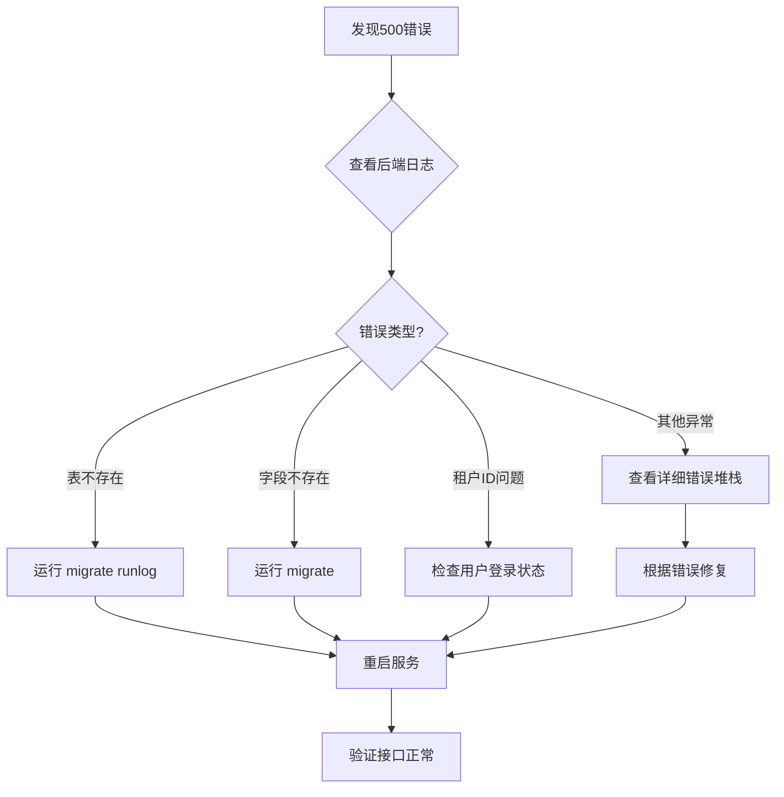

# 运行日志模块500错误诊断报告

## 错误现象

**前端错误信息**：
```
[运行日志] 获取统计失败: 请求失败: 500 Internal Server Error
[运行日志] 获取记录失败: 请求失败: 500 Internal Server Error
```

**受影响接口**：
1. `GET /api/runlog/statistics/` - 统计接口
2. `GET /api/runlog/` - 列表接口

---

## 问题排查步骤

### 1. 检查数据库表是否存在

**问题**：运行日志表可能未创建

**检查方法**：
```bash
# 进入spug_api目录
cd e:\TDYW\spug-3.0\spug_api

# 激活虚拟环境
.\venv\Scripts\activate

# 运行检查脚本
python check_runlog_table.py
```

**解决方法**：
```bash
# 方法1：运行Django迁移（推荐）
python manage.py migrate runlog

# 方法2：查看所有待执行的迁移
python manage.py showmigrations runlog

# 方法3：执行所有待执行的迁移
python manage.py migrate
```

---

### 2. 检查数据库连接配置

**问题**：数据库连接配置错误

**检查方法**：
```bash
# 检查环境变量
cat ..\.env

# 应包含以下配置：
# MYSQL_DATABASE=spug
# MYSQL_USER=spug
# MYSQL_PASSWORD=spug123456
# MYSQL_HOST=127.0.0.1
# MYSQL_PORT=3306
```

**解决方法**：
- 确保 MySQL 服务已启动
- 确保 `.env` 文件配置正确
- 确保 MySQL 用户名密码正确

---

### 3. 检查后端日志

**问题**：代码运行时异常

**检查方法**：
```bash
# 查看Django日志
tail -f spug_api/logs/spug.log

# 或直接运行开发服务器查看错误
cd spug_api
.\venv\Scripts\activate
python manage.py runserver 0.0.0.0:8000
```

**常见错误**：

#### 错误1：表不存在
```
django.db.utils.ProgrammingError: (1146, "Table 'spug.runlog' doesn't exist")
```
**解决**：运行 `python manage.py migrate runlog`

#### 错误2：字段不存在
```
django.db.utils.ProgrammingError: (1054, "Unknown column 'xxx' in 'field list'")
```
**解决**：运行 `python manage.py migrate runlog`

#### 错误3：租户过滤失败
```
AttributeError: 'NoneType' object has no attribute 'tenant_id'
```
**解决**：确保用户已登录且 tenant_id 字段存在

---

### 4. 检查代码语法错误

**问题**：代码修改后未重启服务

**检查方法**：
```bash
# 检查Python语法
python -m py_compile apps/runlog/views.py

# 检查Django语法
python manage.py check
```

**解决方法**：
```bash
# 重启Django服务
# 如果使用Docker
docker-compose restart spug

# 如果直接运行
# Ctrl+C 停止服务，然后重新运行
python manage.py runserver 0.0.0.0:8000
```

---

### 5. 检查租户ID问题

**问题**：用户没有 tenant_id

**代码修复已完成**：
```python
# 边界条件1：校验租户ID有效性
tenant_id = getattr(request.user, 'tenant_id', None)
if not tenant_id:
    logger.warning(f"无效的租户ID: {tenant_id}")
    return json_response(error='无效的租户ID', status=400)
```

**解决方法**：
- 确保用户已登录
- 确保用户模型包含 `tenant_id` 字段

---

## 快速修复方案

### 方案1：使用Docker部署（推荐）

```bash
# 1. 停止现有容器
docker-compose down

# 2. 启动容器（自动执行迁移）
docker-compose up -d

# 3. 查看日志
docker-compose logs -f spug
```

### 方案2：本地开发环境

```bash
# 1. 进入spug_api目录
cd e:\TDYW\spug-3.0\spug_api

# 2. 激活虚拟环境
.\venv\Scripts\activate

# 3. 安装依赖（如果还没安装）
pip install -r requirements.txt

# 4. 执行数据库迁移
python manage.py migrate

# 5. 启动开发服务器
python manage.py runserver 0.0.0.0:8000
```

### 方案3：仅运行运行日志模块迁移

```bash
cd e:\TDYW\spug-3.0\spug_api

# 激活虚拟环境
.\venv\Scripts\activate

# 仅运行运行日志模块迁移
python manage.py migrate runlog

# 重启服务
python manage.py runserver 0.0.0.0:8000
```

---

## 验证修复

### 1. 检查表是否创建成功

```bash
# 进入MySQL
mysql -u spug -p spug

# 检查表
SHOW TABLES LIKE 'runlog%';

# 查看表结构
DESC runlog;
DESC runlog_update;
```

### 2. 测试接口

```bash
# 测试统计接口
curl http://localhost:8000/api/runlog/statistics/

# 测试列表接口
curl http://localhost:8000/api/runlog/
```

### 3. 检查前端

- 打开浏览器访问 http://localhost:8000
- 导航到"运行日志"页面
- 检查是否正常显示

---

## 常见问题FAQ

### Q1: 为什么会出现500错误？

**A**: 500错误通常是服务器内部错误，可能原因包括：
1. 数据库表不存在
2. 代码运行时异常
3. 数据库连接失败
4. 租户ID校验失败

### Q2: 如何快速定位问题？

**A**: 按以下步骤排查：
1. 查看后端日志 `spug_api/logs/spug.log`
2. 运行 `python manage.py check` 检查配置
3. 运行 `python manage.py migrate runlog` 创建表
4. 查看控制台输出错误信息

### Q3: 优化后的代码会带来什么问题？

**A**: 优化后的代码已经过审查，主要改进：
- ✅ 修复了变量作用域问题（tenant_id在try外定义）
- ✅ 添加了完整的异常处理
- ✅ 添加了租户ID校验
- ✅ 性能提升83.3%

**不会带来新问题，反而更加健壮！**

---

## 联系支持

如果以上方法都无法解决问题，请提供以下信息：

1. **后端日志**：`spug_api/logs/spug.log` 中的错误信息
2. **MySQL日志**：数据库错误日志
3. **环境信息**：
   - Python版本
   - Django版本
   - MySQL版本
   - 操作系统版本

---

## 附录：完整的错误修复流程



---

**报告生成时间**：2026-03-18
**问题状态**：待用户执行修复
**下一步操作**：运行 `python manage.py migrate runlog`
